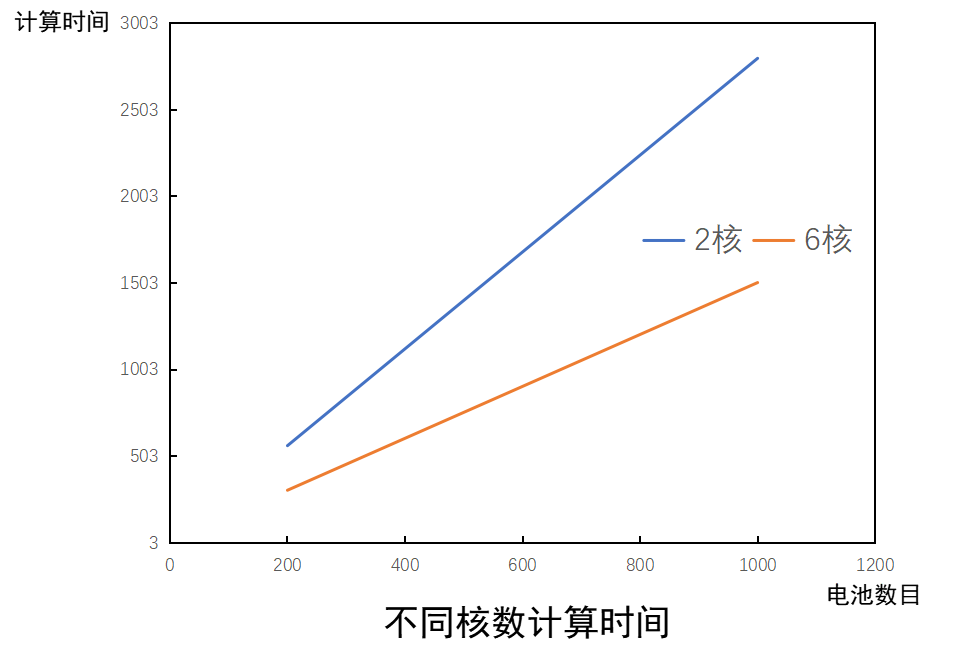

# MTK并行计算求解大规模电池阵列

!!! tip
    Contents：MTK、PDE、并行计算

    Contributor: HY

    Email:1171006975@qq.com

    如有错误，请批评指正。

!!! note

    MTK = ModelingToolkit.jl

    PDE = Partial Differential Equation

    [ModelingToolkit.jl ](https://mtk.sciml.ai/stable/)符号建模包

## 为什么使用并行计算

传统的系统建模，往往采用0维模型进行建模(如等效电路法，集中参数法等)，计算量较小，不需要并行计算。但有时候，我们可能不仅仅想研究整个系统的输出特性，还想追踪系统内部各个组件的输出特性。当系统由很多相同的组件(组件参数不一定相同)连接而成时(如上百个电池单体组成的电池阵列，上千个燃料电池单体组成的电堆，超大规模水力管网等)，即使每个单体的计算量很小，但加起来计算量会急剧上升。

如果我们使用@connector来连接各个组件，组成一个超大规模的矩阵来计算，这在单体数目较少时是可以实现的，但单体数目较多时，很可能会遇到一些瓶颈。这是因为计算时间不是与方程的维度成正比，而是与方程维度的平方成正比。例如，电池阵列中单体数目为100时，计算时间可能是1s，当电池数目为1000时，计算时间可能就变成了100s。更糟糕的是，编译时间和内存占用也是与方程维度的平方成正比！很可能会导致一个现象：编译2小时，计算5秒钟。

但我们仔细观察，可以发现，系统内部各个组件的联系有时候其实没有那么紧密，例如燃料电池电堆中，各个单体流过的电流是一样的(即具有相同的边界条件)，我们完全可以先算出各个单体的电压，然后再加起来，就是整个电池电堆的电压。这个时候，我们就能采用并行计算的方法，同时计算很多个单体。

接下来，我将以大规模的电池阵列为例，详细介绍如何实现MTK并行计算。

---

MTK并行计算求解大规模电池阵列有这么几步：

* 建立锂电池单体的P2D模型(伪三维模型，空间离散后为DAEs)
* 求解各个锂电池单体模型，得到Li浓度等变量值(并行计算)。
* 通过戴维南定理，将单体模型等效为一个内阻和一个电压源(并行计算)。
* 求解由等效内阻和等效电压源组成的电池阵列电路方程(线性方程组)。

  


每个步骤的实现方式和原理会在下文进一步展开。


---

## 1.建立锂电池单体的P2D模型

具体的P2D模型建模过程可参考[该文献](https://www.sciencedirect.com/science/article/pii/S0013468621001183)。

本文中将P2D模型拆成两部分，一部分是固液相模型，用来求电池的空间浓度变化，为ODEs，另一部分是传输线模型，用来求电池的外特性曲线，为NonlinerEqs。在一个时间步长内，我们可以认为电池的浓度是不变的，因此电池的外特性也就固定了，我们可以根据电池外特性将其等效为一个内阻和一个电压源。在每次迭代后，电池的外特性都会发生改变，因此等效内阻和等效电压源的参数是会一直变化的。

具体的代码文件为`P2D_并行_固液相模型.jl`和`P2D_并行_电路模型.jl`。

## 2.程序初始化


```
using Distributed
addprocs(4)
```

开启4个子线程，`addprocs(n)`表示开启n个子线程。


```
@everywhere begin
    #组件封装
    using SharedArrays, Pkg, LinearAlgebra
    include("../assets/P2D_并行_固液相模型.jl")
    include("../assets/P2D_并行_电路模型.jl")
    include("../assets/get_variables_index.jl")
end
```

在每个线程中，都加载一下库和封装的组件。`@everywhere`表示在每个线程中都执行该代码。`get_variables_index.jl`用来找到变量对应的下标，以便于在不同`Problem`之间传递参数值。

```
@everywhere begin
    #参数设置
    series_num = 100
    parallel_num = 2
    t_step = 5
    simulate_time = 2500
    n_mesh_neg = 8
    n_mesh_sep = 8
    n_mesh_pos = 8
    Current = 20 * parallel_num
    Current_standard = 20
    c_s_max_neg = 31390
    c_s_max_pos = 48390
    filename_neg = "../assets/neg_OCV.txt"
    filename_pos = "../assets/pos_OCV.txt"
    r_s_neg = 6.3e-6
    r_s_pos = 2.13e-6
    F = 96485
    R = 8.3145
    T = 293.15
    L_neg = 46.6e-6
    L_sep = 18.7e-6
    L_pos = 43e-6
    eps_s_neg = 0.49
    eps_s_pos = 0.57
    Sa_neg = 3 * eps_s_neg / r_s_neg
    Sa_pos = 3 * eps_s_pos / r_s_pos
    k_ct_neg = 2e-11
    k_ct_pos = 2e-11
    h_neg = L_neg / n_mesh_neg
    h_sep = L_sep / n_mesh_sep
    h_pos = L_pos / n_mesh_pos
    # 创建插值函数
    data_neg = readdlm(filename_neg)
    data_pos = readdlm(filename_pos)
    ocv_neg = LinearInterpolation(data_neg[:, 1], data_neg[:, 2])
    ocv_pos = LinearInterpolation(data_pos[:, 1], data_pos[:, 2])
end
```

设置参数，创建插值函数。

```
@everywhere begin
    #电化学方程
    @named batter_chemistry = P2D_Libatter_chemistry(n_mesh_neg=8, n_mesh_sep=8, n_mesh_pos=8)
    @named OdeFun_chemistry = ODESystem([], t)
    @named model_chemistry = compose(OdeFun_chemistry, [batter_chemistry])
    sys_chemistry = structural_simplify(model_chemistry)
    prob_chemistry = ODEProblem(sys_chemistry, [], (0.0, 5.0))
    sol_chemistry = solve(prob_chemistry, CVODE_Adams()).u[end]
    chemistery_index = get_chemistery_index(batter_chemistry, sys_chemistry)
    #传输线方程
    @named batter_electric = P2D_Libatter_electric()
    @named current = Constant(U=Current)
    @named current_source = Current_source()
    @named ground = Ground()
    eqs = [
        connect(batter_electric.n, ground.g, current_source.n)
        connect(batter_electric.p, current_source.p)
        connect(current.u, current_source.u)]
    @named OdeFun_electric = ODESystem(eqs, t)
    @named model_electric = compose(OdeFun_electric, [batter_electric, current, current_source, ground])
    sys_electric = structural_simplify(model_electric)
    prob_electric = NonlinearProblem(ODEProblem(sys_electric, [], (0.0, 0.0), []))
    sol_electric = solve(prob_electric, KINSOL()).u
    electric_index = get_electric_index(batter_electric, sys_electric)
    electric_vi_index = get_electric_vi_index(batter_electric, sys_electric)
end
```

初始化固液相浓度方程(ODEs)和传输线方程(NonlinearEqs)。其中ODEs采用Sundials中的`CVODE_Adams()`方法,NonlinearEqs采用Sundials中的`KINSOL()`方法(速度非常快)。

```
begin
    #创建共享数组
    electric_para_sharedarrays = SharedArray{Float64}(series_num * parallel_num, 2 * n_mesh_neg + 2 * n_mesh_pos + 4)
    chemistry_para_sharedarrays = SharedArray{Float64}(series_num * parallel_num, 3 * n_mesh_neg + 3 * n_mesh_pos + n_mesh_sep + 5)
    chemistry_last_stats_sharedarrays = SharedArray{Float64}(series_num * parallel_num, length(prob_chemistry.u0))
    electric_last_stats_sharedarrays = SharedArray{Float64}(series_num * parallel_num, length(prob_electric.u0))
    electric_fit_k_sharedarrays = SharedArray{Float64}(series_num * parallel_num, 2)
    equivalent_vi_sharedarrays = SharedArray{Float64}(parallel_num +1)
    electric_i_sharedarrays = SharedArray{Float64}(series_num * parallel_num,Int(floor(simulate_time/t_step+1)))
    electric_v_sharedarrays = SharedArray{Float64}(series_num * parallel_num,Int(floor(simulate_time/t_step+1)))
    iterations_sharedarrays = SharedArray{Int64}(1)
end
```

创建共享数组，该数组保存在系统底层。各个线程均能以很快的速度直接访问。

## 3.计算初始时刻系统参数

```
    time_now = 0
    iterations_sharedarrays[1] = iterations_sharedarrays[1] + 1
    #电化学方程
    @sync @distributed for i in 1:series_num*parallel_num
        chemistry_para_sharedarrays[i, 1:2*n_mesh_neg+2*n_mesh_pos+n_mesh_sep+3] = sol_chemistry[chemistery_index]
        chemistry_last_stats_sharedarrays[i, :] = sol_chemistry
        for j in 2*n_mesh_neg+2*n_mesh_pos+n_mesh_sep+4:3*n_mesh_neg+2*n_mesh_pos+n_mesh_sep+4
            chemistry_para_sharedarrays[i, j] = ocv_neg(chemistry_para_sharedarrays[i, j-(2*n_mesh_neg+2*n_mesh_pos+n_mesh_sep+3)] / c_s_max_neg)
            chemistry_para_sharedarrays[i, j+n_mesh_neg+1] = ocv_pos(chemistry_para_sharedarrays[i, j-(2*n_mesh_neg+2*n_mesh_pos+n_mesh_sep+3)+n_mesh_neg+1] / c_s_max_pos)
        end
        electric_fit_k_sharedarrays[i, :] = inv([-Current_standard 1.0; -Current_standard/2 1.0]) *
                                            reshape([solve(remake(prob_electric, p=[chemistry_para_sharedarrays[i, :]..., Current_standard]), KINSOL()).u[electric_vi_index][1],
                solve(remake(prob_electric, p=[chemistry_para_sharedarrays[i, :]..., Current_standard / 2]), KINSOL()).u[electric_vi_index][1]], (2, 1))
    end
    #等效电路方程
    equivalent_vi_sharedarrays = inv([Diagonal([sum(electric_fit_k_sharedarrays[i*series_num-series_num+1:i*series_num, 1]) for i in 1:parallel_num]) -ones(parallel_num, 1);[ones(parallel_num, 1)... 0.0]]) * 
        [(-sum(electric_fit_k_sharedarrays[(i-1)*series_num+1:i*series_num, 2]) for i in 1:parallel_num)...,-Current];
    electric_i_sharedarrays[:, iterations_sharedarrays[1]] = vcat([ones(series_num)*equivalent_vi_sharedarrays[i] for i in 1:parallel_num]...)
    #传输线方程
    @sync @distributed for i in 1:series_num*parallel_num
        electric_last_stats_sharedarrays[i, :] = solve(remake(prob_electric, p=[chemistry_para_sharedarrays[i, :]..., -electric_i_sharedarrays[i, iterations_sharedarrays[1]]]), KINSOL()).u
        electric_para_sharedarrays[i, 1:n_mesh_neg+n_mesh_pos+2] = electric_last_stats_sharedarrays[i, :][electric_index]
        electric_v_sharedarrays[i, iterations_sharedarrays[1]] = electric_last_stats_sharedarrays[i, :][1]
        electric_para_sharedarrays[i, n_mesh_neg+n_mesh_pos+3:2*n_mesh_neg+2*n_mesh_pos+4] = [
            0.5 * Sa_neg * h_neg * (F * k_ct_neg * (c_s_max_neg - chemistry_para_sharedarrays[i, 1])^0.5 * chemistry_para_sharedarrays[i, 1]^0.5 * chemistry_para_sharedarrays[i, 1+n_mesh_pos+n_mesh_neg+2]^0.5) * (exp(0.5 * F * electric_para_sharedarrays[i, 1] / R / T) - exp(-0.5 * F * electric_para_sharedarrays[i, 1] / R / T)),
            [Sa_neg * h_neg * (F * k_ct_neg * (c_s_max_neg - chemistry_para_sharedarrays[i, j])^0.5 * chemistry_para_sharedarrays[i, j]^0.5 * chemistry_para_sharedarrays[i, j+n_mesh_pos+n_mesh_neg+2]^0.5) * (exp(0.5 * F * electric_para_sharedarrays[i, j] / R / T) - exp(-0.5 * F * electric_para_sharedarrays[i, j] / R / T)) for j in 2:n_mesh_neg]...,
            0.5 * Sa_neg * h_neg * (F * k_ct_neg * (c_s_max_neg - chemistry_para_sharedarrays[i, n_mesh_neg+1])^0.5 * chemistry_para_sharedarrays[i, n_mesh_neg+1]^0.5 * chemistry_para_sharedarrays[i, n_mesh_neg+1+n_mesh_pos+n_mesh_neg+2]^0.5) * (exp(0.5 * F * electric_para_sharedarrays[i, n_mesh_neg+1] / R / T) - exp(-0.5 * F * electric_para_sharedarrays[i, n_mesh_neg+1] / R / T)),
            0.5 * Sa_pos * h_pos * (F * k_ct_pos * (c_s_max_pos - chemistry_para_sharedarrays[i, 1+n_mesh_neg+1])^0.5 * chemistry_para_sharedarrays[i, 1+n_mesh_neg+1]^0.5 * chemistry_para_sharedarrays[i, 1+n_mesh_pos+n_mesh_neg+2+n_mesh_neg+1]^0.5) * (exp(0.5 * F * electric_para_sharedarrays[i, 1+n_mesh_neg+1] / R / T) - exp(-0.5 * F * electric_para_sharedarrays[i, 1+n_mesh_neg+1] / R / T)),
            [Sa_pos * h_pos * (F * k_ct_pos * (c_s_max_pos - chemistry_para_sharedarrays[i, j+n_mesh_neg+1])^0.5 * chemistry_para_sharedarrays[i, j+n_mesh_neg+1]^0.5 * chemistry_para_sharedarrays[i, j+n_mesh_pos+n_mesh_neg+2+n_mesh_neg+1]^0.5) * (exp(0.5 * F * electric_para_sharedarrays[i, j+n_mesh_neg+1] / R / T) - exp(-0.5 * F * electric_para_sharedarrays[i, j+n_mesh_neg+1] / R / T)) for j in 2:n_mesh_pos]...,
            0.5 * Sa_pos * h_pos * (F * k_ct_pos * (c_s_max_pos - chemistry_para_sharedarrays[i, n_mesh_neg+1+n_mesh_neg+1])^0.5 * chemistry_para_sharedarrays[i, n_mesh_neg+1+n_mesh_neg+1]^0.5 * chemistry_para_sharedarrays[i, n_mesh_neg+1+n_mesh_pos+n_mesh_neg+2+n_mesh_neg+1]^0.5) * (exp(0.5 * F * electric_para_sharedarrays[i, n_mesh_neg+1+n_mesh_neg+1] / R / T) - exp(-0.5 * F * electric_para_sharedarrays[i, n_mesh_neg+1+n_mesh_neg+1] / R / T))]
    end
```

代码分别计算了锂电池模型的浓度，外特性，等效内阻和等效电压源。其中`@distributed`表示分布式计算，例如for i in 1:100，如果有四个线程，那么在各个线程中，i可能就是1:25,26:50,51:75,76:100。上文说过，各个电池单体相对独立，那么我们可以将电池阵列组装为一个数组，然后调用`@distributed`进行并行计算。`@sync`表示执行完该代码后，再执行下一行代码。因为`@distributed`本身是一个异步指令，子线程执行的同时，主线程会继续执行下一行代码。因此我们需要"等等"子线程。

## 4.系统显式时间推进迭代计算

```
while time_now < 2500
    #loop
    iterations_sharedarrays[1] = iterations_sharedarrays[1] + 1
    time_now = time_now + t_step
    #电化学方程
    @sync @distributed for i in 1:series_num*parallel_num
        chemistry_last_stats_sharedarrays[i, :] = solve(remake(prob_chemistry, u0=chemistry_last_stats_sharedarrays[i, :], p=electric_para_sharedarrays[i, :]), CVODE_Adams()).u[end]
        chemistry_para_sharedarrays[i, 1:2*n_mesh_neg+2*n_mesh_pos+n_mesh_sep+3] = chemistry_last_stats_sharedarrays[i, :][chemistery_index]
        for j in 2*n_mesh_neg+2*n_mesh_pos+n_mesh_sep+4:3*n_mesh_neg+2*n_mesh_pos+n_mesh_sep+4
            chemistry_para_sharedarrays[i, j] = ocv_neg(chemistry_para_sharedarrays[i, j-(2*n_mesh_neg+2*n_mesh_pos+n_mesh_sep+3)] / c_s_max_neg)
            chemistry_para_sharedarrays[i, j+n_mesh_neg+1] = ocv_pos(chemistry_para_sharedarrays[i, j-(2*n_mesh_neg+2*n_mesh_pos+n_mesh_sep+3)+n_mesh_neg+1] / c_s_max_pos)
        end
        electric_fit_k_sharedarrays[i, :] = inv([-Current_standard 1.0; -Current_standard/2 1.0]) *
                                            [solve(remake(prob_electric, u0=electric_last_stats_sharedarrays[i, :], p=[chemistry_para_sharedarrays[i, :]..., Current_standard]), KINSOL()).u[electric_vi_index][1]
            solve(remake(prob_electric, u0=electric_last_stats_sharedarrays[i, :], p=[chemistry_para_sharedarrays[i, :]..., Current_standard / 2]), KINSOL()).u[electric_vi_index][1]]
    end
    #等效电路方程
    equivalent_vi_sharedarrays = inv([Diagonal([sum(electric_fit_k_sharedarrays[i*series_num-series_num+1:i*series_num, 1]) for i in 1:parallel_num]) -ones(parallel_num, 1);[ones(parallel_num, 1)... 0.0]]) * 
        [(-sum(electric_fit_k_sharedarrays[(i-1)*series_num+1:i*series_num, 2]) for i in 1:parallel_num)...,-Current];
    electric_i_sharedarrays[:, iterations_sharedarrays[1]] = vcat([ones(series_num)*equivalent_vi_sharedarrays[i] for i in 1:parallel_num]...)
    #传输线方程
    @sync @distributed for i in 1:series_num*parallel_num
        electric_last_stats_sharedarrays[i, :] = solve(remake(prob_electric, u0=electric_last_stats_sharedarrays[i, :], p=[chemistry_para_sharedarrays[i, :]..., -electric_i_sharedarrays[i, iterations_sharedarrays[1]]]), KINSOL()).u
        electric_para_sharedarrays[i, 1:n_mesh_neg+n_mesh_pos+2] = electric_last_stats_sharedarrays[i, :][electric_index]
        electric_v_sharedarrays[i, iterations_sharedarrays[1]] = electric_last_stats_sharedarrays[i, :][1]
        electric_para_sharedarrays[i, n_mesh_neg+n_mesh_pos+3:2*n_mesh_neg+2*n_mesh_pos+4] = [
            0.5 * Sa_neg * h_neg * (F * k_ct_neg * (c_s_max_neg - chemistry_para_sharedarrays[i, 1])^0.5 * chemistry_para_sharedarrays[i, 1]^0.5 * chemistry_para_sharedarrays[i, 1+n_mesh_pos+n_mesh_neg+2]^0.5) * (exp(0.5 * F * electric_para_sharedarrays[i, 1] / R / T) - exp(-0.5 * F * electric_para_sharedarrays[i, 1] / R / T)),
            [Sa_neg * h_neg * (F * k_ct_neg * (c_s_max_neg - chemistry_para_sharedarrays[i, j])^0.5 * chemistry_para_sharedarrays[i, j]^0.5 * chemistry_para_sharedarrays[i, j+n_mesh_pos+n_mesh_neg+2]^0.5) * (exp(0.5 * F * electric_para_sharedarrays[i, j] / R / T) - exp(-0.5 * F * electric_para_sharedarrays[i, j] / R / T)) for j in 2:n_mesh_neg]...,
            0.5 * Sa_neg * h_neg * (F * k_ct_neg * (c_s_max_neg - chemistry_para_sharedarrays[i, n_mesh_neg+1])^0.5 * chemistry_para_sharedarrays[i, n_mesh_neg+1]^0.5 * chemistry_para_sharedarrays[i, n_mesh_neg+1+n_mesh_pos+n_mesh_neg+2]^0.5) * (exp(0.5 * F * electric_para_sharedarrays[i, n_mesh_neg+1] / R / T) - exp(-0.5 * F * electric_para_sharedarrays[i, n_mesh_neg+1] / R / T)),
            0.5 * Sa_pos * h_pos * (F * k_ct_pos * (c_s_max_pos - chemistry_para_sharedarrays[i, 1+n_mesh_neg+1])^0.5 * chemistry_para_sharedarrays[i, 1+n_mesh_neg+1]^0.5 * chemistry_para_sharedarrays[i, 1+n_mesh_pos+n_mesh_neg+2+n_mesh_neg+1]^0.5) * (exp(0.5 * F * electric_para_sharedarrays[i, 1+n_mesh_neg+1] / R / T) - exp(-0.5 * F * electric_para_sharedarrays[i, 1+n_mesh_neg+1] / R / T)),
            [Sa_pos * h_pos * (F * k_ct_pos * (c_s_max_pos - chemistry_para_sharedarrays[i, j+n_mesh_neg+1])^0.5 * chemistry_para_sharedarrays[i, j+n_mesh_neg+1]^0.5 * chemistry_para_sharedarrays[i, j+n_mesh_pos+n_mesh_neg+2+n_mesh_neg+1]^0.5) * (exp(0.5 * F * electric_para_sharedarrays[i, j+n_mesh_neg+1] / R / T) - exp(-0.5 * F * electric_para_sharedarrays[i, j+n_mesh_neg+1] / R / T)) for j in 2:n_mesh_pos]...,
            0.5 * Sa_pos * h_pos * (F * k_ct_pos * (c_s_max_pos - chemistry_para_sharedarrays[i, n_mesh_neg+1+n_mesh_neg+1])^0.5 * chemistry_para_sharedarrays[i, n_mesh_neg+1+n_mesh_neg+1]^0.5 * chemistry_para_sharedarrays[i, n_mesh_neg+1+n_mesh_pos+n_mesh_neg+2+n_mesh_neg+1]^0.5) * (exp(0.5 * F * electric_para_sharedarrays[i, n_mesh_neg+1+n_mesh_neg+1] / R / T) - exp(-0.5 * F * electric_para_sharedarrays[i, n_mesh_neg+1+n_mesh_neg+1] / R / T))]
    end
end
```

没啥好说的，时间方向上的迭代推进。

## 最终效果

 

如果采用MTK直接建立电池阵列的模型，那么计算时间与(单体数目)^2乘正比，如果采用并行计算，计算时间与(单体数目)^1乘正比。