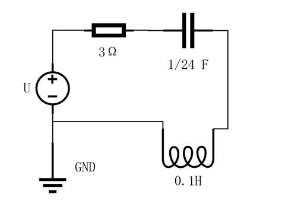
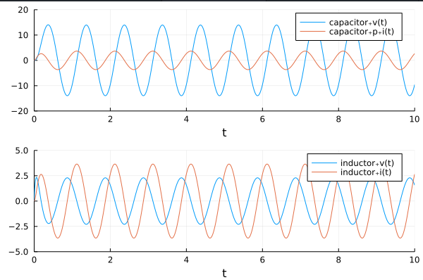

# 组件化建模实例

!!! tip
    Contents：MTK、组件化建模

    Contributor: YJY

    Email:522432938@qq.com

    如有错误，请批评指正。

!!! note

    MTK = ModelingToolkit.jl

    [ModelingToolkit.jl Acausal Component-Based Modeling the RC Circuit](https://mtk.sciml.ai/stable/tutorials/acausal_components/)介绍了组件化建模的例子

## MTK符号建模

在[DifferentialEquations建模方法](../Modeling/DE_intro.md)与[ModelingToolkit建模方法](../Modeling/MTK_intro.md)中介绍DE与MTK的两种建模方式。分析了使用它们建模的具体步骤与实现方法，并介绍了相应的内涵。

这一篇中主要介绍符号建模的另一个强大功能——组件化建模。

## RC电路建模实例

仿真如下图的电路系统：

  

**@MTK版本：8.5.5**

```julia
using ModelingToolkit, Plots, DifferentialEquations

@variables t
@connector function Pin(; name)
    sts = @variables v(t) = 1.0 i(t) = 1.0 [connect = Flow]
    ODESystem(Equation[], t, sts, []; name=name)
end

function Ground(; name)
    @named g = Pin()
    eqs = [g.v ~ 0]
    compose(ODESystem(eqs, t, [], []; name=name), g)
end

function OnePort(; name)
    @named p = Pin()
    @named n = Pin()
    sts = @variables v(t) = 1.0 i(t) = 1.0
    eqs = [
        v ~ p.v - n.v
        0 ~ p.i + n.i
        i ~ p.i
    ]
    compose(ODESystem(eqs, t, sts, []; name=name), p, n)
end

function Resistor(; name, R=1.0)
    @named oneport = OnePort()
    @unpack v, i = oneport
    ps = @parameters R = R
    eqs = [
        v ~ i * R
    ]
    extend(ODESystem(eqs, t, [], ps; name=name), oneport)
end

function Capacitor(; name, C=1.0)
    @named oneport = OnePort()
    @unpack v, i = oneport
    ps = @parameters C = C
    D = Differential(t)
    eqs = [
        D(v) ~ i / C
    ]
    extend(ODESystem(eqs, t, [], ps; name=name), oneport)
end

function ConstantVoltage(; name, V=1.0)
    @named oneport = OnePort()
    @unpack v = oneport
    ps = @parameters V = V
    eqs = [
        V ~ v
    ]
    extend(ODESystem(eqs, t, [], ps; name=name), oneport)
end

function Inductor(; name, L=1.0)
    @named oneport = OnePort()
    @unpack v, i = oneport
    ps = @parameters L = L
    D = Differential(t)
    eqs = [
        D(i) ~ v / L
    ]
    extend(ODESystem(eqs, t, [], ps; name=name), oneport)
end

function ChangeableVoltage(; name)
    @named oneport = OnePort()
    @unpack v, i = oneport
    eqs = [
        v ~ 16 * sin(2π * t)
    ]
    extend(ODESystem(eqs, t, [], []; name=name), oneport)
end


@named resistor = Resistor(R=3.0)
@named capacitor = Capacitor(C=1.0 / 24)
@named source = ChangeableVoltage()
@named inductor = Inductor(L=0.1)
@named ground = Ground()


rc_eqs = [
    connect(source.p, capacitor.p)
    connect(capacitor.n, inductor.p)
    connect(inductor.n, resistor.p)
    connect(source.n, resistor.n, ground.g)
]


@named _rc_model = ODESystem(rc_eqs, t)
@named rc_model = compose(_rc_model,
    [resistor, inductor, capacitor, source, ground])

sys = structural_simplify(rc_model)

using Plots
u0 = [
    capacitor.v => 0.0
    capacitor.p.i => 0.0
    inductor.i => 0
    inductor.v => 0
]
prob = ODAEProblem(sys, u0, (0, 10.0))
sol = solve(prob, Tsit5())
sol[resistor.p.i]
p1 = plot(sol, vars=[capacitor.v capacitor.p.i], xlims=(0, 10), ylim=(-20, 20))
p2 = plot(sol, vars=[inductor.v inductor.i], xlims=(0, 10), ylim=(-5, 5))
plot(p1, p2, layout=(2, 1))
```

结果如图所示：

  

---

主要的过程有以下几步：

1. 构建组件
2. 定义组件实例
3. 连接系统
4. 化简
5. 设置初值
6. 构建问题并求解
7. 结果处理

---

构建组件过程中主要有两方面考虑，系统内部结构与系统对外接口。

**内部结构**则是各个组件内部的数学特性。对于电阻有：
$$V=R*I$$

对于电容有：
$$\frac{dV}{dt}=\frac{I}{C}$$

对于电感有：
$$\frac{dI}{dt}=\frac{V}{L}$$

这些关系可以在模型构建时体现。这是系统的内部变量之间的决定关系。

**外部结构**是模块化的另一个关键部分。

RC的接口体现在函数Pin()上，每一个组件都由两个Pin——输入引脚与输出引脚。这完全是抽象出来的，引脚存在的意义就是为了连接。每个引脚有自己的电压值（更准确的说是电势大小）以及电流。这些变量的引入只是为了跟好地模块化。例如，器件A的出口引脚与器件B的进口引脚相连，它们在电路模型中完全可以视为一个等价的点。为了使模块变得更加完整，分化出来各自的引脚。事实上，这些引脚变量在最后计算时，被化简消除了。

所以，在模块化的过程中为了使个组件变得完整，会派生出很多变量，这些变量都是“锦上添花”的存在，不具备决定性意义。但它们又是使各模块间能够衔接的必要存在。

---

```julia

@named resistor = Resistor(R=3.0)
@named capacitor = Capacitor(C=1.0 / 24)
@named source = ChangeableVoltage()
@named inductor = Inductor(L=0.1)
@named ground = Ground()

```

组件实例化中的`@named`的作用是给相应组件命名，每个组件的本质都是一个ODESystem，不同的组件不过是ODESystem中存储的方程不同。ODESystem中有一个成员为name，`@named`把实例的名称赋值给这个成员变量。

例如,下面两种定义方式是等价的。

```julia

@named resistor = Resistor(R=3.0)

resistor = Resistor(R=3.0;name =:resistor)
```

---

```julia
rc_eqs = [
    connect(source.p, capacitor.p)
    connect(capacitor.n, inductor.p)
    connect(inductor.n, resistor.p)
    connect(source.n, resistor.n, ground.g)
]
```

依据系统的拓扑结构进行连接。connect函数可以接受任意参数个（并联中多点连接的问题就解决了）。连接的本质是建立模块间的联系，连接模块内部的机理，一旦连接绑定，这些变量的使命就完成了。

---

化简的过程中，会把多余的中间变量都消去。

```julia
sys = structural_simplify(rc_model)
```

---

**查看各组件各变量的求解结果：**

```julia
sol[resistor.p.i]
```

值得一提的是，在求解的过程中会化简，但是依旧可以查看这些变量的求解结果。方法如示例所示。

---
