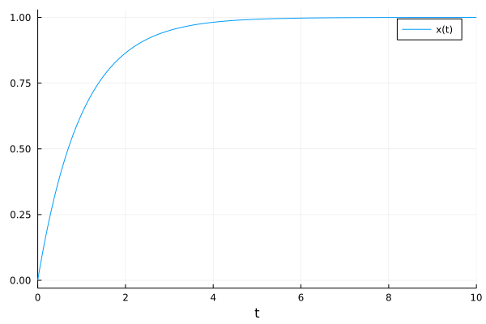
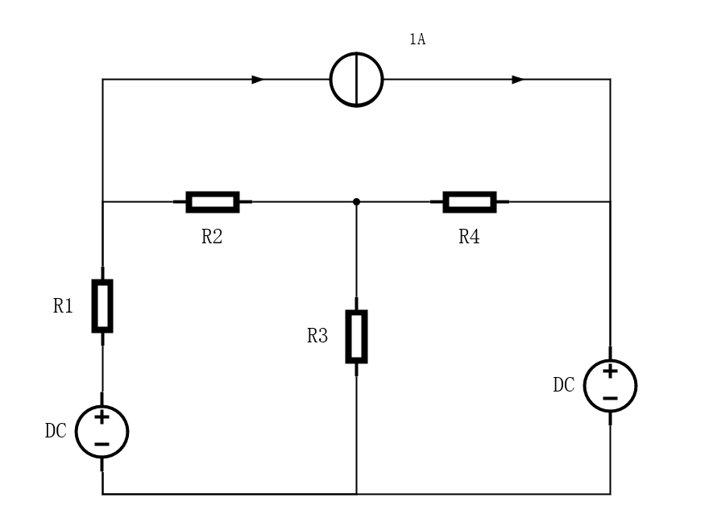
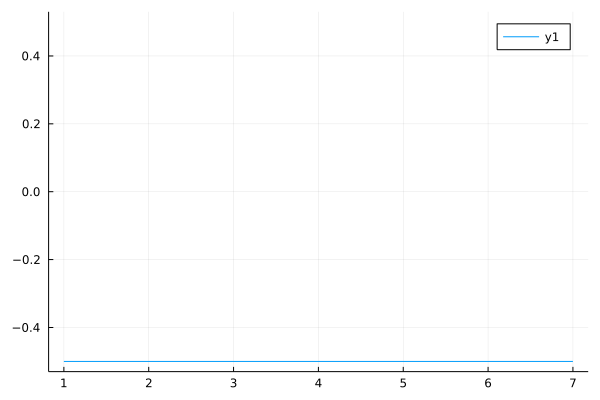

# MTK稳态系统仿真实例

!!! tip
    Contents：MTK、组件化建模

    Contributor: YJY

    Email:522432938@qq.com

    如有错误，请批评指正。

!!! note

    MTK = ModelingToolkit.jl

    [ModelingToolkit.jl Acausal Component-Based Modeling the RC Circuit](https://mtk.sciml.ai/stable/tutorials/acausal_components/)介绍了组件化建模的例子

## 动态与瞬态

从内涵来说，稳态问题是动态问题的子集。

对于稳态动态问题，当微分代数方程中对时间项的微分为0时，则由动态问题过渡为稳态问题。也就是说，稳态问题是动态问题的特殊形式，动态问题是问题的一般形式。微分在实际中代表着“变化”，当该“变化”项为0时，意味着“变化”停止，此时则进入了稳态阶段。

例如，对于这样一个问题：

$$\frac{dx}{dt} = 1-x\\x_0=0$$

从物理演化的角度看，初始时刻，x的变化率为1，x将会不断增大。系统发展到最后，当x增大到1的时候。$\frac{dx}{dt}=0$，此时此刻变化就停止了。所以x将进入稳态，即$x=1$。

这是因为，从物理的角度理解，微分代表一种变化趋势！上述方程的走势如下图，与分析的情况一致。

  

## MTK的稳态求解技巧

求解以下稳态电路问题：

  

该问题的电路状态是确定值，不随时间而改变。而DE和MTK处理的是关于时间的微分方程，单纯的代数方程无法求解。对于这样稳态问题，应该怎样求解呢？

这里主要运用一个技巧——**设定一个变化为0的量加入到方程中**。

什么意思呢？问题必须含有关于时间微分的微分方程，在这一基础之上，让$\frac{dx}{dt}=0$不就实现了一种稳态么?$x$可以代表任何变量，电阻值、电源电压值、电流源值等等。于是，微分变为一种形式，只是让问题能够被求解器求解，对于问题的内涵并没有任何改变。

**@MTK版本：8.5.5**

```julia
using ModelingToolkit, Plots, DifferentialEquations

@variables t
@connector function Pin(; name)
    sts = @variables v(t) = 1.0 i(t) = 1.0 [connect = Flow]
    ODESystem(Equation[], t, sts, []; name=name)
end

function Ground(; name)
    @named g = Pin()
    eqs = [g.v ~ 0]
    compose(ODESystem(eqs, t, [], []; name=name), g)
end

function GroundDIFF(; name)
    @named g = Pin()
    sts = @variables v(t)
    D = Differential(t)
    eqs = [
        g.v ~ 0,
        D(v) ~ 0
    ]
    compose(ODESystem(eqs, t, sts, []; name=name), g)
end

function OnePort(; name)
    @named p = Pin()
    @named n = Pin()
    sts = @variables v(t) = 1.0 i(t) = 1.0
    eqs = [
        v ~ p.v - n.v
        0 ~ p.i + n.i
        i ~ p.i
    ]
    compose(ODESystem(eqs, t, sts, []; name=name), p, n)
end

function Resistor(; name, R=1.0)
    @named oneport = OnePort()
    @unpack v, i = oneport
    ps = @parameters R = R
    eqs = [
        v ~ i * R
    ]
    extend(ODESystem(eqs, t, [], ps; name=name), oneport)
end

function ConstantVoltage(; name, V=1.0)
    @named oneport = OnePort()
    @unpack v = oneport
    ps = @parameters V = V
    eqs = [
        V ~ v
    ]
    extend(ODESystem(eqs, t, [], ps; name=name), oneport)
end

function ConstantCurrent(; name, I=1.0)
    @named oneport = OnePort()
    @unpack i = oneport
    ps = @parameters I = I
    # D = Differential(t)
    eqs = [
        i ~ I
    ]
    extend(ODESystem(eqs, t, [], ps; name=name), oneport)
end


@named resistor1 = Resistor(R=5.0)
@named resistor2 = Resistor(R=5.0)
@named resistor3 = Resistor(R=30.0)
@named resistor4 = Resistor(R=20.0)
@named Isource = ConstantCurrent()
@named Vsource1 = ConstantVoltage(V=30.0)
@named Vsource2 = ConstantVoltage(V=5.0)
@named ground = GroundDIFF()


rc_eqs = [
    connect(Vsource1.p, resistor1.p)
    connect(resistor1.n, resistor2.p, Isource.p)
    connect(resistor2.n, resistor3.p, resistor4.p)
    connect(resistor4.n, Isource.n, Vsource2.p)
    connect(Vsource1.n, Vsource2.n, resistor3.n, ground.g)
]

@named _rc_model = ODESystem(rc_eqs, t)
@named rc_model = compose(_rc_model,
    [resistor1, resistor2, resistor3, resistor4,
        Isource, Vsource1, Vsource2, ground])

sys = structural_simplify(rc_model)

using Plots

u0 = [
    ground.v => 0.0
]
prob = ODAEProblem(sys, u0, (0, 10.0))
sol = solve(prob, Tsit5())
observed(sys)
plot(sol[resistor4.n.i])

```

代码中的关键在于函数`GroundDIFF()`，这个函数中添加的微分项为电势变化为0，即

$$\frac{dV}{dt}=0$$

并且这个V没有任何意义，既不是接地的电势，也没有和电路中的任何变量产生关联。它只是为了让问题能够被求解而存在。

---

最后求解的结果为：

  

可以看到，求解的结果在时间轴上是不变的。随然问题看似是一个动态问题，本质上其实是稳态。因为其没有任何改变，时间轴上的任何状态与其前后状态都一样。

思想的核心其实就是——稳态是动态的一个子集，当动态过程中状态不再改变则进入稳态。**这里不过是将问题设置为状态不发生变化的动态，其本质就是稳态**。

!!! tip
    稳态电路本质是代数方程组，若加上了微分方程，则变成了微分代数方程组。代码中定义的问题是`ODAEProblem`而不是`ODEProblem`。DE只有求解微分代数方程的接口而没有求解代数方程的接口。所以需要构造成微分代数问题。
