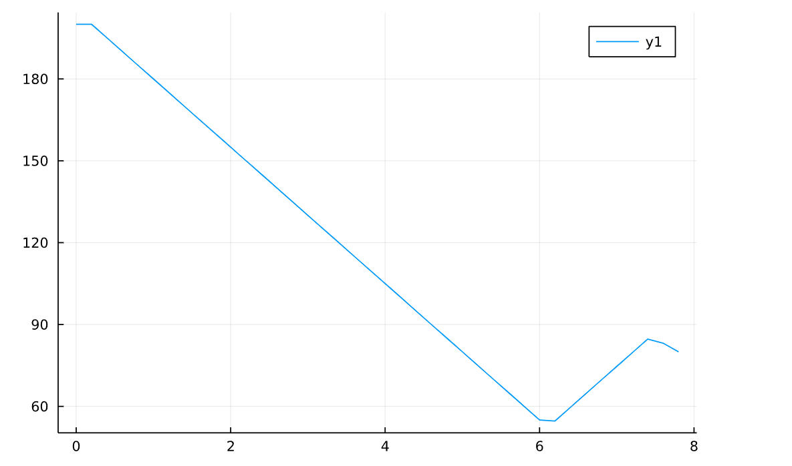
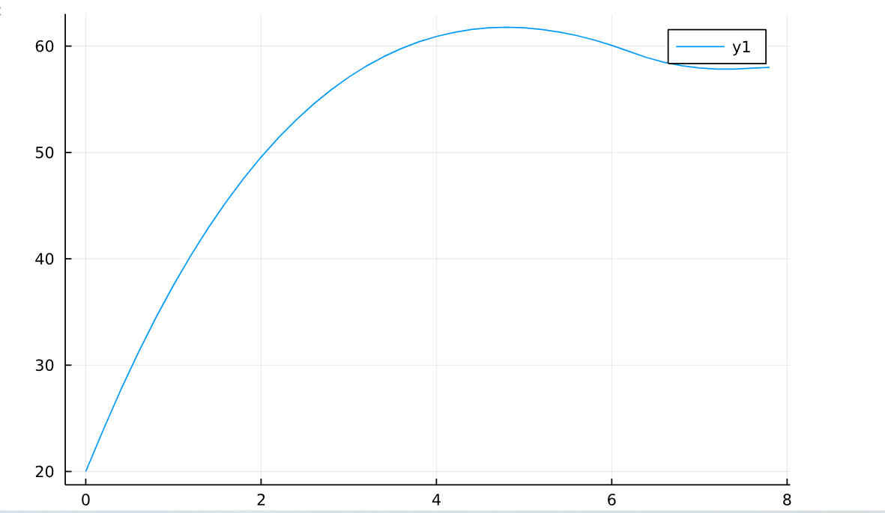
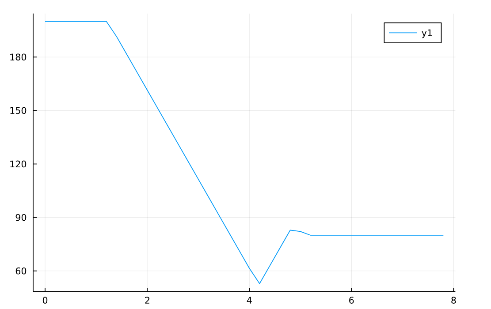
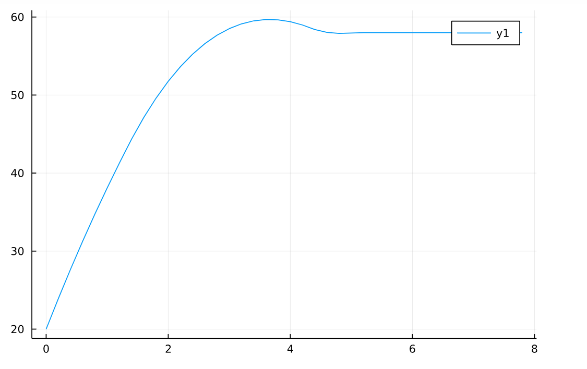

# JuMP求解MPC问题

!!! tip
    Contents：JuMP、Control

    Contributor: YJY

    Email:522432938@qq.com

    如有错误，请批评指正。

!!! note

    [JuMP](https://jump.dev/JuMP.jl/v0.21.8/tutorials/Nonlinear%20programs/clnlbeam/)是计算优化问题的Julia软件包。

## MTK中的OptimizationSystem、ControlSystem

通过MTK中的OptimizationSystem、ControlSystem构建MPC问题都是可行的，但是其一个致命的问题是，System会忽略约束！换一句话说，System只接受Loss方程。这是MTK优化体系不完善的地方。那么，Julia中较为成熟的优化包是JuMP、Optim和NLopt。JuMP的集成度比较好，在JuMP中可以根据不同的优化问题使用不同的求解器。所以尝试用JuMP解决。

## 实例：加热器问题

### 问题描述

现在有一个物体加热，它的温度由加热项和散热项决定。α是散热系数，β是加热系数，环境温度为$T_{out}$。那么控制方程: 

$$T' = α*(T_{out} - T) + β*Q(t)$$

现在可以改变加热功率，那么我们构建一个优化问题：调节加热功率，使得物体的温度从$T_{0}$开始，迅速上升并且稳定在某一个温度（比如说58℃）。问题的数学表达为，通过优化控制变量$Q(t)$ 使得损失函数最小:

$$Loss = \sum_{i} ||58.0-T(t_i)||$$

### 构建问题

首先明确问题。现在假设以一个恒定功率（p=80）加热物体，环境温度18℃，初始温度20℃,散热系数α = 0.2,加热系数β = 0.1。先求解该问题。

```julia
using Plots,DifferentialEquations
Tout = 18.0
α = 0.2
β = 0.1
f(x,p,t) = α*(Tout - x) + β*p
tspan=(0.0,40.0)
u0 = 20.0
p = 80.0
pr = ODEProblem(f,u0,tspan,p)
sol = solve(pr)
plot(sol,ylimit=(10,60))
```

得到的结果是：
  

很清晰可以看到，温度缓慢上升最后稳定在58℃。那么作为我们拍脑袋的控制策略来说，这个控制问题很简单。**我们可以先让功率在前期比较大（比如说150），等温度到了58℃附近，再把功率调回80**，就可以实现“温度迅速上升并最后稳定在58度”。

### 优化求解

```julia
using JuMP,Ipopt
N = 40
Tout = 18.0
T0 = 20.0
dt = 8/N
Loss = 0.0
T = T0
α = 0.2
β = 0.1
model = Model(Ipopt.Optimizer)
@variable(model, 0 <= u[1:N] <= 200)
for i in 1:N
    global T = @expression(model,T + (α*(Tout - T) + β*u[i])*dt)
    global Loss += @expression(model,(T - 58.0)^2)
end
for i = 1:N-1
    @constraint(model,-5 <= u[i]-u[i+1] <= 5)
end
@objective(model, Min, Loss)
optimize!(model)
JuMP.value.(u)
```

u是符号量，离散的个数为N，上面选择离散为40个变量。通过一个for循环，就可以迭代求解40个点上的温度值并且构建Loss方程。同时添加约束，约束的物理含义是控制加热器功率的改变幅度不能太大，这里设置为（-5，5）。

**PS：这里的离散方法，对微分方程求解来说实际上是最简单的欧拉法，精度有待提高，后退欧拉法，亚当斯方法，龙格库塔方法等等方法都可以用来构建Loss方程，只不过方程表达式会很复杂。**

最后我们可以看到整个定义的问题。

```julia
print(model)
```

表达式非常复杂，就不放图了。

加热功率的变化为：

```julia
plot([(i -1)*dt for i in 1:N],value.(u))
```

  

温度的变化为：

  

## 调节约束

结果有些许波动，调一下功率变化的幅度限制，把约束范围调成（-10，10）

加热功率的变化为：

```julia
plot([(i -1)*dt for i in 1:N],value.(u))
```

  

温度的变化为：

  

比刚刚好多了！
