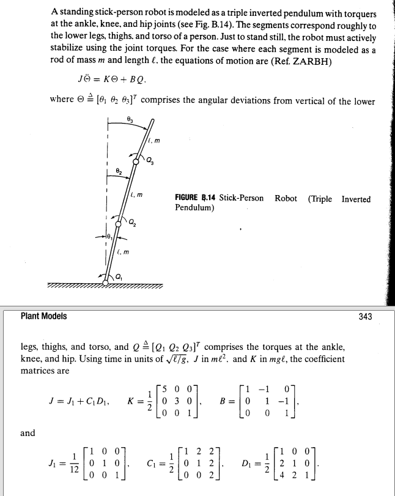
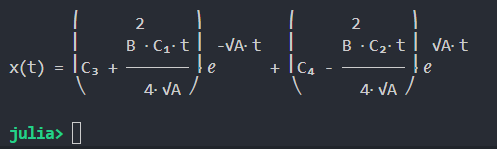
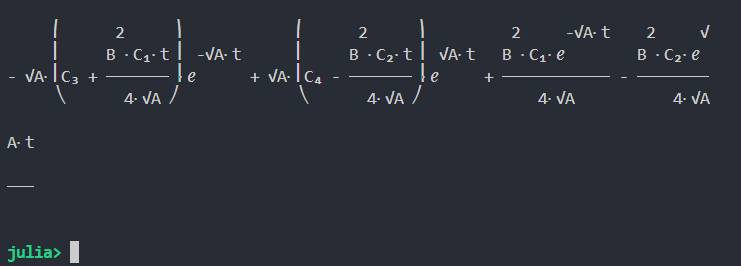
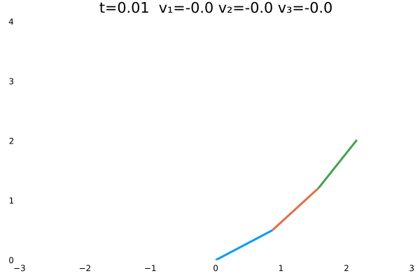
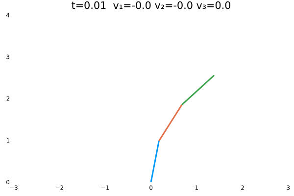
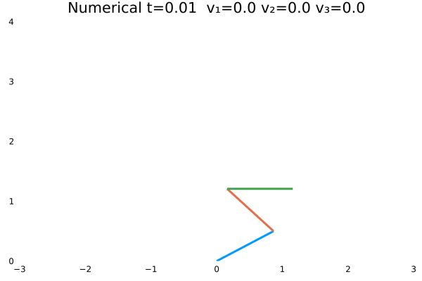
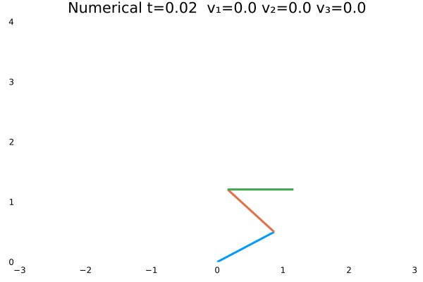
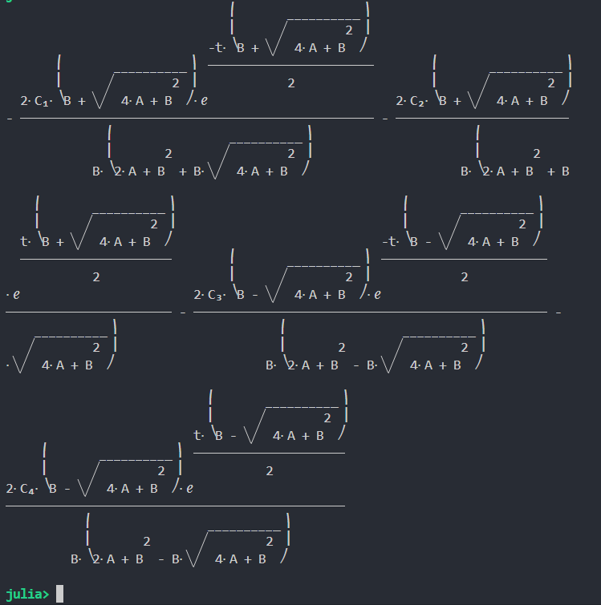

# 最优控制理论与应用

!!! tip
    Contents：JuMP、Control、EquationsSolver

    Contributor: YJY

    Email:522432938@qq.com

    如有错误，请批评指正。

!!! note

    [JuMP](https://jump.dev/JuMP.jl/stable/)是计算优化问题的Julia软件包。

    [Symbolics.jl](https://symbolics.juliasymbolics.org/dev/)为符号计算包

    [EquationsSolver](https://jake484.github.io/EquationsSolver.jl/)自制的小型方程（组）求解器。

## 1 问题描述

本篇通过一个机器人的控制问题，介绍最优控制的相关理论与求解方式。问题如下：

  

题目信息总结如下：

* 这是一个含有三个关节的机器人。
* 机器人身体的三部分与垂直方向的夹角分别为$\theta=[\theta_1,\theta_2,\theta_3]$。
* 机器人的三个关节能够提供使机器人运动的扭矩：$Q=[Q_1,Q_2,Q_3]$。
* 机器人关节的扭矩与夹角之间的关系（控制方程）为：$J\mathbf{\ddot{\theta}}=K\theta+BQ$。

扭矩对夹角的控制方程的推导方法，我们并不关心。**知晓它是通过动力学学分析得出即可。**

它最重要的信息是揭示了$Q$与$\theta$之间的控制关系。通过该方程，我们可以知道，如果控制量$Q$发生了改变，被控量$\theta$会发生何种变化。控制方程的物理含义是，夹角变化的角加速度与夹角的位置以及关节扭矩相关。具体的系数值见上图所示。

### 1.1 （最优）控制内涵

从这个问题中，我们可以抽象出“控制”一般性内涵：**通过改变控制量来操作被控量。**

那么什么是最优控制的内涵呢？

假如，机器人初始状态是斜站着（$\theta=[\frac{\pi}{4},\frac{\pi}{4},\frac{\pi}{4}]$，弧度制单位），现在要让机器人站直（$\theta=[0,0,0]$）。我们可以改变关节扭矩$Q$。那么问题来了，$Q$应该：

* 是否是一个随时间不变的常数？
* 如果是常数，取何值？
* 是否是一个随时间变化的函数？
* 如果是函数，怎样变化？
  
我们从方程中可以发现，假若对$Q$不加限制。只是要机器人站直，那么我可以通过改变$Q$，让机器人可以慢慢的站、快快的站、先蹲后站，先躺后站，先俯卧撑再站，先整几个深蹲再站 :)。

最优的含义则体现在这些“限制”里。一般而言，若对控制的效果加以限制，使控制的某种指标最大（最小），则是最优控制。例如，让机器人最快的站直，最省力的站直。在这些“最”的限制下，$Q$就不是任意的了（要最快的站直就不能先做个俯卧撑再站，那样就慢了 :) ），而是仅有一组最符合要求的。在数学上，最符合要求的$Q$则是这个最优化问题的解。这就是最优化控制的内涵。

综上，其关键的要素有两点：

1. 控制方程
2. 控制过程中的最优化目标

在以上2点关键要素之下，最优控制问题的本质是优化问题：

* 优化目标：控制最优化
* 优化约束：控制方程代表的变量约束以及起点终点约束等。

## 2 状态方程

状态空间方程是控制学中非常重要的一个概念。控制学中，把变量视为状态。其本质还是将数学上的变量赋予了物理含义。状态方程的矩阵形式为：

$$\dot{\mathbf{x}}=\mathbf{A}(t)\mathbf{x}+\mathbf{B}(t)\mathbf{u}$$

其特征如下：

* 上述$\mathbf{x}$为状态向量
* 上述$\mathbf{u}$为系统的输入向量（控制量向量）
* 上述$\mathbf{A,B}$为系统系数矩阵，描述内部量之间的联系。
* 统一以一阶导数的形式描述。

若把机器人的控制方程写成状态方程，则有：

```math
\left\{\begin{matrix}\dot{\mathbf{x_1}}=\mathbf{x_2}\\\dot{\mathbf{x_2}}=\mathbf{J^{-1}K}\mathbf{x_1}+\mathbf{J^{-1}B}\mathbf{u}\end{matrix}\right.\Rightarrow \dot{\mathbf{x}}=\begin{bmatrix}0&1\\\mathbf{J^{-1}K}&0\end{bmatrix}\mathbf{x}+\begin{bmatrix}0\\\mathbf{J^{-1}B}\end{bmatrix}\mathbf{u}
```

其中，

```math
\mathbf{A}=\begin{bmatrix}0&1\\\mathbf{J^{-1}K}&0\end{bmatrix},\mathbf{B}=\begin{bmatrix}0\\\mathbf{J^{-1}B}\end{bmatrix}
```

* 上述$\mathbf{x_1}$代表角速度向量，有三个角速度分量。
* 上述$\mathbf{x_2}$代表角加速度向量，有三个角加速度分量。
* 上述$\mathbf{u}$代表扭矩向量，有三个扭矩分量。

如此则统一了控制问题的方程描述。状态方程也好，控制方程也好，其本质是描述系统的方程。**它们只是形式上的区别，在数学本质上是一致的**。统一为状态方程的好处是，能够对控制问题进行普适性的推导与计算，使得状态方程下的数学推论具有普遍意义。

!!! note
    状态方程的定义为:描述系统状态变量与输入变量之间关系的一阶微分方程组，称为系统的状态方程。状态方程表征了系统由输入量引起的内部状态变量的变化情况。

## 3 最优控制问题解析解

**首先，介绍系统一般性数学描述：**

`系统状态方程`

```math
\dot{x}(t)=Ax(t)+Bu(t)=f[x(t),u(t),t]
```

由于状态量都是关于时间的因变量，所以都写成关于时间的函数。

`系统始端与终端`

```math
x(t_0)=x_0,x(t_f)=x_f 
```

`系统性能指标`

```math
J=\int_{t_o}^{t_f}L[x(t),u(t),t]dt
```

---

**其次，把它写优化问题的数学形式则为：**

```math
\begin{matrix}
 \min \int_{t_o}^{t_f}L[x(t),u(t),t]dt\\s.t.\hspace{6cm}\\\dot{x}(t)=f[x(t),u(t),t]\\x(t_0)=x_0\\x(t_f)=x_f 
\end{matrix}
```

一般的优化问题的解是数。不同于一般的优化问题，该优化的问题的解是函数。这就涉及到数学中的变分概念。这里不过多介绍，只给结论。

!!! tip
    一般最优化问题中，是找到相应的数值使得优化目标最小。最优化控制问题中，是找到相应的控制函数，使得优化目标最小。一个是找数值，一个是找函数。相当于自变量变为了函数。这是泛函分析解决的问题。


### 3.1 端点固定问题的解法

**端点固定问题即$t_f$的数值确定**。

求解析解的方法是拉格朗日乘子法在泛函分析中的体现。首先令，

```math
H = L[x(t),u(t),t] + \lambda(t)^Tf[x(t),u(t),t]
```

上式中，$H$称为**哈密尔顿函数**，$\lambda(t)$为**伴随方程**。最优控制函数存在的必要条件为：

```math
\begin{matrix}
 \dot{\lambda} = -\frac{\partial H}{\partial x}\\
\frac{\partial H}{\partial u}=0\\
\end{matrix}
```

再结合控制方程与边界方程，则可以解得分析解。

!!! tip
    最优控制问题中有多种边界条件。端点固定问题只是其中一种。它们分别为：

    1. 终端时刻$t_f$固定，终端向量$x(t_f)$自由
    2. 终端时刻$t_f$固定，终端向量$x(t_f)$约束
    3. 终端时刻$t_f$自由，终端向量$x(t_f)$约束

    在约束中，数值确定是也是约束的一种。不同的边界条件，添加不同的边界方程，在此不过多介绍，有兴趣可以翻看《最优控制理论》。

## 4 机器人控制问题求解实例

机器人问题的状态方程为：

```math
\begin{matrix}
 \dot{\mathbf{x}}=\mathbf{A}\mathbf{x}+\mathbf{B}\mathbf{u}\\  \\
\mathbf{A}=\begin{bmatrix}0&1\\\mathbf{J^{-1}K}&0\end{bmatrix},\mathbf{B}=\begin{bmatrix}0\\\mathbf{J^{-1}B}\end{bmatrix}
\end{matrix}
```

设优化目标如下，可以理解为最省力的站直方式。因为其物理含义是时间域上的扭矩平方和最小。

```math
J=\int_{t_o}^{t_f}u^2dt
```

可以得到哈密尔顿方程为：

```math
H=u^2+A\lambda_2x_1+\lambda_1x_2+\lambda_2Bu
```

代入解析解存在的必要条件：

```math
\begin{matrix}
 \dot{\lambda_1} = -\frac{\partial H}{\partial x_1}=-\lambda_2x_2\\ \dot{\lambda_2} = -\frac{\partial H}{\partial x_2}=-\lambda_1\\\frac{\partial H}{\partial u}=2u+\lambda_2B=0\\
\end{matrix}
```

### 4.1 SymPy求状态方程解析解

化简伴随方程，结合控制方程，可以得到：

```math
\begin{matrix}
 \ddot{\lambda_2} - A\lambda_2= 0\\ u=-0.5*\lambda_2B\\\ddot{x_1}=Ax_1+Bu
\end{matrix}
```

为了求得上述问题的解析解，采用SymPy。SymPy是基于python的符号计算包，其开发了julia的调用接口。

```julia
using SymPy
@syms t A B λ() x() #定义函数及符号变量
diffeq = Eq(λ(t).diff(t, 2), A * λ(t)) # 定义需要求解的方程
λt = dsolve(diffeq, λ(t)).__pyobject__.rhs # 求解得到λ
ut = -1//2 * B * λt # 计算得到u
diffeq2 = Eq(x(t).diff(t, t), A * x(t) + B * ut)# 定义关于x(t)的微分方程
dsolve(diffeq2, x(t))  # 求解
``` 

!!! warning
    在上述代码中，0.5需要用1//2，这样$x(t)$才能求得解析解，否则会报错。因为0.5是浮点数。
得到结果如下：

  

即：

$$x_1(t)=(C_3+C_1\frac{B^2t}{4\sqrt{A}})exp^{-\sqrt{A}t}+(C_4-C_2\frac{B^2t}{4\sqrt{A}})exp^{\sqrt{A}t}$$

同时，对$x_1(t)$进行求导，得到$x_2(t)$。

```julia
dsolve(diffeq2, x(t)).__pyobject__.rhs.diff(t)
``` 

  

即：

$$x_2(t)=-(\sqrt{A}C_3+C_1\frac{B^2t}{4})exp^{-\sqrt{A}t}+(\sqrt{A}C_4-C_2\frac{B^2t}{4})exp^{\sqrt{A}t}+C_1\frac{B^2t}{4\sqrt{A}}exp^{-\sqrt{A}t}-C_2\frac{B^2t}{4\sqrt{A}}exp^{\sqrt{A}t}$$

这里一共有4个未知数:$C_1,C_2,C_3,C_4$，通过4个边界调节确定：

```math
\begin{matrix}
x_1(0)=[\frac{\pi}{4},\frac{\pi}{4},\frac{\pi}{4}]\\x_1(1)=[0,0,0]\\x_2(0)=[0,0,0]\\x_2(1)=[0,0,0]\\
\end{matrix}
```

4个边界方程则可解出4个未知数$C_1,C_2,C_3,C_4$。实际上$C_1,C_2,C_3,C_4$是4个向量，每个向量分别对应机器人三部分的参数。在求解时，实际上是12个变量。

!!! note
    也可以通过SymPy直接求解微分方程组。能获得同样的结果。
    ```julia
    using SymPy  
    @syms t A B λ1() x1() λ2() x2()
    eqs = [
    Eq(λ1(t).diff(t), -A * λ2(t)),
    Eq(λ2(t).diff(t), -λ1(t)),
    Eq(x1(t).diff(t), x2(t)),
    Eq(x2(t).diff(t), A * x1(t) - B^2 / 2 * λ2(t))
    ]
    dsolve(eqs)
    ```

### 4.2 参数矩阵求解

下面介绍如何在Julia生态高效计算4个未知数。

需要运用符号处理包——Symbolics.jl。该包在[MTK的"前世今生"](../Modeling/WathMTKdo.md)已经介绍过。本篇中也会用到。

```julia
using Symbolics, EquationsSolver, LinearAlgebra
# ==========================functions==================== #
function initPara()
    J1 = 1.0 / 12 * collect(I(3))
    C1 = 0.5 * [1 2 2; 0 1 2; 0 0 2]
    D1 = 0.5 * [1 0 0; 2 1 0; 4 2 1]
    J = J1 + C1 * D1
    K = 0.5 * [5 0 0; 0 3 0; 0 0 1]
    B = [1 -1 0; 0 1 -1; 0 0 1]
    A = inv(J) * K
    B = inv(J) * B
    return A, B
end

function x1(A, B, t, C1, C2, M1, M2)
    A = sqrt(A)
    B = inv(A) * B * B / 4
    s = -(B * t) .* exp.(A * t) .* C1
    s = s .+ exp.(A * t) .* M1
    s = s .+ (B * t) .* exp.(-A * t) .* C2
    s = s .+ exp.(-A * t) .* M2
    return s
end

function x2(A, B, t, C1, C2, M1, M2)
    A = sqrt(A)
    B = B * B / 4
    s = (-B * t .* C1 .+ A * M1 .- inv(A) * B * C1) .* exp.(A * t)
    s = s .+ (-B * t .* C2 .- A * M2 .+ inv(A) * B * C2) .* exp.(-A * t)
    return s
end

function SolvePro(eqs, init, vars)
    pro = NLProblem(eqs, init)
    res = solve(pro)
    return [reshape([res[var[i]] for i in 1:3], (3, 1)) for var in vars]
end

function condition(θfields, A, B, tfields, C1, C2, M1, M2)
    res = x1(A, B, tfields[1], C1, C2, M1, M2)
    eqs = [res[i] ~ θfields[1][i] for i in 1:3]
    res = x1(A, B, tfields[2], C1, C2, M1, M2)
    append!(eqs, [res[i] ~ θfields[2][i] for i in 1:3])
    res = x2(A, B, tfields[1], C1, C2, M1, M2)
    append!(eqs, [res[i] ~ θfields[3][i] for i in 1:3])
    res = x2(A, B, tfields[2], C1, C2, M1, M2)
    append!(eqs, [res[i] ~ θfields[4][i] for i in 1:3])
    return eqs
end

function Problem(A, B, θfields, tfields)
    vars = @variables C1[1:3] C2[1:3] M1[1:3] M2[1:3]
    C1, C2, M1, M2 = [reshape(collect(var), 3, 1) for var in vars]
    eqs = condition(θfields, A, B, tfields, C1, C2, M1, M2)
    init = Dict(var[i] => 0.0 for var in vars for i in 1:3)
    return SolvePro(eqs, init, vars)
end


# ==========================main==================== #
A, B = initPara()
# 分别为x1(0) x1(t) x2(0) x2(t)的边界值
θfields = [[π / 3, -π / 4, π / 2], [0, 0, 0], [0, 0, 0], [0, 0, 0]]
tfields = (fill(0.0, 3, 1), fill(1.0, 3, 1))
N = 100
C1, C2, M1, M2 = Problem(A, B, θfields, tfields)
t = (0, 1)

degrees = [x1(A, B, fill(i, 3, 1), C1, C2, M1, M2) for i in range(t[1], t[2], length=N)]
velocity = [x2(A, B, fill(i, 3, 1), C1, C2, M1, M2) for i in range(t[1], t[2], length=N)]
```

!!! warning
    SolvePro()中，$\frac{B^2t}{4\sqrt{A}}$等含有除以矩阵$A$的式子，在编写时都要写为左乘$A$的逆矩阵。这是由数学含义决定的，否则结果错误。

上述代码的核心思想为：**将符号计算与数字计算在形式上统一**。核心为函数`x1()`与`x2()`。其便捷性在于，若把符号矩阵作为传递给`x1()`，则`x1()`计算结果为符号矩阵，若传递数值，则计算结果为数值解。

---  

**符号计算解参数：**

```julia
function SolvePro(eqs, init, vars)
    pro = NLProblem(eqs, init)
    res = solve(pro)
    return [reshape([res[var[i]] for i in 1:3], (3, 1)) for var in vars]
end
function condition(θfields, A, B, tfields, C1, C2, M1, M2)
    res = x1(A, B, tfields[1], C1, C2, M1, M2)
    eqs = [res[i] ~ θfields[1][i] for i in 1:3]
    res = x1(A, B, tfields[2], C1, C2, M1, M2)
    append!(eqs, [res[i] ~ θfields[2][i] for i in 1:3])
    res = x2(A, B, tfields[1], C1, C2, M1, M2)
    append!(eqs, [res[i] ~ θfields[3][i] for i in 1:3])
    res = x2(A, B, tfields[2], C1, C2, M1, M2)
    append!(eqs, [res[i] ~ θfields[4][i] for i in 1:3])
    return eqs
end
function Problem(A, B, θfields, tfields)
    vars = @variables C1[1:3] C2[1:3] M1[1:3] M2[1:3]
    C1, C2, M1, M2 = [reshape(collect(var), 3, 1) for var in vars]
    eqs = condition(θfields, A, B, tfields, C1, C2, M1, M2)
    init = Dict(var[i] => 0.0 for var in vars for i in 1:3)
    return SolvePro(eqs, init, vars)
end
```

* 在`Problem()`函数中，定义了12个未知数。
* 将符号作为参数传递给`condition()`并通过其构建待求解方程。如果兴趣可以在函数中Print待求解方程结果。
* 通过`SolvePro()`调用[EquationsSolver](https://jake484.github.io/EquationsSolver.jl/)方程求解器求解。
  
最终可得到12个参数的结果

**数字计算算结果：**

在计算出4个参数向量后，`SolvePro()`经过结果处理返回参数向量值，再调用`x1()`与`x2()`时，则能够得到各时间点的数值。具体的操作方式如下：

```julia
t = (0, 1)
degrees = [x1(A, B, fill(i, 3, 1), C1, C2, M1, M2) for i in range(t[1], t[2], length=N)]
velocity = [x2(A, B, fill(i, 3, 1), C1, C2, M1, M2) for i in range(t[1], t[2], length=N)]
```

在调用`x1()`与`x2()`时，不过是传递了不同的参数，就能得到不同结果的类型。**传递符号就计算符号，传递数值就计算数值**。符号与数值本在数学形式上是一致的，在Julia中则完美地实现了这一点！

### 4.3 解析解可视化

```julia
degrees = real.(degrees)
velocity = real.(velocity)
using Plots
filename = "./a.gif"
len = 1
anim = @animate for i in 1:N
    strings = "t=$(i/N*(t[2]-t[1])+t[1])  "
    strings *= "v₁=" * string(round.(velocity[i][1], digits=2))
    strings *= " v₂=" * string(round.(velocity[i][2], digits=2))
    strings *= " v₃=" * string(round.(velocity[i][3], digits=2))
    l = collect(0:0.01:len)
    xs1 = l .* sin(degrees[i][1])
    ys1 = l .* cos(degrees[i][1])
    xs2 = l .* sin(degrees[i][2]) .+ xs1[end]
    ys2 = l .* cos(degrees[i][2]) .+ ys1[end]
    xs3 = l .* sin(degrees[i][3]) .+ xs2[end]
    ys3 = l .* cos(degrees[i][3]) .+ ys2[end]
    plot([xs1, xs2, xs3], [ys1, ys2, ys3],
        ylims=(0, 4), xlims=(-3, 3), w=3,
        grid=false, showaxis=false, legend=false,
        title=strings)
end
gif(anim, filename, fps=24)
```

上面的实例计算的是机器人初态为$\theta=[\frac{\pi}{3},-\frac{\pi}{4},\frac{\pi}{2}]$的情况。动图如下：

  

机器人初态为$\theta=[\frac{\pi}{3},\frac{\pi}{4},\frac{\pi}{5}]$的情况：

  

机器人初态为$\theta=[\frac{\pi}{18},\frac{\pi}{6},\frac{\pi}{4}]$的情况：

  

## 5 数值解

该问题使用数值解则很好解决，优化问题使用JuMP则迎刃而解。

### 5.1 求解方法

首先看一个示例：

```julia
using JuMP, LinearAlgebra, Ipopt, Statistics

θ = [π / 3, -π / 4, π / 2]
θ = [π / 18, π / 6, π / 4]
θ = [π / 3, π / 4, π / 5]
N = 100
tf = 4.0

#---------------------------------------------#
function initPara()
    J1 = 1.0 / 12 * collect(I(3))
    C1 = 0.5 * [1 2 2; 0 1 2; 0 0 2]
    D1 = 0.5 * [1 0 0; 2 1 0; 4 2 1]
    J = J1 + C1 * D1
    K = 0.5 * [5 0 0; 0 3 0; 0 0 1]
    B = [1 -1 0; 0 1 -1; 0 0 1]
    A = inv(J) * K
    B = inv(J) * B
    return A, B
end
A, B = initPara()
model = Model(Ipopt.Optimizer)
@variables(model, begin
    -π / 2 <= x1[1:N, 1:3] <= π / 2
    x2[1:N, 1:3]
    -10 <= u[1:N, 1:3] <= 10
end)
initzeros = zeros(3)
for j in 1:3
    @NLconstraint(model, x1[1, j] == θ[j])
    @NLconstraint(model, x2[1, j] == initzeros[j])
    @NLconstraint(model, x1[N, j] == initzeros[j])
    @NLconstraint(model, x2[N, j] == initzeros[j])
end
for i in 1:N-1
    a1 = x1[i, :] + (x2[i+1, :] + x2[i, :]) * 0.5 * tf / N
    a2 = x2[i, :] + (A * (x1[i+1, :] + x1[i, :]) + B * (u[i+1, :] + u[i, :])) * 0.5tf / N
    for j in 1:3
        @NLconstraint(model, x1[i+1, j] == a1[j])
        @NLconstraint(model, x2[i+1, j] == a2[j])
    end
end
@NLobjective(model, Min, sum(20 / π * x1[i, j]^2 + u[i, j]^2 for i in 1:N-1 for j in 1:3))
JuMP.optimize!(model)
degrees = JuMP.value.(x1)
velocity = JuMP.value.(x2)


using Plots
filename = "./u_x_a4.gif"
len = 1
anim = @animate for i in 1:N
    strings = "Numerical t=$(i/N*tf)  "
    strings *= "v₁=" * string(round(velocity[i, 1], digits=2))
    strings *= " v₂=" * string(round(velocity[i, 2], digits=2))
    strings *= " v₃=" * string(round(velocity[i, 3], digits=2))
    l = collect(0:0.01:len)
    xs1 = l .* sin(degrees[i, 1])
    ys1 = l .* cos(degrees[i, 1])
    xs2 = l .* sin(degrees[i, 2]) .+ xs1[end]
    ys2 = l .* cos(degrees[i, 2]) .+ ys1[end]
    xs3 = l .* sin(degrees[i, 3]) .+ xs2[end]
    ys3 = l .* cos(degrees[i, 3]) .+ ys2[end]
    plot([xs1, xs2, xs3], [ys1, ys2, ys3],
        ylims=(0, 4), xlims=(-3, 3), w=3,
        grid=false, showaxis=false, legend=false,
        title=strings)
end
gif(anim, filename, fps=24)
```

该示例包含了求解与可视化，有如下特征:

1. 时间采样数（离散数）为：`N = 100`；
2. 调节时间为：`tf = 4`；
3. 优化变量（扭矩、角度）有范围限制；
4. 终端对速度也有约束；
5. 状态方程作为优化问题的约束，约束不同时刻的状态量之间的关联（不同时间的角度值为不同优化变量。角度状态，角速度状态，扭矩状态各有3N个）。状态方程变为离散结构，因为一旦涉及到数值解，必定是离散化的。离散的方式是[二阶的梯形法](../Simulation/DE_heattran.md)；
6. 优化目标为$\sum_{j=1}^{3}\sum_{i=1}^{N}\frac{20}{\pi}x_{1(i,j)}^2+u_{(i,j)}^2$

!!! tip
    离散的概念有两种理解，一种为问题性质上的理解，即问题本身具有离散性质。另外一种是方法上的理解，即求解问题的过程中对于连续问题采用了离散化的方式。

    问题性质的离散，是变量本身的一种状态或特性，如开关状态的0与1是独立的状态，本身具有不连续的特性。

    而离散化是对于连续问题的求解方式。问题本身是连续的，但是为了使用数值计算方法求得数值解，需要取“连续”中的一些相互间隔的“离散”点来代表“连续”。例如，微分方程的数值解法欧拉法的步长则是具有“连续”性质的离散。微分方程的数值解法，一定是离散化的方法——在时间域上选取一定步长间隔的点求解。

    这两者都可以认为是离散问题，而离散化的方法决定了数值计算的精度以及求解的计算量。从方法的层面说，数值计算本身就是离散问题，对于使用计算机进行数值求解来说，不存在连续求解方法。

对于以上6点，先不做说明，可以先看一些结果。

**情况一**

* 优化目标：$\sum_{j=1}^{3}\sum_{i=1}^{N}u_{(i,j)}^2$；
* 参数：`N = 100`，`tf = 1`；
* 末速度限制为0；变量无约束。
* 初态为$\theta=[\frac{\pi}{3},-\frac{\pi}{4},\frac{\pi}{2}]$

  

**情况二** 

* 优化目标：$\sum_{j=1}^{3}\sum_{i=1}^{N}u_{(i,j)}^2$；
* 参数：`N = 100`，`tf = 1`；
* **末速度无限制**；变量无约束。
* 初态为$\theta=[\frac{\pi}{3},-\frac{\pi}{4},\frac{\pi}{2}]$

  

**情况三** 

* 优化目标：$\sum_{j=1}^{3}\sum_{i=1}^{N}x_{1(i,j)}^2$；
* 参数：`N = 100`，`tf = 1`；
* 末速度限制为0；变量无约束。
* 初态为$\theta=[\frac{\pi}{3},-\frac{\pi}{4},\frac{\pi}{2}]$

  

**情况四**

* 优化目标：$\sum_{j=1}^{3}\sum_{i=1}^{N}x_{1(i,j)}^2$；
* 参数：`N = 100`，`tf = 2`；
* 末速度限制为0；变量范围限制：$-10<=u<=10$。
* 初态为$\theta=[\frac{\pi}{3},-\frac{\pi}{4},\frac{\pi}{2}]$

  

**情况五**

* 优化目标：$\sum_{j=1}^{3}\sum_{i=1}^{N}x_{1(i,j)}^2+u_{(i,j)}^2$；
* 参数：`N = 100`，`tf = 4`；
* 末速度限制为0；变量范围限制：$-10<=u<=10$。
* 初态为$\theta=[\frac{\pi}{3},-\frac{\pi}{4},\frac{\pi}{2}]$

  

### 5.2 对比分析

情况一（站直且速度为零）与情况二（站直速度任意）为不同边界约束的结果。情况一确实不如情况二“迅猛”，情况一的机器人有些拘束，情况二的动作则一气呵成，因为约束少了。同时，情况一的解析解与数值解结果，机器人动作非常神似。

情况一（最省力）、情况三（距离最短）与情况五（省力也要距离短）为不同优化条件的结果。可以看出来情况五综合了情况一个和情况二的优点。同时，情况五$x_1$前面的系数目的是为了平衡优化的效果——将角度值与速度值置于同一量级，即加大省距离的权重。这类似于机器学习的正则化。其实他们在内涵上有相通之处，通过权重规定了对不同优化目标的“重视程度”！

情况三与情况四的不同之处在于控制量的范围约束与调节时间限制。在数学上来说，不管给定何种始终条件，若控制量u不限制，则一定能完成控制任务（优化问题有解）。所以在条件4的控制量约束下，若是设`tf=1`，则在求解时找不到最优解，唯有把时间放款才能在控制量约束下找到解。这非常符合实际，控制量不能无限大，控制过程也需要时间。

事实上，也可以通过解析解来验证这些结论，但解析解的代码量太大，不如数值解来得方便 :) 。例如，同时考虑$x$与$u$的解析解结果为 :)：

  

## 总结

由机器人的最优控制问题，介绍最优问题的解析解与数值解。从两方面基本上已经诠释了最优控制的内涵。即，为了某种目标去找到一组最合适的控制量。事实上，这只是控制的第一步，计算结果都是静态的。接下来还需要根据实际的系统反馈进行时间域上的滚动优化，滚动起来后，就能够利用系统的反馈，**实现了真正意义上的控制——对反馈的处理与计算**。

另外，从整个机器人问题求解的过程也可以看出Julia生态的强大之处。当问题清楚之后，灵活使用Julia生态的各种软件包，能方便快捷地计算出结果。事实上，最优控制问题的底层数学形式为两种——求解类问题（解析解）与优化类问题（数值解）。同时，符号计算使得编写代码方便快捷。这三者恰恰是Julia计算的长处。所以Julia处理最优控制问题，可以用两个词来形容——丝滑、顺畅。
