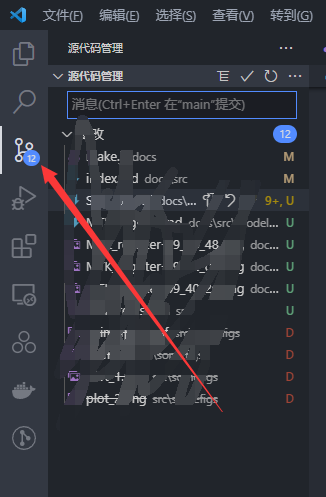
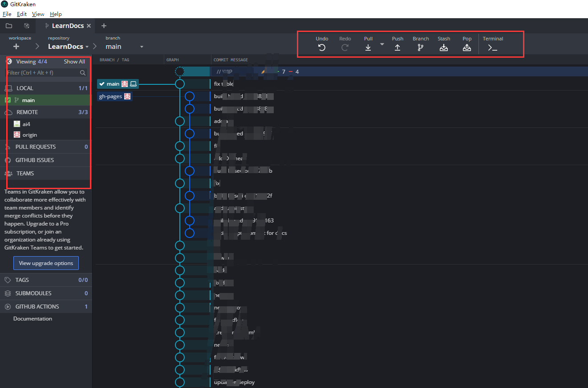

# SSH、Git与Git图形化软件

!!! tip
    Contents：SSH、Git与Git的图形化软件

    Contributor: YJY

    Email:522432938@qq.com

    如有错误，请批评指正。

本文介绍ssh、git与git的图形化软件。他们之间的关系为：

* git基于ssh通讯操作
* git图形化软件是操作git的图形化软件

## SSH使用

### SSH是什么

SSH是一种网络协议，用于计算机之间的加密登录。一个用户从本地计算机，使用SSH协议登录另一台远程计算机，就可以认为，这种登录是安全的，即使被中途截获，密码也不会泄露。


### SSH密钥登录原理

1. 客户端发出认证请求；
2. 服务器端使用客户端发送的公钥对一个随机的256位的字符串进行加密，并发送给 客户端；
3. 客户端使用私钥对字符串进行解密，并生成一个MD5值发送给服务器端；
4. 服务器端根据原始随机字符串生成MD5值进行匹配, 确认客户端身份；
5. 至此, 双方互相确认对方身份并建立加密信道, 可以正式进行安全通信。

### SSH的两种认证方式

* **1.基于口令的安全认证** ：提供正确的用户口令后可以登录远程服务器。

**操作方式**：

(默认端口为22)

```powershell
ssh user@host

example：
ssh root@127.0.0.1
ssh yjy@152.20.45.154
```

然后输入登录密码进行登录
使用p参数，可以修改端口

```powershell
ssh -p 端口号 user@host

example：
ssh -p 8080 yjy@152.20.45.154 
```

上面这个例子是以8080端口登录

* **2.基于密钥的安全认证** ：使用公钥和私钥对的方式对用户进行认证。

密钥登录首先需要产生**公钥**和**私钥**。

公钥放在服务端，私钥放在需要远程登录服务端的客户端

##### 产生公私钥

```powershell
ssh-keygen -t rsa
```

在~/.ssh文件夹（~为用户目录，windows和linux目录下都会有）下会出现id_rsa与id_rsa.pub两个文件。

**id_rsa是私钥，id_rsa.pub是公钥。**

### 修改配置文件

之后，在远程主机的ssh配置文件(/etc/ssh/sshd_config)中做如下修改，开启权限。这几项有些是新加上的，有些原来是no：

```powershell
RSAAuthentication yes
PubkeyAuthentication yes
AuthorizedKeysFile .ssh/authorized_keys
```

### 在服务端存放公钥

**方法一：**

将公钥中的一大串字符添加到服务端~/.ssh/authorized_keys文件中去，如果已经存在，那么在后面再添上一条。不建议覆盖，因为这样其它客户端远程登录的公钥就会被覆盖！

**方法二：**

也可以用一段代码自动加过去

```powershell
ssh root@111.20.45.124 "mkdir -p .ssh && cat >> .ssh/authorized_keys" < ~/.ssh/id_rsa.pub
```

这条命令由多个语句组成，依次分解开来看：

* （1）"$ ssh user@host"，表示登录远程主机；
* （2）单引号中的mkdir .ssh && cat >> .ssh/authorized_keys，表示登录后在远程shell上执行的命令：
* （3）"$ mkdir -p .ssh"的作用是，如果用户主目录中的.ssh目录不存在，就创建一个；
* （4）'cat >> .ssh/authorized_keys' < ~/.ssh/id_rsa.pub的作用是，将本地的公钥文件~/.ssh/id_rsa.pub，重定向追加到远程文件authorized_keys的末尾。

**写入authorized_keys文件后，公钥登录的设置就完成了**。

现在就可以远程免密登录了！

### 可能出现的问题

基本都是文件权限的问题，比如报错too open。Linux和Windows都会出现这样的情况，相关的解决方案很多，可以直接查找。

### 登录githup或者码云

用ssh怎么操作呢？

做一个转换，githup相当于就是服务端，只需要把公钥放在服务端就可以了。在githup上更加方便，因为它都是图形化软件操作。进入设置软件，选择ssh就可以进行调试了（码云同理）。

配置好了之后，可以进行如下测试：

```powershell
ssh -T git@githup.com
（ssh -T git@gitee.com）
```

## git的使用

### git和ssh的关联

之前讲了那么多ssh的知识，有什么作用呢？
会了ssh，git基本就会了一半了！

### git的关键要素

* 本地工作区（自己电脑的文件夹）
* 远程仓库（远端服务器上的文件夹）

### git基本操作

* 初始化本地仓库
* 从远端拉取
* 在本地编写文件
* 文件暂存
* 提交修改
* 提交到远程

**1.初始化本地仓库**

通过git bash或者cmd进入**仓库文件夹**
输入：

```powershell
git init
```

简单配置(相关教程也很多，不赘述)：

```powershell
git config user.name "Your Name"
git config user.email "email@example.com"
```

链接到仓库的地址，相当于后面的操作就不需要输入地址了：
（origin相当于变量，储存远端的地址）

```powershell
git remote add origin "仓库的ssh地址"
```

**2.从远端拉取**

拉取origin的master分支

```
git pull origin master
```

**3.本地编写文件**
编写hello.txt

**4.提交暂存**

```powershell
git add .
##或者
git add hello.txt
```

**5.提交修改**

```powershell
git commit -m "文件说明"
```

**6.推送到远端**

```
git push origin master
```

### git进阶操作

* 提交多个版本的文件
* 回退
  
**1. 提交多个版本的文件**
hello.txt 版本1：

```
i love you
```

提交暂存并修改

```powershell
git add hello.txt
git commit -m "first"
```

---
hello.txt 版本2：

```
i love you
I love you
```

提交暂存并修改

```powershell
git add hello.txt
git commit -m "second"
```

---
hello.txt 版本3：

```
i love you
I love you
I love you too much
```

提交暂存并修改

```powershell
git add hello.txt
git commit -m "third"
```

---
接下来查看日志：

```
git log
```

如图：


可以看到，HEAD 指向的是最新版本（head可以理解为当前版本，也就说如果要推到远程就是推这个版本）

**2.回退**
接下来回退到上一个版本：

```powershell
git reset --hard HEAD^ ##回退到上上个就是：HEAD^^
```


那么可以看到head确实变了

又不想回退了，还是要回到第三次改变的最新版本

```powershell
git reset --hard 3ed54(commid的id，只能这样操作)
```

**其实回退了之后就看不到id了，如果想要回到最新版本，就要记下id，所以说善变是有代价的！**

可以方便查看id与修改信息：

```
git log --pretty=oneline
```

**3.Push**
在善变之后，找到了真爱，不管是谁吧，反正证还是要领的。最后就是把文件推送到远端了。

```
git push origin master
```

## git图形化软件

git图形化软件的好处就是，把以上对git的操作图形化。

常用且免费的有：

* sourcetree
* vscode中内嵌的git操作页面
* gitkraken（团队版付费，个人免费）

### sourcetree示例

软件如下：


比如说clone：


某一个链接仓库的工作软件：


### vscode示例

  

更多操作见[vscode中使用git](../Tools/vscode_git.md)

### gitkraken示例

[gitkraken网址](https://www.gitkraken.com/)

  

不管什么软件，拉取、提交、暂存等等都是相同的！

**如果你明白git的操作原理了，那么这个无师自通，因为本质上sourcetree就是提供一个图形化的操作软件。再没有其它新鲜玩意了！**
