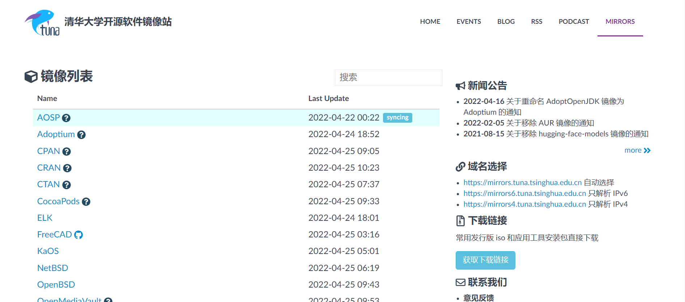
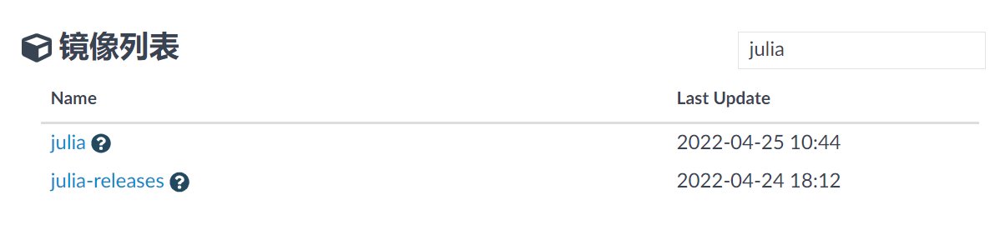
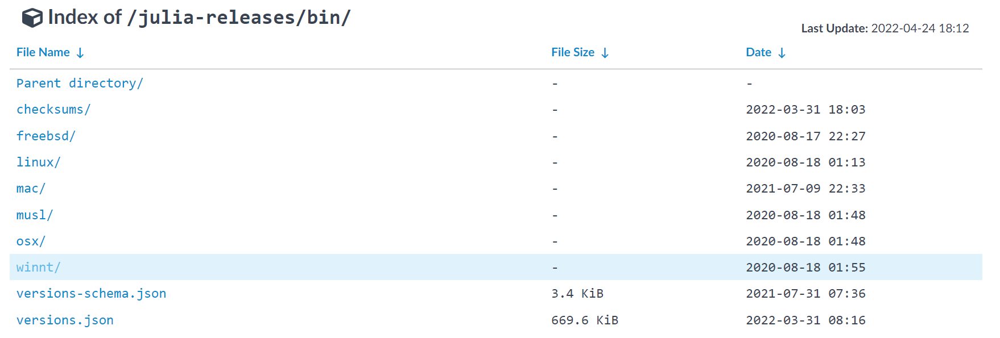
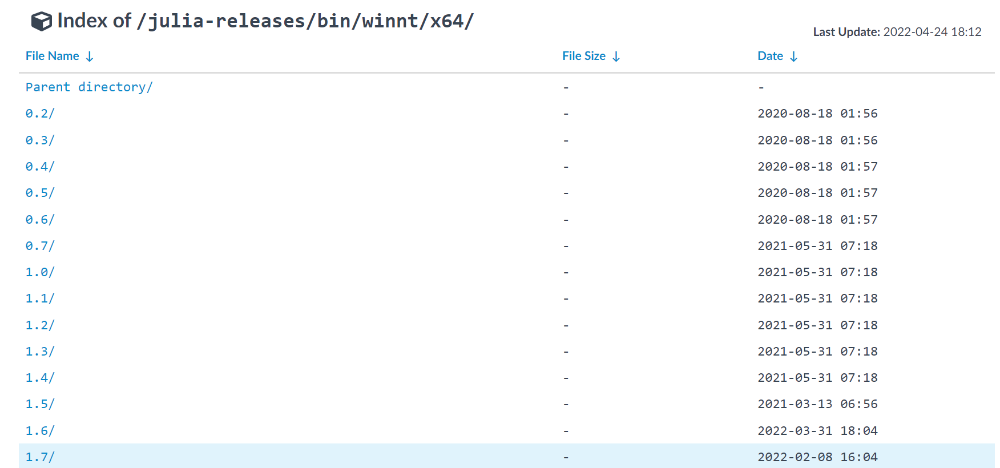
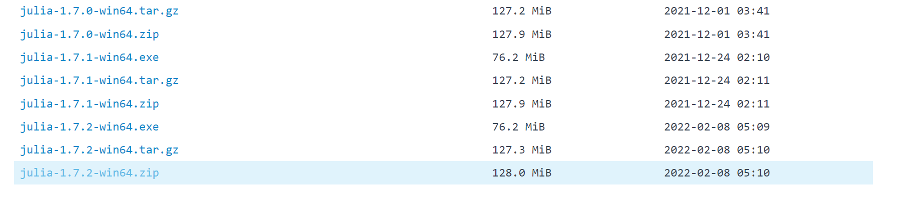
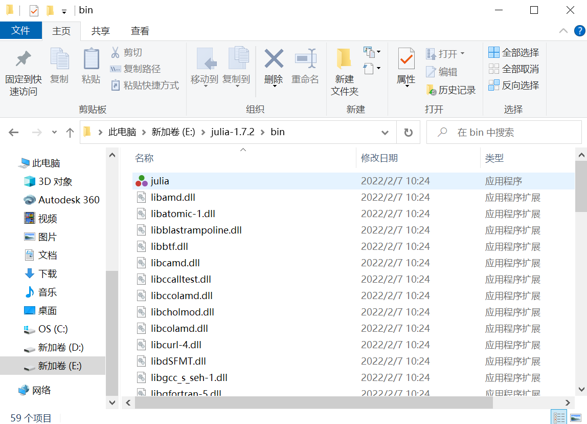

# Julia安装

!!! tip
    Contents：julia安装

    Contributor: 孙蓓蓓

    Email:

    如有错误，请批评指正。

## 下载网址

搜索[清华大学开源软件镜像站](https://mirrors.tuna.tsinghua.edu.cn/)。  

## 下载julia-1.7.2-win64.zip安装包

!!! note
    v1.7.2(Feb 6,2022)为julia当前稳定版本。

首先，在搜索框中搜索julia，点击julia-releases：

其次，点击bin/：

找到winnt/：

选择x64/：

然后，找到1.7版本系列：

最后，下拉找到julia-1.7.2-win64.zip安装包，点击下载。

## 解压安装

找到下载好的安装包，右键解压。解压后，生成一个julia-1.7.2文件夹。可执行文件julia.exe就在julia-1.7.2文件夹的bin文件夹下。

## 将路径加到环境变量中

在任务栏搜索框中找到“编辑系统环境变量”：

打开环境变量；在用户变量中选择变量Path，点击编辑；新建，将julia.exe文件所在路径复制进去，然后点击确定。

## 执行julia
在任务栏搜索框输入cmd，打开命令提示符，输入julia，此时julia就可以执行了。

按下快捷键"Ctrl+D"，再输入exit()，即可退出。

