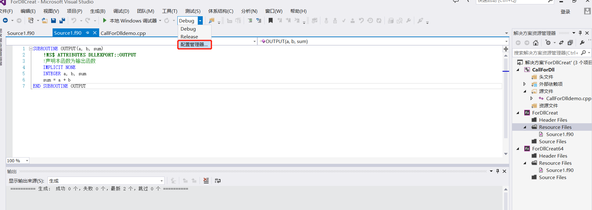
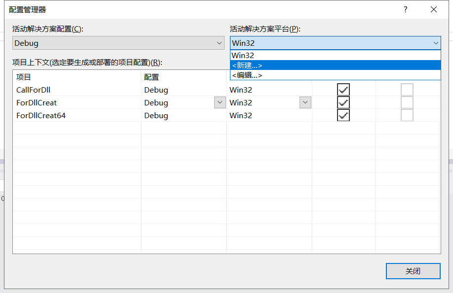
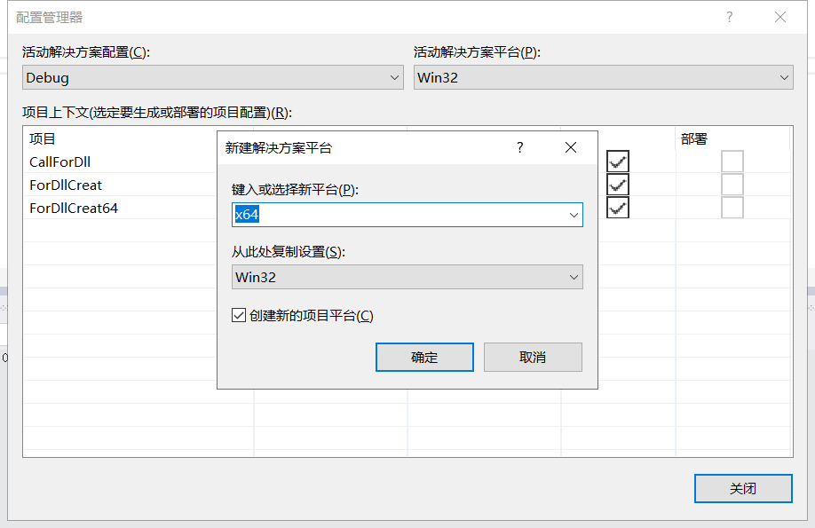
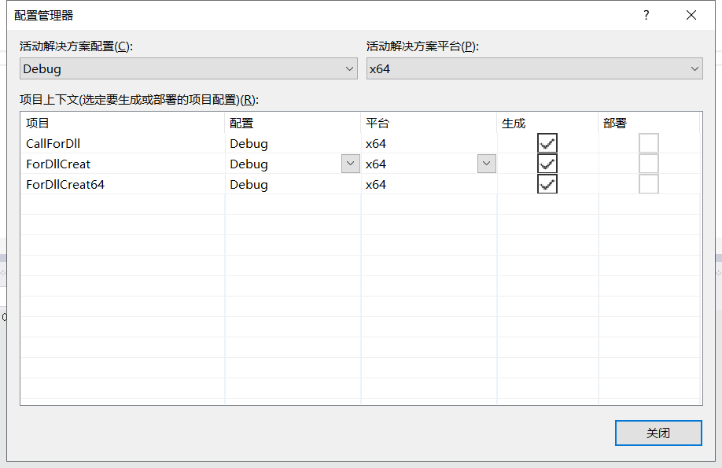
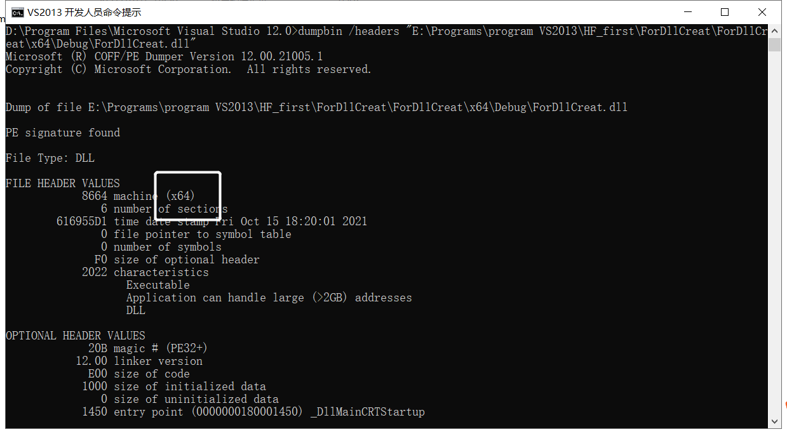
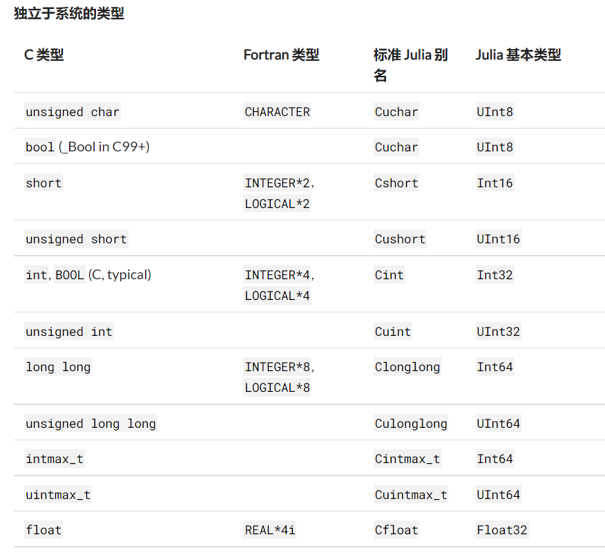

# 动态链接库(DLL)的生成与调用

!!! tip
    Contents：Julia调用Dll

    Contributor: 杨月宝

    Email:812987139@qq.com

    如有错误，请批评指正。

## 问题的产生与解决过程概述

热流问题数值计算课程的代码是2003年重新整理的Fortran代码。

通过Julia调用教学代码中的函数完成课程大作业。

Step1:生成Fortran dll，尝试用C语言调用dll。

Step2:通过C++调用dll，尝试用Julia调用dll。

Step3:配置VS2013，生成64位dll，使用Julia(64bit)调用dll。

## 工作环境

Julia 1.7.0-beta2

VS2013 Fortran编译器：Intel.Visual.Fortran.Composer.XE.2013-SP1

VSCode

## 内容说明

1.使用Fortran生成dll

2.使用VS2013开发人员命令提示查看dll位数

3.使用C++调用dll

4.使用Julia调用dll

## 1.使用Fortran生成dll

新建一个Fortran动态链接库项目


在Resource Files中添加一个f90文件，并输入如下内容

```Fortran
SUBROUTINE OUTPUT(a, b, sum)
    !MS$ ATTRIBUTES DLLEXPORT::OUTPUT
    !声明本函数为输出函数
    IMPLICIT NONE
    INTEGER a, b, sum
    sum = a + b
END SUBROUTINE OUTPUT
```

Fortran通过下句表示dll输出函数

```Fortran
!MS$ ATTRIBUTES DLLEXPORT::OUTPUT
```

配置编译器属性，选择64位的编译器来生成64位的dll






编译文件后生成项目，就可以在.\x64\Debug文件夹下找到生成的dll文件

## 使用VS2013开发人员命令提示查看dll位数

VS2013的工具路径在安装目录下

```txt
.\Microsoft Visual Studio 12.0\Common7\Tools\Shortcuts
```

选择VS2013开发人员命令提示，可以使用dumpbit命令获得dll信息

```txt
dumpbin /headers 路径
```

读取上段生成dll，部分结果：



## 3.使用C++调用dll

这里采用动态调用方法，根据网上找到的资料和Fortran程序设计课程讲义，我重新整理了C++代码。

这部分代码把那几个冒号去了就是C的代码。

调试或启动exe文件前，请将dll文件放于EXE文件所在的Debug文件夹内。我的是在E:\Programs\program VS2013\HF_first\ForDllCreat\x64\Debug

我的解决方案名和Fortran生成dll的方案同名了，请不要混淆。

```C++
#include <stdio.h>
#include <windows.h> // 调用 WINDOWS API 函数所需的头文件

typedef void(*Func)(int *, int *, int *);//定义一个函数指针类型，这个指针类型与被调用函数的输入类型要一一对应

int main()
{
 int a = 1, b = 2, sum;

 //宏定义函数指针类型
 HMODULE hLibrary = ::LoadLibrary(L"ForDLLCreat.dll"); //加载动态库文件，dll名前不加L会报错
 if (hLibrary == NULL)
 {
  printf("No DLL file exist!\n");
  return -1;
 }
 Func dllPro = (Func)::GetProcAddress(hLibrary, "OUTPUT");
 //获得 Fortran 导出函数的地址
 if (dllPro == NULL)
 {
  printf("Can not fine the address of the function!\n");
  return -2;
 }
 dllPro(&a, &b, &sum);
 printf("%d + %d = %d\n", a, b, sum);
 FreeLibrary(hLibrary); //卸载动态库文件
 return 0;
}
```

## 4.使用Julia调用dll

Julia官方文档地址：[Calling C and Fortran Code](https://docs.julialang.org/en/v1/manual/calling-c-and-fortran-code/)

在开始前，请务必确认Julia的位数与所用dll位数相同，否则会报错dll不是一个可用的Win32应用。

ForDllCreate.dll与ForDllCreate.64.dll内部包含和前文相同的函数，区别是前者是32位，后者是64位。
在64位REPL上载入32位dll会报错。

```
ERROR: LoadError: could not load library "e:\yyb\HF_first\ForDllCreat.dll"
%1 is not a valid Win32 application.
Stacktrace:
 [1] top-level scope
   @ e:\yyb\HF_first\test.jl:15
in expression starting at e:\yyb\HF_first\test.jl:15
```

先贴上示例。

```julia
#error
a=[1]
b=[2]
c=[0]
ccall((:OUTPUT, ".\\ForDllCreat.dll"),Cvoid,(Ptr{Cint},Ptr{Cint},Ptr{Cint}),pointer_(a),pointer(b),pointer(c))
print(c)

#work
a=[1]
b=[2]
c=[0]
ccall((:OUTPUT, ".\\ForDllCreat64.dll"),Cvoid,(Ptr{Cint},Ptr{Cint},Ptr{Cint}),pointer_from_objref(a)+0x40,pointer_from_objref(b)+0x40,pointer_from_objref(c)+0x40)
print(c)
```

Julia可用通过ccall函数调用C和Fortran编译的dll文件，输入格式为

```txt
  ccall((function_name, library), returntype, (argtype1, ...), argvalue1, ...)
  ccall(function_name, returntype, (argtype1, ...), argvalue1, ...)  
  ccall(function_pointer, returntype, (argtype1, ...), argvalue1, ...)
```

这里通过第一种调用方法来调用我们编译的ForDllCreat64.dll，

function_name是调用的函数名称。引用时即可以用:OUTPUT表示，也可以用"OUTPUT"表示。

C语言与Fortran输出dll时函数名不变，C++输出函数有命名粉碎，自制dll尽量采用C输出，一定要确定被调用函数的名字才能成功引用。[可看此视频](https://www.bilibili.com/video/BV1dW411G7hL)

library是被调用dll的路径，用字符串表示。调用C标准库中的函数时，library可以略去。

```julia
#调用C标准库函数，不用写引用
t = ccall(:clock, Int32, ())
```

returntype是被调函数的返回类型。Fortran的subroutine返回类型是空，即void，在Julia中表示为Cvoid。数据类型对应的表格可以参考下文表格，也可以查看官方文档。

(argtype1, ...)是一个tuple，与被调函数的输入变量类型要一一对应，类似在C++中定义一个与被调函数输入变量类型一一对应的函数原型。

argvalue1, ...  这部分是输入变量，类型要与(argtype1, ...)一一对应，并与被调函数对应。输入变量不用tuple表示。

不同语言间调用dll，最重要的就是数据类型的匹配。下表是[从Julia官方文档中复制的数据类型对应表](https://docs.juliacn.com/latest/manual/calling-c-and-fortran-code/)。更多细节请查看官方文档。

  

## Julia中指针的用法

**此处有不明点，请实践时小心处理**。

数组类型基本上通过指针传递。

Julia中，指针有两种，Ptr{T}与Ref{T}

Ptr表示的是从变量获得的地址，这类地址是否被销毁不由Julia管理，一般是“危险的”（unsafe)。

Ref是由Julia分配的地址，这类地址的任何更改都由Julia进行，因此是“安全的”。

但是Ref能用的方法似乎不多，目前为止我没学明白这个怎么用。

Julia中获得变量地址的函数有pointer和pointer_form_objref，他们获得的指针都是Ptr型的
pointer获得的地址被标明了数据类型，并且总比pointer_form_objref的返回值多出一个数据类型的bit数；pointer_form_objref获得的地址是无数据类型的。
在官方文档中，pointer_from_objref是对C提供接口的方法([C_Interface](https://docs.julialang.org/en/v1/base/c/))

```julia
a="大家好"
b=pointer(a)
c=pointer_from_objref(a)
println(b)
println(c)
println(b-c)

println("a[1]的字节数是",sizeof(typeof(a[1])))#UInt8的字节数是1,但是Char类型的字节数是4
```
由地址获得值的方法是unsafe_pointer_to_objref，这个函数也是官方文档中C接口的函数。

对一个Ptr指针，用pointer获得的指针要减去一个数据类型的bit数才能获得指针内的值。

```julia
a=[1.23]

b=pointer(a)
c=pointer_from_objref(a)

d=unsafe_pointer_to_objref(b-0x40)
e=unsafe_pointer_to_objref(c)

println("d=",d)
println("e=",e)
```
