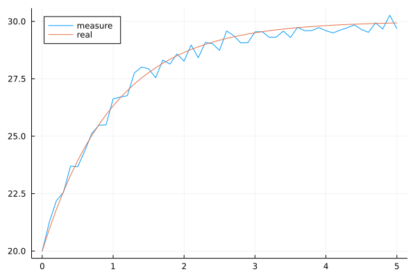
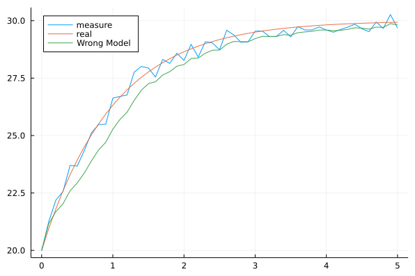
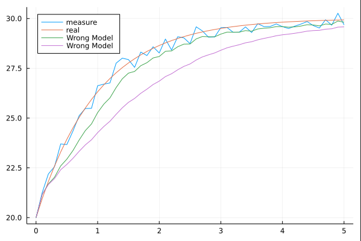

# 卡尔曼滤波理论与应用

!!! tip
    Contents：卡尔曼滤波(Kalman Filtering)

    Contributor: YJY

    Email:522432938@qq.com

    如有错误，请批评指正。

!!! note

    一篇[卡尔曼滤波的英文博客](http://www.bzarg.com/p/how-a-kalman-filter-works-in-pictures/)，兼具理论与感性认识。

    上述博客的[中文翻译](https://blog.csdn.net/u010720661/article/details/63253509)版本

## 卡尔曼滤波介绍

一句简单的话概括卡尔曼滤波：综合考虑**模型计算值**与**实际测量值**，估计动态系统中**状态**的真实值。

对这句概括的话，提出2个问题：

* 为什么要综合考虑模型计算值和实际测量值？
* 如何综合考虑？

对于问题1，有2个事实：

1. **模型**不是准确的。例如，欧姆定律中，电阻值真的是一个常数吗？基础模型尚且如此，更不用说复杂系统的模型了。所以，描述系统的模型，一定是有偏差的。
2. **测量值**不代表真实值。通过各种仪表读数时，读出来的数不能代表真实值，读数时会有各种随机误差。

所以，Kalman觉得可以结合模型计算值与观测值，对状态的真实值进行估计。

对于问题2：

综合考虑的方式为：先通过状态空间方程的计算出结果，再对结合误差对结果进行修正。由此可见，卡尔曼滤波是控制学与统计学的交叉学科方法。

## 卡尔曼滤波的数学表达

只给结论，不推导。

```math
\left\{\begin{array}{l}
x_{k}=F_{k-1} x_{k-1}+\Gamma_{k-1} w_{k-1} \\
z_{k}=H_{k} x_{k}+v_{k}
\end{array}\right.
```

其中：

* 下表$k$代表$k$时刻
* 系统状态向量——$x_k$（行向量）
* 系统状态转移矩阵——$F_k$，如果在时间域上不变则为——$F$
* 模型噪声——$w_k$
* 模型噪声矩阵（描述噪声对变量的影响）——$\Gamma_k$（行向量）
* 系统量的测向量——$z_k$
* 量测矩阵——$H_k$（行向量）
* 模型噪声——$v_k$

同时，噪声满足正态分布：

$$w_k \sim N(0,Q_k) \\ v_k \sim N(0,R_k)$$

下面为卡尔曼滤波的滤波过程:

Step1 模型计算:

```math
x_{k}=F_{k-1} x_{k-1}\\
P_{k}=F_{k-1} P_{k-1} F_{k-1}^{T}+\Gamma_{k-1} Q_{k-1} \Gamma_{k-1}^{T}
```

Step2 滤波:

```math
G_{k}=P_{k } H_{k}^{T}\left[H_{k} P_{k} H_{k}^{T}+R_{k}\right]^{-1}\\
\hat{x}_{k}=x_{k}+G_{k}(\tilde{z}_{k} - H_{k}x_{k})\\
\hat{P}_k = (I-G_kH_k)P_k
```

其中：

* 系统的量测的协方差矩阵——$P$
* 滤波后的系统状态向量——$\hat{x}_{k}$
* 滤波后的系统状态向量——$\hat{x}_{k}$
* 模型噪声的方差——$Q_k$，如果在时间域上不变则为——$Q$
* 测量噪声的方差——$R_k$，如果在时间域上不变则为——$R$
* 滤波后的系统的量测的协方差矩阵——$\hat{P}_{k}$
* 测量值向量——$\tilde{z}_{k}$
* 模型噪声——$v_k$

## 卡尔曼滤波实例

考虑加热器：$$\frac{dT}{dt} = -(T-20) + 10$$
即散热系数为1，加热功率为10，环境温度为20。

使用DifferentialEquations.jl获得仿真数据并加上扰动。

```julia
using DifferentialEquations
using Statistics, Plots

f(u, t, p) = -(u - 20) + 10

prob = ODEProblem(f, 20.0, (0, 5))

sol = solve(prob, saveat=0.1)
noise = rand(-0.5:0.0001:0.5, length(sol.u))
cov(noise)

measureT = noise + sol.u
t = collect(0:0.1:5)
plot(t, measureT, label="measure", legend_position=:topleft)
plot!(t, sol.u, label="real", legend_position=:topleft)
```

获得的`measureT`将作为未来每个时间点上的温度测量数据（实际为精确解加随机误差生成的数据）。真实值与测量值如下图。

  

若取$dt=0.1$，使用欧拉法离散，则上述微分则转变为状态空间方程：$$T_{k+1} = 0.9T_k+3$$

若采用上述状态空间方程，则可以称之为“完美模型”。

为了验证卡尔曼滤波的有效性，我们设计一个十分错误的模型：$$T_{k+1} = T_k$$

即，我们认为这是一个温度不变的系统（错得不能再错的模型）。同时，给一个比较大的$Q_w$，说明模型扰动的方差比较大。

```julia
begin
    F = 1
    Γ = 0.1
    H = 1
    Qv = 0.8
    Qw = 10

    P = 10
    x = 20.0

    x_res = zeros(1, length(measureT))
    p_res = zeros(1, length(measureT))

    p_res[:, 1] = [P]
    x_res[:, 1] = [x]

    for i in 1:length(measureT)-1
        _P = F * p_res[1, i] * F' .+ Γ' * Qw * Γ
        _G = _P * H * inv(H * _P * H + Qv)
        _x = F * x_res[1, i]
        global x_res[1, i+1] = _x + _G * (measureT[i+1] - H' * _x)
        global p_res[1, i+1] = (1 - _G' * H) * _P
    end

    plot!(t, x_res[1, :], label="Wrong Model", legend_position=:topleft)
end
```

 

结果显示，居然和真实值差不多。如果令$Q_w=1$，给得比较小。则变成了：

  

没那么好，但也不差（比直线好太多了）。

如果把模型设置成原本的模型则:

```julia
begin
    F = 0.9
    Γ = 0.1
    H = 1
    Qv = 0.8
    Qw = 10

    P = 10
    x = 20.0

    x_res = zeros(1, length(measureT))
    p_res = zeros(1, length(measureT))

    p_res[:, 1] = [P]
    x_res[:, 1] = [x]

    for i in 1:length(measureT)-1
        _P = F * p_res[1, i] * F' .+ Γ' * Qw * Γ
        _G = _P * H * inv(H * _P * H + Qv)
        _x = F * x_res[1, i] + 3
        global x_res[1, i+1] = _x + _G * (measureT[i+1] - H' * _x)
        global p_res[1, i+1] = (1 - _G' * H) * _P
    end

    plot!(t, x_res[1, :], label="Right Model", legend_position=:topleft)
end
```

  

基本就一致了。

## 小结

卡尔曼滤波的重要意义是利用了测量值带来的信息。模型不准确的时候，利用滤波带来的效果，可以对模型进行一个矫正。

但它的缺点在于，对预测没有帮助。对未来的多点预测只能是通过模型。既然是预测，说明事情还没有发生，那测量值无法获得，也就无法通过测量值进行矫正。

其特点是，对已经发生的事情做一个优化，而不能提升预测未来的能力。
