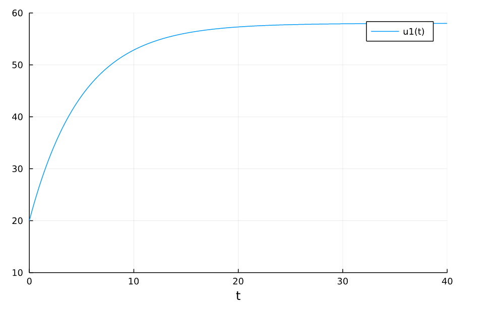
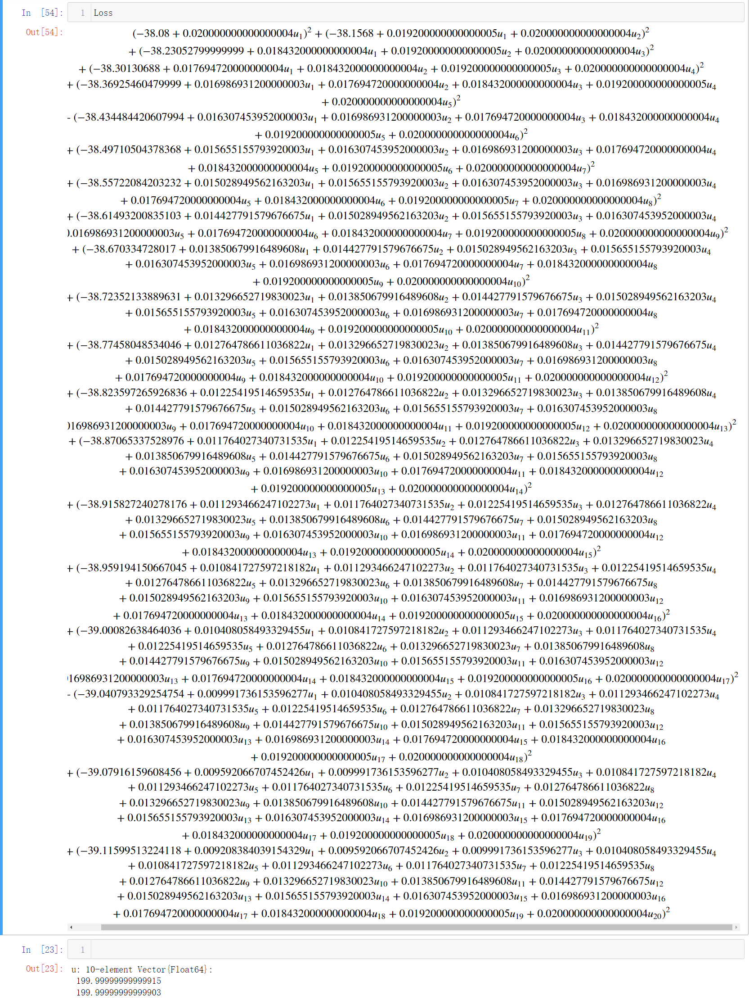
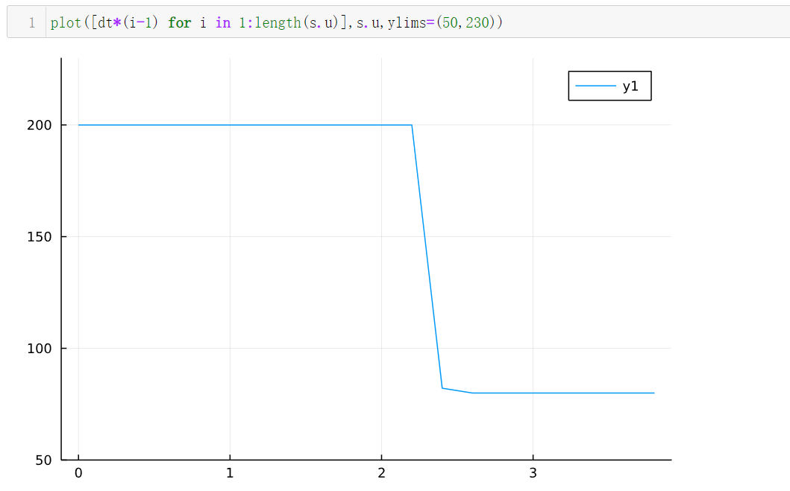

# MTK求解MPC问题

!!! tip
    Contents：MTK、Control

    Contributor: YJY

    Email:522432938@qq.com

    如有错误，请批评指正。

!!! note

    MPC = Model Predict Control

    MTK = ModelingToolkit.jl

    [OptimizationSystem](https://mtk.sciml.ai/stable/tutorials/optimization/)为MTK中的系统类型之一

## MTK中的ControlSystem

在ModellingToolkit的Optimal Control中，有关于ControlSystem的描述。但经过实验测试，ControlSystem并不能很好地求解“过程控制量”的值。

因为MTK使用runge_kutta_discretize（龙格库塔离散）函数将问题离散。问题离散后，传入OptimizationSystem，而OptimizationSystem目前有一个缺陷——不能接受问题的约束。所以，即使用龙格库塔离散离散出控制过程中的多个状态量，在变量没有约束时，优化结果没有意义。（离散的概念在[微分方程参数辨识](../Optimization/DE_Estim.md)中有提及）
在实例过后，这一点会有清晰的体现。

## MTK中的OptimizationSystem

为了简单起见，手动构建一个MPC优化问题，通过OptimizationSystem来求解。通过构建优化目标方程，调用不同优化器求解该优化问题。那么从控制问题到优化问题这一过程可以看成是手动离散。相当于自己实现了runge_kutta_discretize。构建完优化问题，就可以直接把它推给OptimizationProblem求解，这是可以做到的。

**上述过程的核心就是把控制中的状态量手写出来**。

可行的做法是，**通过MTK符号建模体系建立优化变量，同时构建Loss方程关于优化变量的符号表达。通过OptimizationSystem生成用符号体系构建的优化问题，把构建的OptimizationSystem推给OptimizationProblem，最后选择合适的求解器求解**。

## 实例：加热器问题

### 问题描述

现在有一个物体加热，它的温度由加热项和散热项决定。α是散热系数，β是加热系数，环境温度为$T_{out}$。那么控制方程: 

$$T' = α*(T_{out} - T) + β*Q(t)$$

现在可以改变加热功率，那么我们构建一个优化问题：调节加热功率，使得物体的温度从$T_{0}$开始，迅速上升并且稳定在某一个温度（比如说58℃）。问题的数学表达为，通过优化控制变量$Q(t)$ 使得损失函数最小:

$$Loss = \sum_{i} ||58.0-T(t_i)||$$

而$Q(t_i)$就是未来一段时间域内，不同时间点上的控制量（控制科学中称为状态量）。通过改变这些值，能够控制温度的走势，这是控制的内涵。若使温度达到一个让人满意的状态（这里是维持在58℃，也可以是使温度线性上升等等），这是最优控制的内涵。

**所以，最优控制或者模型预测控制最根本的数学内涵是优化——多变量优化**。这也是为什么能用OptimizationProblem来处理控制问题。

### 构建问题

首先明确问题。现在假设以一个恒定功率（p=80）加热物体，环境温度18℃，初始温度20℃,散热系数α = 0.2,加热系数β = 0.1。先求解该问题。

```julia
using Plots,DifferentialEquations
Tout = 18.0
α = 0.2
β = 0.1
f(x,p,t) = α*(Tout - x) + β*p
tspan=(0.0,40.0)
u0 = 20.0
p = 80.0
pr = ODEProblem(f,u0,tspan,p)
sol = solve(pr)
plot(sol,ylimit=(10,60))
```

得到的结果是：
  

很清晰可以看到，温度缓慢上升最后稳定在58℃。那么作为我们拍脑袋的控制策略来说，这个控制问题很简单。**我们可以先让功率在前期比较大（比如说150），等温度到了58℃附近，再把功率调回80**，就可以实现“温度迅速上升并最后稳定在58度”。

### 优化求解

```julia
using Symbolics,ModelingToolkit,GalacticOptim,Optim
N = 20
Tout = 18.0
T0 = 20.0
dt = 4/N
Loss = 0.0
T = T0
α = 0.2
β = 0.1
@variables u[1:N]
for i = 1:N
    global T = T + (α*(Tout - T) + β*u[i])*dt
    global Loss += (T - 58.0)^2
end
```

u是符号量，离散的个数为N，上面选择离散为20个变量。通过一个for循环，就可以迭代求解20个点上的温度值并且构建Loss方程。**这里的20个变量，就是控制的核心，通过改变这20个不同时间点上的控制量（加热功率）的值，使得被控量（温度）接近“更好、更快”地接近目标——58℃**。

可以看到Loss方程的结果：

  

有些许复杂，但在情理之中。

```julia
@named sys = OptimizationSystem(Loss,[u[i] for i in 1:N],[],inequality_constraints=inequ)
u0 = [u[i] => 1.0 for i in 1:N]
lb = [0.0 for i in 1:N]
ub = [200.0 for i in 1:N]
prob = OptimizationProblem(sys,u0,[],lb = lb,ub = ub,grad=true,hess=true)
s = solve(prob,Optim.LBFGS())
```

然后构建System和OptimizationProblem，给定上下限。这里功率上限设为200，最后求解！

结果为：

```julia
u: 20-element Vector{Float64}:
 199.99999999999997
 199.99999999999997
 199.99999999999997
 199.99999999999997
 199.99999999999997
 199.99999999999997
 199.99999999999997
 199.99999999999994
 199.99999999999991
 199.9999999999999
 199.99999999999957
 199.99999999996504
  82.18673442597857
  79.99995550035416
  80.0000502201614
  79.99991729083732
  80.00001272875645
  80.00004827285969
  79.99999940246633
  79.99997217751334
```

  

应该说是非常理想的。和我们设想的一样。先以最大功率加热到58℃附近，然后迅速将到稳态维持58℃的功率80，这样2s就完成了控制过程，而之前以恒定功率80加热，耗费了20s!

---

从图中可以很容易看出局限性，加热功率先猛加，以最高限度200直接加热到58，然后功率在恒定在80维持恒温58摄氏度。这种直上直下的调节，很显然不那么让人满意。可以想象，假如不给变量设置上下限，那么优化的结果一定是：第一个离散的变量加热功率上万，相当于在**一瞬间使用超大且精准的功率把温度加到58摄氏度**。第二个往后的状态量为80——维持恒温58摄氏度的加热功率。

这在数学上是合理的，在实际中却没有意义。所以在控制中一般需要加一些约束，比如加热功率上下限、加热功率变化幅度。

所以，为了处理约束，可以[使用JuMP来做MPC](./JuMPMPC.md)。
