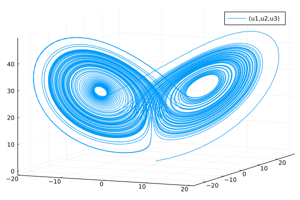
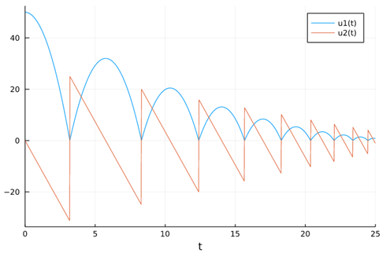

# DifferentialEquations建模方法

!!! tip
    Contents：建模、DE

    Contributor: YJY

    Email:522432938@qq.com

    如有错误，请批评指正。

!!! note

    DE = DifferentialEquations.jl

    [DifferentialEquations.jl](https://diffeq.sciml.ai/dev/)为处理时间微分的求解建模工具包。

## 浅谈建模内涵

在研究各类系统时（上至电力、能源系统、交通系统，下至RC电路、水利管网系统），当我们需要对系统进行处理时，我们都会一件相同的事情——把系统抽象成我们能够处理的对象！

从发现问题到获得计算结果，在现代计算科学中一般分为两步：

1. 把问题抽象可量化、可处理的数学问题
2. 把数学问题设计成可用计算机处理与计算的可计算问题

在这个过程中，大脑在这个过程充当了“解释器”的角色。把实际的问题层层抽象，最后让问题变得可计算。不得不感叹，人类“编译”能力之强大。也许人类在计算速度上远远不及计算机。但在深度与广度层面，远远超过计算机。

从前牛顿等巨人的时代开始，科学家研究的主体内容，主要是是第一步的内容。近40年，计算机科学技术呈爆炸式增长。依托于计算机，社会生产的智能化日益提高。于是基于第2步的问题也发展出许多学科分支，作为科研领域重要的方向之一。

不经让人感叹，“啥都不会，就是能算”也是一种不容小觑的能力！

言归正传，在第一步中，描述对象的数学形式有微分方程（组）、代数方程（组）、图等等。针对对象进行计算的数学形式有求解方程问题、寻优问题、计算图等等。DifferentialEquations.jl就是处理基于时间微分的微分方程（组）求解软件包！

## DE使用实例

现有洛伦兹方程为例：

```math
\frac{dx}{dt}  = \sigma(x+y) \\ \frac{dy}{dt}  = x(\rho-z)-y \\ \frac{dz}{dt} = xy - \beta z
```

微分方程在DifferentialEquations.jl中含有5个要素：

* 方程描述
* 求解时间域
* 初值（边界条件）
* 方程参数
* 问题类型

---

在方程定义中，有4个参数：

```julia
function lorenz!(du,u,p,t)
    du[1] = p[1]*(u[2]-u[1])
    du[2] = u[1]*(p[2]-u[3]) - u[2]
    du[3] = u[1]*u[2] - p[3]*u[3]
end
```

其中，

* du为微分变量向量
* u为变量向量
* p为参数
* t为时间变量

---

剩下要素的定义：

```julia
p = [10.0,28.0,8/3]
u0 = [1.0;0.0;0.0]
tspan = (0.0,100.0)
prob = ODEProblem(lorenz!,u0,tspan,p)
```

其中，

* p为参数
* u0变量的初始值
* tspan为求解时间域
* prob为通过方法ODEProblem()定义的ODE问题

!!! tip
    ODEProblem = Ordinary Differential Equations Problem(常微分方程)

    ```math
    \begin{array}{l}
    \frac{d x}{d t}=\sigma(y-x) \\
    \frac{d y}{d t}=x(\rho-z)-y \\
    \frac{d z}{d t}=x y-\beta z
    \end{array}
    ```

    除此之外，还有：

    DAEProblem = Differential Algebraic Equations Problem（微分代数方程）

    ```math
    \begin{aligned}\frac{d y_{1}}{d t} &=-0.04 y_{1}+10^{4} y_{2} y_{3} \\\frac{d y_{2}}{d t} &=0.04 y_{1}-10^{4} y_{2} y_{3}-3 * 10^{7} y_{2}^{2} \\1 &=y_{1}+y_{2}+y_{3}\end{aligned}
    ```

    DDEProblem = Delay Differential Equations Problem（随机微分）

    ```math
    \begin{aligned}
    d x_{0} &=\frac{v_{0}}{1+\beta_{0}\left(x_{2}(t-\tau)\right)^{2}}\left(p_{0}-q_{0}\right) x_{0}(t)-d_{0} x_{0}(t) \\d x_{1} &=\frac{v_{0}}{1+\beta_{0}\left(x_{2}(t-\tau)\right)^{2}}\left(1-p_{0}+q_{0}\right) x_{0}(t) \\&+\frac{v_{1}}{1+\beta_{1}\left(x_{2}(t-\tau)\right)^{2}}\left(p_{1}-q_{1}\right) x_{1}(t)-d_{1} x_{1}(t) \\d x_{2} &=\frac{v_{1}}{1+\beta_{1}\left(x_{2}(t-\tau)\right)^{2}}\left(1-p_{1}+q_{1}\right) x_{1}(t)-d_{2} x_{2}(t)\end{aligned}
    ```

    更多方程种类可查官方文档。

---

求解并画图

```julia
sol = solve(prob, Tsit5())
plot(sol,vars=(1,2,3))
```

  


全部代码：

```julia
using DifferentialEquations,Plots
function lorenz!(du,u,p,t)
        du[1] = p[1]*(u[2]-u[1])
        du[2] = u[1]*(p[2]-u[3]) - u[2]
        du[3] = u[1]*u[2] - p[3]*u[3]
end
p = [10.0,28.0,8/3]
u0 = [1.0;0.0;0.0]
tspan = (0.0,100.0)
prob = ODEProblem(lorenz!,u0,tspan,p)
sol = solve(prob, Tsit5())
plot(sol,vars=(1,2,3))
```

---

## DE的Callback特性

Callback的含义为，当系统运行到某个状态时，人为介入改变系统参量的值，随后继续求解。

下面以弹球系统为例，介绍Callback的用法。

弹球系统的特点是，当弹球碰到地面时，需要弹起。所以在模拟弹球系统时，需要考虑求解过程中速度的方法变化，这时候就用到callback。碰地的数学的描述为，弹球速度变量变为它的相反数。也就是说当弹球高度$x$变为0时，速度$u$需要变成$-u$。

其数学表达为：

```math
x' = v \\ v' = -g
```

---

DE问题构建：

```julia
function f(du,u,p,t)
    du[1] = u[2]
    du[2] = -p
end
```

其中，
* u1为x，即弹球高度
* u2为v，即弹球速度

---

建立Callback函数：

```julia
function condition(u,t,integrator) # Event when event_f(u,t) == 0
    u[1]
end
function affect!(integrator)
integrator.u[2] = -integrator.u[2]
end
cb = ContinuousCallback(condition,affect!)
```

`condition`为系统调用callback时应该满足的条件，默认为函数返回值为0（false）时的情况。即`u[1]=0`。
`affect!`为系统调用callback时的处理动作，这里为将速度变负。

---

定义剩余要素并求解，**在solve中需要传递callback**。

```julia
u0 = [50.0,0.0]
tspan = (0.0,15.0)
p = 9.8
prob = ODEProblem(f,u0,tspan,p)
sol = solve(prob,Tsit5(),callback=cb)
plot(sol)
```

可以得到如下结果：


---

如果考虑反弹损失（每次反弹速度损失20%）：

```julia
function affect!(integrator)
integrator.u[2] = -integrator.u[2]*0.8
end
```

  

也能够得到相应的结果，妙啊！！！

全部代码：

```julia
using DifferentialEquations,Plots
function f(du, u, p, t)
    du[1] = u[2]
    du[2] = -p
end
function condition(u, t, integrator) # Event when event_f(u,t) == 0
    u[1]
end
function affect!(integrator)
    integrator.u[2] = -integrator.u[2]
end
cb = ContinuousCallback(condition, affect!)
u0 = [50.0, 0.0]
tspan = (0.0, 15.0)
p = 9.8
prob = ODEProblem(f, u0, tspan, p)
sol = solve(prob, Tsit5(), callback=cb)
plot(sol)
```

!!! tip
    DE中有许多特性，例如求解结果的处理（Solution Handle）、回调函数（Callback）等等。更多特性可以在官方文档中查看。
