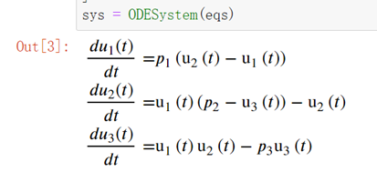
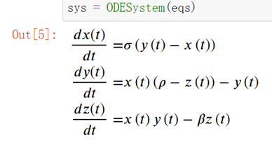

# ModelingToolkit建模方法

!!! tip
    Contents：建模、MTK

    Contributor: YJY

    Email:522432938@qq.com

    如有错误，请批评指正。

!!! note

    MTK = ModelingToolkit.jl

    [ModelingToolkit.jl](https://mtk.sciml.ai/stable/)为基于符号系统的建模工具包。

## 符号计算内涵

符号计算的内涵很简单，其本质就是处理、简化方程的未知数。例如:
$$(x+y)z = xy + yz$$
又例如:
$$\frac{dy}{dt} = 2t => y = t^2 + C $$
它们本质上都是数学符号的推演，而没有涉及到数字的计算。

一般的情况下，可以计算问题都是人为地把计算推演到数字计算的层面，中间的符号推演、化简的过程都不由计算机处理。随着计算机能力的日益强大，以及计算理论的发展。计算机也能开始进行符号计算。

例如，$(x+y)z = xy + yz$就完全能由计算机计算并得到结果。

MTK，就是这样一种符号计算包。在DE中，我们构建的是方程（function），通过方程来建立模型。而在MTK中，我们构建的是符号，通过符号建立模型。

## MTK符号计算实例

考虑洛伦兹方程：

```math
\frac{dx}{dt}  = \sigma(x+y) \\ \frac{dy}{dt}  = x(\rho-z)-y \\ \frac{dz}{dt} = xy - \beta z
```

---

通过MTK构建：

```julia
@variables t u[1:3](t)
@parameters p[1:3]
D = Differential(t)
eqs =[
    D(u[1]) ~ p[1]*(u[2]-u[1])
    D(u[2]) ~ u[1]*(p[2]-u[3]) - u[2]
    D(u[3]) ~ u[1]*u[2] - p[3]*u[3]
]
Sys = ODESystem(eqs)
```

其中：

* t是时间变量
* u是关于时间的依赖变量向量
* 参数向量p
* 微分符号D
* eqs本质是一个描述符号方程的数组

@variables定义了符号变量，@parameters p[1:3]定义了参数。方程由ODESystem结构体储存，可以看到其中描述“=”的符号为“~”。这些表明，上述代码在处理符号，这是一套符号描述体系！

  

---

因为是处理符号时，当然也可以更加具象，将符号定义为$x,y,z$

```julia
@variables t x(t) y(t) z(t)
@parameters  σ ρ β
D = Differential(t)
eqs =[
    D(x) ~ σ*(y-x)
    D(y) ~ x*(ρ-z) - y
    D(z) ~ x*y - β*z
]
sys = ODESystem(eqs)
```

  

由于符号运算的展现形式更加贴近自然语言，我们几乎可以不加处理地建立与原数学方程几乎一样的符号方程描述，这是符号计算的优势之一。

---

在明确MTK的系统构建之后，与DifferentialEquations一样，最后需要明确定义的问题以及初值等要素。

```julia
tspan = (0.0,100.0)
u0 =[
    x => 1.0
    y => 0.0
    z => 0.0
]
p=[
    σ => 10.0
    ρ => 28.0
    β => 8/3
]
prob = ODEProblem(sys,u0,tspan,p)
sol = solve(prob,Tsit5())
```

与DE不同是，MTK传值时需要指定具体变量（参数的值）。
最后能得到与DE计算同样的结果。

---

全部代码：

```julia
using ModelingToolkit
using DifferentialEquations
@variables t x(t) y(t) z(t)
@parameters  σ ρ β
D = Differential(t)
eqs =[
    D(x) ~ σ*(y-x)
    D(y) ~ x*(ρ-z) - y
    D(z) ~ x*y - β*z
]
@named sys = ODESystem(eqs)
tspan = (0.0,10.0)
u0 =[
    x => 1.0
    y => 0.0
    z => 0.0
]
p=[
    σ => 10.0
    ρ => 28.0
    β => 8/3
]
prob = ODEProblem(sys,u0,tspan,p)
sol = solve(prob,Tsit5())
```

---

## DE与MTK的对比

同一问题，可用MTK与DE来求解。但它们并不完全等价，异同是客观存在的：

* 不同之处：
    ModelingToolkit基于符号体系描述问题，等价于在DifferentialEquations问题描述的上层添加了一层符号系统，通过求解符号系统之后，能得到真正的微分方程问题。

* 相同之处：
    它们最终得到的问题形式是一样的，比如说最终都会生成ODEProblem，也就是说它们可以通过同一个求解器求解。

MTK凭借着符号计算，在模型建立时会更加方便，更加友好。符号推演功能相当于减轻了模型构造时的工作量，即在数学模型到计算机可计算的模型这个过程中，计算机又往前前进了一步。所以，MTK从某种程度上来说会比DE好用很多。

从另一个角度来看，DE是MTK的底层求解器，意味着其比MTK更加直接，速度更快。MTK在DE基础之上构建了符号计算系统，其形式与功能上让人惊叹。但要明白的是，这种提供便捷的符号计算系统是要使用资源的，MTK需要花费更多资源去计算、化简符号。好用意味着大量的资源消耗在用户友好方面，效率高意味着资源消耗在真正的问题解决上。这是软件发展过程中始终存在的矛盾。

!!! note

    就像Linux与Windows一样。大家在开发环境中都愿意用Windows，但在服务器端都用的是Linux。也像是Python与C之间的矛盾。Python代码易用，但运行效率却远远比不上C代码。

关于DE与MTK的取舍，根据问题的特性选择即可。

此外，MTK的符号系统还有更大的妙用，在后面的章节中会逐渐展开。
