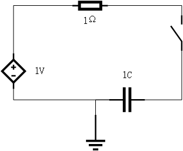
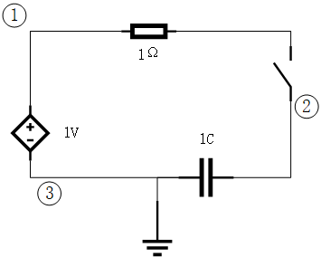
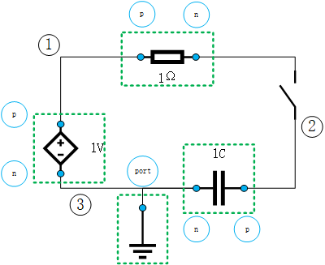
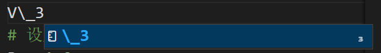

# 组织方程的艺术——组件化（入门）

!!! tip
    Contents：建模思想

    Contributor: YJY

    Email:522432938@qq.com

    如有错误，请批评指正。

## 前言

Ai4Energy开发者总是张口闭口组件化建模，那么组件化建模的内涵到底是什么？为什么要组件化建模？这篇我们从头至尾介绍做一个组件化思想的入门介绍。

建模用[ModelingToolkit.jl](https://mtk.sciml.ai/stable/)；求解用[DifferentialEquations.jl](https://diffeq.sciml.ai/dev_/)。

## 电路问题

以电路系统切入，深入探讨组件化建模的内涵是最合适不过的了。

首先准备2个电路元件的方程。

* 欧姆定律：电阻两端的电压与流过电阻电流成正比。

```math
U=IR
```

* 电容器：电容两端电压的变化率与电流成正比。

```math
\frac{dV}{dt} = \frac{I}{C}
```

!!! tip
    C是电容量，单位为法拉（F）。

我们再准备一个电路系统，如下图:

  


**需要求解的问题是**：电容初始电压为0，当开关闭合后，电容电压电流的变化情况是？

### 手搓求解

手搓的意思是电路中学的传统解法。开关闭合后，视为导线。采用节点电压法求解。标记三个节点1，2，3。节点电压分别为$V_1,V_2,V_3$，如下图。整个电路只有一条主路，所以电流为$I$。

  

所以电路的方程为：
```math
V_1-V_3=1 (V) \\
V_1-V_2=1 (\Omega) * I\\
\frac{d(V_2-V_3)}{dt} = \frac{I}{1 (F)} = I\\
V_3 = 0 \tag{1}
```

手动化简之后可以得到2种情况：

* 保留$I$，化简掉$V_1,V_3,V_2$。开关刚闭合，有电容视为导线，则0时刻，$I=1$
```math
\frac{1-I}{dt} = -\frac{dI}{dt}= I\\
I_0 = 1(A) \tag{2}
```
* 保留$V_2$，化简掉$V_1,V_3,I$
```math
\frac{dV_2}{dt} = 1-V_2\\
V_{2,0}=0(V) \tag{3}
```

以上微分方程式2或3，求解任何一个，把结果代回方程组1，整个电路系统的情况就可以得到了。这个问题就解决了。

下面看一看组件化怎么做！

### 组件化求解

在之前的基础之上，我们只做一件事情——**引入额外的变量**。

为每个器件添加两个端口变量（地只加一个端口）。正极叫p，负极叫n。同时为器件取名，电源叫做source，电阻叫做resistor，电容叫做capacitor，地叫做ground。同时规定，器件索引其子要素的方式为“.”。例如，电阻正极电压的变量全名为$resistor.p.V$。如下图所示。

   


那么我们新引入了14个变量：

* 电源的4个
```math
source.n.V\\
source.n.i\\
source.p.V\\
source.p.i\\
```

* 电阻的4个
```math
resistor.n.V\\
resistor.n.i\\
resistor.p.V\\
resistor.p.i\\
```

* 电容的4个
```math
capacitor.n.V\\
capacitor.n.i\\
capacitor.p.V\\
capacitor.p.i\\
```

* 地的两个
```math
ground.port.V\\
ground.port.i\\
```

再研究一下变量关系，我们可以发现。**所有端口电流（地端口除外）的数值都等于$I$，端口电压值都等于对应的电压节点的电压**。

这，貌似就是给$V_1,V_3,V_2,I$这几个变量加了很多别名？一顿操作猛如虎，细想发现全白干，形式主义我最行？

下面才是主菜！

#### Step1: 把$V_1,V_3,V_2,I$**全踢掉**，如下图。

   

#### Step2. 分别写组件的方程，规定电流入流为正，流出为负：

* 电源：
```math
source.p.V - source.n.V = 1 (V)\\
source.p.I + source.n.I = 0
```

* 电阻：
```math
resistor.p.V - resistor.n.V = resistor.p.I * 1 (\Omega)\\
resistor.p.I + resistor.n.I = 0
```

* 电容：
```math
\frac{d(capacitor.p.V - capacitor.n.V)}{dt} = \frac{capacitor.p.I}{1 (F)} \\
capacitor.p.I + capacitor.n.I = 0
```

* 地（规定电势为0的点，电流不做要求）：
```math
ground.port.V = 0\\
ground.port.I = 0
```

#### Step3: 构建连接关系

* 电源和电阻连（等价于节点1，节点电压相等、电流净流量为0）
```math
source.n.V = resistor.p.V\\
source.n.I + resistor.p.I = 0
```

* 电阻和电容连（等价于节点2，节点电压相等、电流净流量为0）
```math
resistor.n.V = capacitor.p.V\\
resistor.n.I + capacitor.p.I = 0
```

* 电容、电源和地连（等价于节点3，节点电压相等、电流净流量为0）
```math
capacitor.n.V = sourc.p.V = ground.port.V\\
capacitor.n.I + sourc.p.I + ground.port.I= 0\\

```

稍微思考一下可以发现，上述10多个方程组成的方程大组，其数学本质与方程小组1**完全等价**！唯一的区别是前者多引入了很多变量，并且这些变量完全可以消去！

但是，前者完成了组件化的封装，由此**连接关系与组件内部之间成了相互独立的关系**。

什么意思呢？以$V_1$为例。$V_1$既是电压源的出口电压又是电阻的正极电压。同时$V_1$作为节点电压，已经消去了电流的概念。这就意味每节点是不同的。而组件化的内涵就是把这一点拆解成了两部分：连接与组件内部。以电阻的正负极端口为例，**对内建立组件内部的方程**：

```math
resistor.p.V - resistor.n.V = resistor.p.I * 1
```

其本质就是$U=IR$；**对外建立与其他组件连接**：

```math
source.p.V = resistor.p.V\\
source.n.I + resistor.p.I = 0\\
resistor.n.V = capacitor.p.V\\
resistor.n.I + capacitor.p.I = 0
```

其本质就是节点电压1和2.

这么多方程很复杂但逻辑清晰。其实它很简单，因为化简计算机会去做。

## 求对比解

### 手搓版

把节点电压法的分析过程，写成ModelingToolkit的代码。

!!! tip
    * 在VScode中，输入入V\_3就能输入V₃
      
    * 在VScode中，按下`Ctrl+Enter`可以执行光标所在行的一行代码。以下的代码可以一行一行执行，看中间结果。

```julia
using ModelingToolkit, DifferentialEquations

# 定义变量
@variables t
@variables V₁(t) V₂(t) V₃(t) I(t)

# 定义微分
D = Differential(t)

# 设置参数
R = 1.0
C = 1.0
V = 1.0

# 输入方程
rc_eqs = [
    V₁ - V₃ ~ V
    V₁ - V₂ ~ I * R
    D(V₂) ~ I / C
    V₃ ~ 0
]

# 构建系统
@named rc_model = ODESystem(rc_eqs, t)

# 系统化简
sys = structural_simplify(rc_model)

# 设置初值
u0 = [
    V₂ => 0.0
]
# 求解时间范围
tspan = (0.0, 10.0)

# 构建问题并求解
prob = ODAEProblem(sys, u0, tspan)
sol = solve(prob, Tsit5())

# 分别查看 V₁, V₂, V₃ 的变化
sol[V₂]
sol[V₁]
sol[V₃]

```

再查看一下化简前的方程：

```julia
equations(rc_model)
```

结果为:
```
4-element Vector{Equation}:
 Differential(t)(V₂(t)) ~ I(t)
 V₁(t) - V₃(t) ~ 1.0
 V₁(t) - V₂(t) ~ I(t)        
 V₃(t) ~ 0
```

再查看一下化简后的方程：
```julia
equations(sys)
```

结果为:
```
1-element Vector{Equation}:
 Differential(t)(V₂(t)) ~ V₁(t) - V₂(t)
```
方程中$V_1=1$，和推导的结果是一致的。

### 组件版

把组件化的过程，写成代码。

```julia
using ModelingToolkit, DifferentialEquations

# 定义独立时间变量
@variables t

# 器件端口作为连接点
@connector function Pin(; name)
    sts = @variables v(t) = 1.0 i(t) = 1.0 [connect = Flow]
    return ODESystem(Equation[], t, sts, []; name=name)
end

# 地，地的端口名字改为g，不是port
function Ground(; name)
    @named g = Pin()
    eqs = [g.v ~ 0; g.i ~ 0]
    return compose(ODESystem(eqs, t, [], []; name=name), g)
end
# 电阻元件
function Resistor(; name, R=1.0)
    @named p = Pin()
    @named n = Pin()
    ps = @parameters R = R
    eqs = [
        p.v - n.v ~ p.i * R
        0 ~ p.i + n.i
    ]
    return compose(ODESystem(eqs, t, [], ps; name=name), p, n)
end
# 电容元件，因为不能对表达式进行微分，所以再引入一个电容的电压差变量v
function Capacitor(; name, C=1.0)
    @named p = Pin()
    @named n = Pin()
    ps = @parameters C = C
    sts = @variables v(t) = 1.0
    D = Differential(t)
    eqs = [
        v ~ p.v - n.v
        D(v) ~ p.i / C
        0 ~ p.i + n.i
    ]
    return compose(ODESystem(eqs, t, sts, ps; name=name), p, n)
end
# 电压源
function ConstantVoltage(; name, V=1.0)
    @named p = Pin()
    @named n = Pin()
    ps = @parameters V = V
    eqs = [
        V ~ p.v - n.v
        0 ~ p.i + n.i
    ]
    return compose(ODESystem(eqs, t, [], ps; name=name), p, n)
end

# 定义组件
R = 1.0
C = 1.0
V = 1.0
@named resistor = Resistor(R=R) # @name可以视为给定义的组件起了个名字，Resistor(R=R)返回的组件名字就叫resistor
@named capacitor = Capacitor(C=C)
@named source = ConstantVoltage(V=V)
@named ground = Ground()

# 构建连接关系
rc_eqs = [
    connect(source.p, resistor.p)
    connect(resistor.n, capacitor.p)
    connect(capacitor.n, source.n, ground.g)
]
@named _rc_model = ODESystem(rc_eqs, t) #连接关系也需要放到ODESystem中。

# 组件与组件连接关系一起构建系统
@named rc_model = compose(_rc_model,[resistor, capacitor, source, ground])
equations(rc_model) # 查看方程

# 系统化简
sys = structural_simplify(rc_model)
equations(sys) # 查看方程

# 定义初值
u0 = [
    capacitor.v => 0.0
]

# 求解
prob = ODAEProblem(sys, u0, (0, 10.0))
sol = solve(prob, Tsit5())

# 查看
sol[capacitor.v]
sol[resistor.n.v]
sol[capacitor.p.v]
```

## 小结

引入的组件端口变量作为内部方程与外部连接关系的桥梁，使得组件完整又独立，可以与任意外部组件相连接。连接就去干连接的活，组件内部就管组件内部的方程。

从另一个角度说，节点电压法需要针对每一个系统做比较复杂的系统分析，因为其包含了某种化简的内涵；而组件化模式则是批量定义组件和批量处理连接关系，最后统一化简。后者更加易于理解与设计计算算法。

组件化的意义就在于高效复用以提高系统构建效率。因为组件都是由开发者写好的，用户只需要构建连接关系，系统即可搭建好。这也是为什么说组件化是关于方程组织的艺术了，本质还是那个本质，只是换一种变量与方程的组织模式。电路系统的组件化是组件化思想的体现之一。

* [组件化建模实例](../Simulation/componementModel.md)简要介绍了组件化建模思想。
* [Ai4EComponentLib.jl](https://ai4energy.github.io/Ai4EComponentLib.jl/dev/)中系统的设计方法，都体现了组件化思想。
* [Ai4EComponentLib.jl设计理念](../Frameworks/Ai4EComponentLib.md)介绍了更高层次的抽象组件内涵。

最后，思考如何用节点电压法解下图的电路，以及如何用组件搭建。

 

其实思考之后就会发现组件化构建的优点：
* 高复用性：节点电压法构建需要自己写组件的特性方程；组件化不需要，不管它内部是什么牛鬼蛇神，组件写好了就能拿来用。之后就一个事——连接。定义组件的过程就是对组件内部方程的重用。
* 高易用性：一旦组件设计好了，构建连接关系不需要再动脑子了，照着系统图哪里有节点连哪里不就完事了？剩下精髓，是如何去设计一个系统，不再需要考虑组件底层。

!!! tip
    提问：我们上面手敲代码定义组件和构建连接的过程，与在Simulink中通过图形化界面拖一个组件连一个线的过程，有本质的区别吗？

    如果你觉得没有区别，恭喜，你已经大致掌握流程模拟仿真软件底层架构的逻辑了。

### 练习

尝试用上面写好的组件构建上图系统并求解。同样的，都假设电容电压初值为0。
