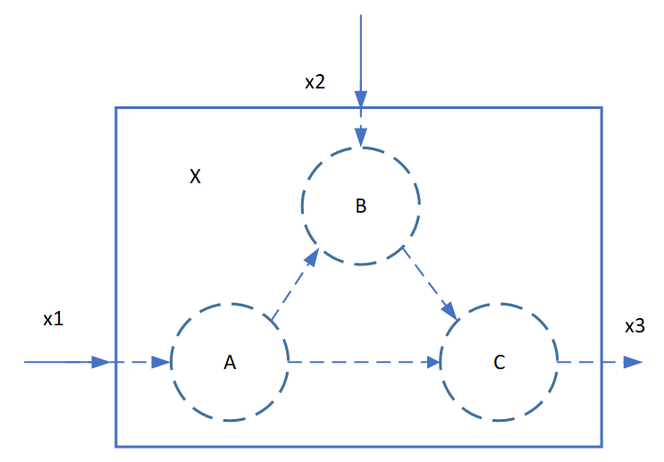

# 浅谈流程建模

!!! tip
    Contents：流程建模内涵分享

    Contributor: YJY

    Email:522432938@qq.com

    如有错误，请批评指正。

流程建模的核心在于**过程**，以及过程中的物质能量**流动**。在以MTK为代表的建模过程中，最重要的有两个点：组件的内部过程与外部连接。设计一个系统，也就是设计它们的内部结构与外部连接。

系统与子系统之间的关系，可以用数学中的图与子图的形式来描述。假若现有一个系统，系统中有3个模块ABC，如图所示，每个模块有各自的输入输出节点（如a1、a2等），其输入输出特性如箭头所示。

  

## 外部连接特征

在构建系统时，我们关注点在于其连接的“**物质能量流动**”。

以a2至b1的过程为例。首先，构建系统时需要明确其流动的物质是什么。整个系统是通过物质流动构建起来的。

1. 例如电路系统。电路系统的a2作为组件的出口，电流与电势值是必要的属性。同时，每个组件的进出口都存在电流与电势。所以，在电路系统中，电流与电势是连接系统的“物质流”。

2. 例如水流管道系统（不考虑势能）。管道系统的a2作为组件的出口，水流的压力与流速是必要的属性。每个组件的进出口都存在水压与流速属性。所以，在管道系统中，水压与流速连接系统的“物质流”。

具体的物质流动关系，我们需要根据特性系统的数学模型来构建。例如，电路系统中的基尔霍夫定律，管道流动的伯努利方程。**控制方程是描述系统的基础**。

在外部的连接特性中，一般都必须遵循守恒定律——能量守恒与质量守恒：

```math
\left\{\begin{array}{l}
|a 2|=|b 1| \\ |b 3|=|c 2| \\|a 3|=|c 1|
\end{array}\right.
```

对于状态量，如电压、水压、气体压力。一般有：

```math
\left\{\begin{array}{l}
a 2=b 1 \\ b 3=c 2 \\a 3=c 1
\end{array}\right.
```

对于具有流动特性的量，如电流、水流量、气体流量。一般有（规定流入为正，流出为负）：

```math
\left\{\begin{array}{l}
a 2+b 1=0 \\ b 3+c 2 =0\\a 3+c 1=0
\end{array}\right.
```

## 内部结构特征

各模块内部有自身的特性。即输入输出量之间在节点内部产生的反应与物质信息交换的过程，在组件与组件之间是各不相同的。这些机制反映了模型对现实实体的映射，是不同的数学物理现象的抽象。

例如上图组件A的a1、a2、a3。在组件内部，它们有特性的数学关系。

$$f(a1,a2,a3) = 0$$

这些特性就决定了“物质能量流动”流经组件时的变化。由此，整个系统的反应的特性就能够通过这些组件确定下来。

例如，同样的电压差加在一个不同电阻的两端，流过的电流大小不同。而电阻的阻值就决定了系统的反应特性。若电阻是随时间变化的，那么系统的电流也是随时间变化的。由此，系统就“动”起来了。

## 组件内外分离的意义

由此来看，似乎组件内部的变化机制才是最重要的部分。对系统的变化具有决定性意义。而外部连接似乎只起到了一个连接作用。这种连接作用对于真正的系统反应不具备决定性，只是辅助系统构建。

事实也的确如此。模块化的组件在系统构建时只是把系统拆解成一个个小组件。好处是方便用户构建系统，这些连接变量在系统构建后的系统化简时还要消耗计算资源进行符号化简。那是不是就是为了一点点用户友好的特性而浪费资源呢?

答案是否定的。

在[MTK的"前世今生"](./WathMTKdo.md)中我们谈到模块化的意义。细小的组件建模仍然拥有模块化的好处——构建复杂系统。

例如，由模块ABC组成的系统视为一个整体X，则ABC成为了X的内部结构，其表征形式也为微分代数方程，与模块ABC的表征形式并没有本质上的区别。唯一的区别在于方程数量的多少。系统X同样拥有对外的三个接口：输入接口x1、x2与输出接口x3。所以系统X作为模块处理在形式上没有任何不妥之处。

  

此时系统与子系统有了完备的闭包概念。假若此时ABC并不是一个最小系统，在ABC的基础之上可进一步细分出更小的模块。那么，可以称ABC为系统X的子系统，系统ABC同样拥有自己的子系统。

假如ABC一共只有几个方程，那么不需要ABC作为X的子系统来构建。我们直接把X内部的方程手动展平，只包含x1、x2、x3即可。但假如ABC一共有成千上万个方程，假若系统ABC同样拥有自己的子系统。这个时候手动展平还是一种好方法吗？

所以，分为内外结构的组件，在组成一个巨型系统时具有重要意义。一旦内部最关键的特性决定了，在今后复杂系统的任何层次节点上，人们的精力都能够集中在系统最关键的问题上——系统（子系统）之间的构建连接关系。

剩下的化简，就交给计算机吧！若是让人不断的去展平方程，从零构建系统，不也是人力资源的浪费吗？人思维的价值应该体现系统的设计上，而不是展平方程上，虽然浪费一些计算资源，但不也是生产力的提升吗？
