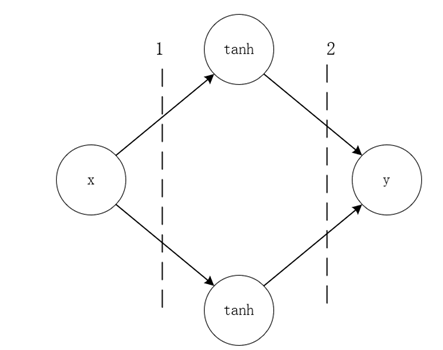
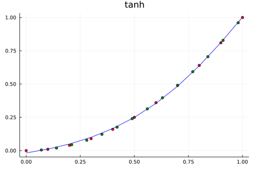
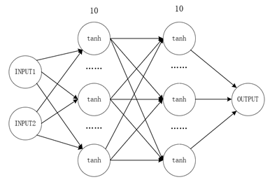
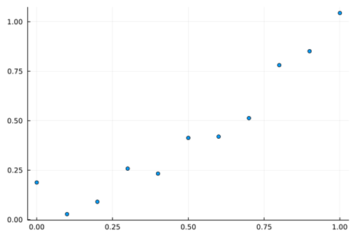
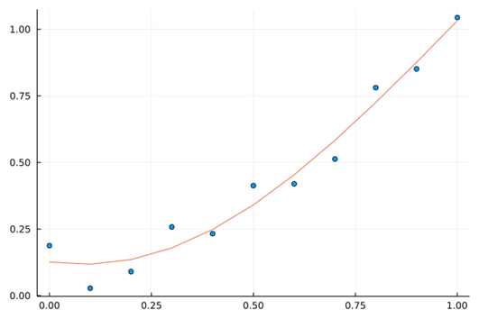
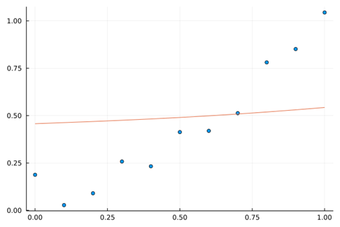

# 数学视角下的神经网络

!!! tip
    Contents：Flux，神经网络

    Contributor: YJY

    Email:522432938@qq.com

    如有错误，请批评指正。

!!! note

    [Flux.jl](https://fluxml.ai/Flux.jl/stable/) Julia机器学习包

## 1 神经网络的数学内涵

  

对于这样一个简单的神经网络，其中间神经元的激活函数为$tanh$，输入$x$与输出$y$之间的数学表达式为：

$$y=w_{2,1}tanh{\left(w_{1,1}x+b_{1,1}\right)}+w_{2,2}tanh{\left(w_{1,2}x+b_{1,2}\right)+b_2}$$

训练的目标为：

$$min{{\sum_{i=0}^{n} \left(y_{real,i}-y_{train,i}\right)^2}} \tag{1-1}$$

其中$y_{real,i}$为实际数据，$y_{train,i}$为通过模型计算出来的数据。

如果y也是一个激活函数$tanh$，经过激活函数后输出，那么数学模型则变为：

$$y=tanh(w_{2,1}tanh{\left(w_{1,1}x+b_{1,1}\right)}+w_{2,2}tanh{\left(w_{1,2}x+b_{1,2}\right)+b_2})+b$$

神经网络的参数训练，则是为了要找到使训练目标最小的一组参数：$\{w_{i,j},b_{i,j}\}$。

由此可以归纳：

* 神经网络的本质是一个关于激活函数的复合函数
* 训练的内涵是寻优的过程，内涵是优化问题（回归问题）
* 神经网络处理问题的内涵是用复合函数去拟合数据集

所以从数学内涵上来说，作为人工智能代表之一的神经网络并没有那么神秘。事实上，它也并没有那么强大！根据其内涵，可以总结出其优缺点。

优点：

* 普适性的优化框架，如BP算法
* 模型任意搭建，成熟的工具（Tensorflow等）

缺点：包含了拟合的缺点。

* 其模型的内涵（机理）不明确，只是从数学的角度逼近真实数据
* 容易过拟合

下面通过一些实验来说明。

## 2 神经网络的学习特性探究

### 2.1 一维曲线学习

考虑简单的函数学习问题，用神经网络（1隐藏层2节点，如上图所示，中间层激活函数采用双曲正弦函数）来学习一个一元函数，即单输入单输出网络，一共有7（2*2+2+1）个参数。在数据集中生成中，严格按照二次曲线规律生成，不添加任何扰动。

采用下面的程序计算，训练10000次，训练结果的均方差为5.52E-5。为了验证学习的效果。在区间$[0,1.0]$内取一些原函数（$y= x^2$）上的点，作为测试集。

```julia
using Flux
using Flux: train!
using Plots

W1 = rand(2,1)
b1 = rand(2)
layer1(x) = W1 * x .+ b1

W2 = rand(1,2)
b2 = rand(1)
layer2(x) = W2 * x .+ b2

g(x) = x^2

model(x) = layer2(g.(layer1(x)))[1]

x_train = collect(0:.1:1)
y_train = x_train.^2
scatter(x_train,y_train,legend=false)

model.(x_train)
loss(x,y) = Flux.Losses.mse(model.(x),y)
parameters = [W1,b1,W2,b2]
data = [(x_train,y_train)]
opt = Descent(0.1)
for i in 1:5000
    train!(loss, parameters, data, opt)
end
println(loss(x_train,y_train))
begin
    scatter(x_train,y_train,legend=false,title="x^2",color="red")
    plot!(x_train,model.(x_train),color="blue")
end

begin
    x_learned = collect(0.07:0.07:1)
    scatter!(x_learned,x_learned.^2,legend=false,color="green")
end
```

  

学习的结果如上图，**红色点为训练集，以绿色点为测试集**。可以认为，学习机很好地找到了在区间$[0,1.0]$原有数据的“机理”，因为学习结果几乎和原函数一致。这是一个非常漂亮的学习过程！

上述学习训练过程的核心特点为：**训练集的学习域覆盖了测试集的测试域，它们都在之内**$[0,1.0]$。自然而然地想到，没有学习过的区域呢？比如$[1.0,2.0]、\left[-1.0,0.0\right]$这些区间表现会表现得怎么样？

```julia
begin
    x_pred = collect(1:.1:2)
    scatter!(x_pred, x_pred.^2,legend=false,color="green")
    plot!(x_pred,model.(x_pred),color="blue")
end

begin
    x_pred = collect(-1.0:.1:0)
    scatter!(x_pred, x_pred.^2,legend=false,color="green")
    plot!(x_pred,model.(x_pred),color="blue")
end
```

  

在$[1.0,2.0]、\left[-1.0,0.0\right]$区间上，结果如图所示。表现为没有“学会”。因为实际值和测试值偏离了。

### 2.2 内涵探讨

事实上，这个结果应该是意料之中的。上面说过，神经网络学习的本质上是用复合函数逼近。用一个构造的数学函数y去代替数据点二次曲线的实际内涵。

Tanh的泰勒展开为：

$$\tanh{=x-\frac{x^3}{5}+\frac{2x^5}{15}+o(x^7)}$$

在式（1-1）中，学习机除去偏移量$b_2$还有6个参数，简单认为逼近的精度为$tanh$泰勒展开的前6项，误差为项为$o(x^{13})$。在数据训练集区间内，$o(x^{13})$可以保证在训练域误差可以很小，但一旦扩展到全实数域，这部分误差是无法避免的。因为其本质的“机理”并不相同。

上面的问题中，神经网络通过参数优化，逼近了$[0,\ 1.0]$区间内关于$x^2$的数据特性，可以使得学习机在$[0,\ 1.0] $“完美替代”$x^2$。在这个区间外，它还是它自己，即tanh。

所以，神经网络的数学内涵是逼近，其预测世界规律的方法是激活函数。采用统一的方法去逼近任意区间内的数据。所以，从数学的角度，激活函数与神经元个数都体现神经网络结构的逼近能力。

下图分表表示了激活函数为$exp$与$x^2$训练与预测情况。

  

  

在$[0,\ 1.0]$内，可以认为神经网络可以代表$x^2$。而在$[0,\ 1.0]$外，函数走势都是它们“本来的样子”。

### 2.3 二维曲线学习

拓展到二维平面拥有相同的规律。采用10节点2隐藏层全连接网络逼近二元函数函数:

$$g\left(x,y\right)=sin{\left(x\right)}\ast c o s{\left(y\right)}\ \ \ x,y\in\left(0,1\right)$$

神经网络图与训练结果如下图：

  

  

散点代表真实值。平面代表预测平面。可以看到散点图几乎都在平面上，训练效果较好。

  

学习机在$x,y\in\left(0,2\right)$的表现如上图所示。红点为训练数据集，黄点为训练集域内的测试集，绿点为训练集外的测试集。可以看到随着预测范围往外扩展，绿点作为测试集与预测平面已经“分道扬镳”。

这与前面的分析一致，不同之处在于学习机逼近二元函数，逼近的对象是面而不是曲线。再拓展到更高维度的超平面上，神经网络逼近的特性仍然成立。这是由它的数学内涵决定的。

代码如下。

```julia
using Flux
using Flux: train!
using Plots

W1 = rand(10,2)
b1 = rand(10)
layer1(x) = W1 * x .+ b1

W2 = rand(10,10)
b2 = rand(10)
layer2(x) = W2 * x .+ b2

W3 = rand(1,10)
b3 = rand(1)
layer3(x) = W3 * x .+ b3

model(x) = layer3(tanh.(layer2(tanh.(layer1(x)))))[1]

xs = collect(0:0.1:1.0)
x_grid = [x for x = xs for y = xs]
a_grid = [y for x = xs for y = xs]
z_train = cos.(x_grid) .* sin.(a_grid)
xy = [[x,y] for x in xs for y in xs]
model.(z_train)

loss(x,y) = Flux.Losses.mse(model.(x),y)
parameters = [W1,b1,W2,b2,W3,b3]
data = [(xy,z_train)]
opt = Descent(0.1)

for i in 1:1000
    train!(loss, parameters, data, opt)
end
println(loss(xy,z_train))


xs = collect(0:0.1:2.0)
x_grid = [x for x = xs for y = xs]
a_grid = [y for x = xs for y = xs]
xy = [[x,y] for x in xs for y in xs]
z_predic = model.(xy)
plot(x_grid,a_grid,z_predic, st = :surface)
scatter!(x_grid,a_grid,cos.(x_grid) .* sin.(a_grid))


xs = collect(0:0.1:2.0)
x_grid = [x for x = xs for y = xs]
a_grid = [y for x = xs for y = xs]
xy = [[x,y] for x in xs for y in xs]
z_predic = model.(xy)
plot(x_grid,a_grid,z_predic, st = :surface)
xs = collect(0.05:0.1:1.0)
x_grid = [x for x = xs for y = xs]
a_grid = [y for x = xs for y = xs]
scatter!(x_grid,a_grid,cos.(x_grid) .* sin.(a_grid),color="yellow",legend=false)
xs = collect(0:0.1:1.0)
x_grid = [x for x = xs for y = xs]
a_grid = [y for x = xs for y = xs]
scatter!(x_grid,a_grid,cos.(x_grid) .* sin.(a_grid),color="red")
xs = collect(0:0.1:2.0)
x_grid = [x for x = xs for y = xs if x>=1.0||y>=1.0]
a_grid = [y for x = xs for y = xs if x>=1.0||y>=1.0]
scatter!(x_grid,a_grid,cos.(x_grid) .* sin.(a_grid),color="green")
```

### 2.4 正则化对逼近的影响

那么正则化的引入有没有改变这一内涵呢？答案是否定的。

在前面的讨论中，数据集都严格符合函数规律，没有任何误差。在实际的数据集中，不可能由如此理想的情况。而正则项就是对这测量值误差的一种折中处理，神经网络的设计者可以通过正则项来指引网络的优化方向，从人的智能角度规避纯数据带来的“误导”。

首先，基于$y=x^2$在$[0.0,1.0]$范围内生成一些点，并且加上随机扰动作为训练集。如下图所示。

  

从散点图依稀可以看出二次函数的影子。

下面尝试不同的正则化。

情况1，无正则化：$Loss=\sum_{i=1}^{N}\left(y_i-f\left(x_i\right)\right)^2$

  

情况2，正则化大权值逼近$y=0.5$：$Loss=\sum_{i=1}^{N}\left(y_i-f\left(x_i\right)\right)^2+10.0\ast(f{\left(x_i\right)-0.5)}^2$

  

情况2，正则化大权值逼近$y=x^2$：$Loss=\sum_{i=1}^{N}\left(y_i-f\left(x_i\right)\right)^2+10.0\ast(f{\left(x_i\right)-x_i^2)}^2$

  

学习机是否克服了“逼近”带来的缺点呢？答案依旧是否定的。在未知域，学习机并没有带来惊喜。如图下图所示，在$[1.0,2.0]$的预测范围内，预测能力也没有得到显著的提升。Loss方程的改变，只是规避了数据观测误差带来的影响，防止神经网络因某些异常点陷入过拟合状态。其并没有改变神经网络架构逼近的数学内涵，所以其仍然不具备学习域外的预测能力，因为其“探索世界的根本方法论”依旧是——$tanh$。

但正则项所带来的泛化能力是毋庸置疑的，在遇到特定问题时也许不容易知道数据的“机理”，但是从方法论的进程上来说，正则化已经向“探索未知”迈出了重要的一步。

  

```julia
using Flux
using Flux: train!
using Plots
using Statistics

N = 10
W1 = rand(N,1)
b1 = rand(N)
layer1(x) = W1 * x .+ b1

W2 = rand(1,N)
b2 = rand(1)
layer2(x) = W2 * x .+ b2

model(x) = layer2(tanh.(layer1(x)))[1]

x_train = collect(0:.1:1)
y_train = x_train.^2 .+ rand(length(x_train))*0.2

model.(x_train)
loss(x,y) = 0.1*Flux.Losses.mse(model.(x),y) + mean((model.(x).-x.^2).^2)
parameters = [W1,b1,W2,b2]
data = [(x_train,y_train)]
opt = Descent(0.1)
begin
    for i in 1:2000
        train!(loss, parameters, data, opt)
    end
    println(loss(x_train,y_train))
end

begin
    scatter(x_train,y_train,legend=false)
    plot!(x_train,model.(x_train))
end

begin
    x_pred = collect(1:0.1:2)
    y_pred = model.(x_pred)
    scatter!(x_pred,x_pred.^2,color="green")
    plot!(x_pred,y_pred,color="green")
end

```

神经网络的数学内涵是用函数去逼近某个区间内的数据集，其本质的特征是激活函数。这一点决定了在未学习过的未知域，神经网络的预测作用有限。
在纷杂又充满噪声的数据中，正则化是探索数据内涵重要的利器！正则项代表人的智能对学习机学习的一种指导，在已知域内正则化可以剔除噪声发现已知域的本质。这是从完全的数据挖掘以至于陷入过拟合发展状态的重大突破。虽然如此，但正则项没有改变根本的拟合逼近问题。

## 3 启发与讨论

### 神经网络应用的启示

从上面的分析中，我们可以划分定义两个概念：

* 训练域：训练集涉及到的变量区间
* 未知域：训练集未涉及到的变量区间

可以把测试集分成两类。一类是在训练域中的，一类是在未知域中的。由上面的实验可以推知，在训练域中训练集的临域通过学习机“逼近”了，那么在临域内的测试集就能有很高预测精度。而在未知域中的测试集，那么就只能听天由命。因为训练域之外，学习机就呈现了激活函数本来的面貌。

对其应用而言，又要引入两个概念：

* 结构化问题：传统的机理明确（能用完备的数学方程描述，如欧姆定律：$U=I*R$）的问题
* 非结构化问题：机理不明确的问题（只知变量之间有关联但无明确的机理量化关系，如喝牛奶频率和身高的关系）

从以上分析，可以知道。在结构化问题中，神经网络无优势。其优势在于非结构化问题的预测，因为非结构化问题本就机理不明，不明就“暴力拟合”试试呗 :)！虽然上述过程中讨论的都是结构化问题，但是对于非结构化问题也有一定的参考。

例如，人脸识别。这可以从某种程度上解释人脸学习时为何需要一组端端正正的人脸。图像可以视作高维函数（自变量为RGB值）。一组端正的人脸保证了不管是训练集还是测试集，他们作为“数”的特性的坐标都比较相近，即保证了用来测试的人脸一定是在训练时“见过的”，或者“和见过的非常相近”。类比至上述实验的解释是，采用端正的$[0,\ 1.0]$区间的“人脸”作为训练集，当测试集的人脸也很端正，也在$[0,\ 1.0]$区间内，或者在其“附近”，那么学习机就能准确识别，因为已经学过了。但是，出现了一张“奇怪”的人脸，假设它是在$[2.5,\ 3.0]$区间内。这没有学过，那就不会！

那么，机器学习的应用中可以获得一些启示。

1. 对于分类问题判别问题，应该用训练集包含更加广泛的训练域，如果训练域涵盖了测试集，那么精度会非常高。类似与高维的图像识别在数据量少的如何做到这一点呢？就需要在特征提取与降维方面下功夫。简单来说是，训练时让学习机见识过了所有的情况，那么测试时再见到，它一定可以处理得很好。如果见识太少，那就只能靠猜。人的经验不就是这样的道理吗？但问题是，在一维$[0,\ 1.0]$区间，我们很容易界定训练域与未知域。在实际问题中，这是很难定义的。例如，怎么量化定义人脸的训练域？仅通过RGB颜色值？似乎不好说。所以，这还有待长远的探索。
2. 关于预测，若是对于训练域之外的测试集要想准确预测，要么改变tanh能够让激活函数体现出数据发展趋势的“道”；要么提取被学习对象的精髓让激活函数能够成为它的“道”。但预测本来就有巨大的不确定性。在实际问题的非结构性问题中，神经网络拟合的这个“机理”究竟是否是“真实的机理”呢？没人说得清，依旧要靠其它测试集来实践检验！或者，面对一些复杂的问题，通过一系列“猛如虎的操作”（例如池化卷积等等），本质上没有提升神经网络的预测能力，而是通过调参把训练集与测试集的尽可能缩到了处理后的变量训练域内。这样，逼近就有效果了，但这内涵难道不更像是插值处理？所以预测在某些些问题上，本就是一个伪命题。要真正实现预测，一定是机理得以明确，找到了事物最本质的规律之后的“对未知的预测”，而不是基于统计原理的“带插值含义的预测”。

所以，对于神经网络，我们不需要过于神话。其本质可以看作一个强有力的拟合工具，尤其是在计算机技术飞速发展的今天，神经网络有它巨大的使用价值。但作为工具来说，科学的发展并不依赖于工具。工具只是手段，有些时候我们也应该“不忘初心”，回到对问题本质的结构化性质探索的方向上去。从另一个角度来说，神经网络可以成为结构化性质探索道路上的得力帮手，但是其大概率不能成为决定性因素。若是我们心中对它已经有了一种依赖，或者陷入了某种网络调参的狂热。**那么我们是不是应该反思，我们是否陷入了对机器学习的路径依赖，是否忘了探索的真谛——研究问题本身？**

### 3.2 学习的本质

人类探索真理的过程，本质上是一个演绎推理、实验验证的过程。对应机器学习，一次训练对应演绎推理，测试集测试对应实验验证。对于人类的科学发展而言，这一探索是螺旋式上升的。从实践到理论，再用理论指导实践，实践结果修正理论，这是马克思科学原理的哲学观。

在探索与发展的过程中，没有什么是绝对成立的，没有绝对的真理。就像牛顿定律不适用于量子领域，正是在“大误差”中，科学得以修正发展，本质上是一个理论与实践的Loss方程数值不断缩小的过程。

类比科学发展的本质，在有限的数据集下，机器学习的学习方法或者学习范式还不够具有发展性。机器学习的学习方式更加接近于“一锤子买卖”。学习训练然后测试，没有测试结果指导理论的过程，或者说这一过程是由人来完成的。人根据测试结果的准确性来判断模型是否需要修改提升。目前阶段学习机没有自我驱动的迭代能力，即根据学习的效果来修正学习模型。人类智能的巨大潜力，正是体现在驱动实践理论再实践这一个过程当中。从这哲学的角度，这样一种实践理论再实践的学习范式是面对“未知的虚无”最强有力的手段，也是最强大的学习方法。

学习的本质，在机器学习中更加接近元学习的思想。即在学习模型中提供根据结果修正模型参数的接口，让学习机能够在Loss方程的指引下，自我迭代。目前可能是调整超参数，未来可能就能发展成为自我修正网络结构、激活函数等学习模型的框架结构。从计算的本质来说，这一过程对应Code Generation。目前普遍的学习方法是修改模型参数，元学习的学习方法是学习机能够修改模型代码。对应的实现方式为元编程——用代码写代码。

目前来说元编程的技术实现完全没有问题，Julia语言中就有成熟高效的元编程方式。元学习的技术实现不是问题。但从它的学习过程可以轻易推断，元学习的难点在于Loss方程的量化指标。由损失到参数，是在数的领域。而由损失到网络结构，这不是一个可以直接跨越的鸿沟。在它们中间，需要架起一座由数到结构的桥梁，也就是变成一个可计算的问题。要实现这一点，还需要长时间的探索。
