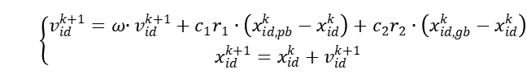
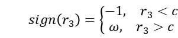
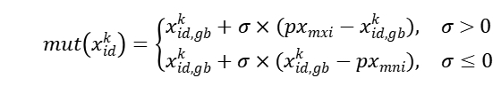
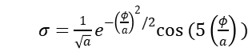

# GenSBO—a General **S**imulation **B**ased **O**ptimizer

## GenSBO简介

[GenSBO](https://github.com/ai4energy/gensbo)（General Simulation Based Optimizer）是由Ai4Energy开发的一个面向仿真的优化器。它利用智能优化算法，在优化过程中通过调用仿真器获取当前方案的评价值，从而帮助算法获得可靠的优化结果。

GenSBO 支持单目标优化和多目标优化，并分别实现了基于改进简化小波粒子群算法的单目标优化引擎和基于改进小波全面学习粒子群算法的多目标优化引擎。该优化器还能够处理混合整数非线性优化问题，并且允许用户方便地自定义目标函数。

通过使用 GenSBO，用户可以灵活地进行面向仿真的优化，将智能优化算法与仿真模型相结合，实现高效、可靠的优化方案，从而优化设计和决策过程。


## 模块组成

1. **问题定义模块** (`Problem`): 该模块用于定义优化问题，包括目标函数、约束函数以及变量的类型和范围等信息。
2. **优化评估模块** (`UserFunction`): 用于评估优化问题的目标函数和约束函数值。它与实际的优化问题相关联，通过调用仿真模拟器来获取当前方案的评价值。
3. **优化算法模块** (`PSO`): 优化算法模块实现了多种优化算法，如粒子群算法（PSO）。用户可以根据需要选择合适的优化算法来解决特定的优化问题。
4. **GenSBO主程序** (`GenSBO`): GenSBO主程序是整个优化系统的核心部分。它将问题定义模块、仿真模拟器和优化算法模块进行整合，并负责执行优化过程。
5. **结果保存和可视化模块**: GenSBO支持将优化结果保存为多种格式，如 np.array 和 xls。此外，它还提供了可视化功能，可以绘制寻优历史图和帕累托前沿图。

通过这些组成部分，GenSBO实现了面向仿真的优化功能，将智能优化算法与仿真模拟器相结合，以获得高效、可靠的优化方案结果。用户可以根据自己的需求，选择合适的目标函数、约束函数、变量类型以及优化算法来解决各类优化问题。


## 算法组成

GenSBO结合了SPSO算法（粒子群优化算法）和PSOWM算法（粒子群优化算法）

### 对于单目标优化

在传统的PSO算法中，粒子通过维护位置和速度两个信息来进行搜索。在每次迭代中，粒子根据自身和邻域最优解的信息，更新自己的速度和位置。这样的设计可以使得粒子向着较优解的方向移动，逐渐收敛到全局最优解或局部最优解。

速度和位置更新公式：



SPSO算法的改进了PSO算法，它只保留粒子的位置更新公式，省略速度的更新，减少了计算成本；同时引入反向搜索机制，增强了算法的全局寻优能力，可以更好地找到全局最优解。

反向搜索公式：




PSOWM算法引入小波变异操作。在每一次迭代过程中，以一定的概率对部分粒子的位置进行小波变异。这个小波变异操作会在当前位置附近产生一个随机的扰动，从而增加了粒子的多样性和随机性。

小波变异公式：






通过这种方式，SPSO算法和PSOWM算法的结合使GenSBO既保留了传统PSO的粒子群协作和学习的特性，又提供了运算速度，增强了全局寻优能力，增加了算法的探索性和多样性。这样一种改进可以提高算法在复杂优化问题中的表现，并有可能找到更优的解。

### 对于多目标优化

对于多目标优化，GenSBO采取了基于MOPSO算法（多目标粒子群优化算法）的CLPSOWM算法（小波粒子群优化算法）

MOPSO算法相比于PSO算法，它是在多个目标函数下寻找一组非劣解（Pareto前沿）用于解决多目标优化问题，研究者可以根据自己的需求选择最合适的解。其适应度函数是一个多目标函数，它衡量解向量在多个目标下的优劣程度。

总的来说，MOPSO算法是PSO的扩展，用于解决多目标优化问题。MOPSO考虑了多个目标函数下的优化，并寻找一组非劣解来提供决策者多样的选择。

而CLPSOWM算法是对MOPSO算法的改进，它对位置信息增加小波变异操作，增加粒子的多样性和随机性。

### 约束处理

GenSBO有普通罚函数方法和Oracle罚函数法可供选择。

普通罚函数是一种在优化问题中常用的约束处理方法，用于将含约束的优化问题转化为无约束的优化问题。在普通罚函数中，通过在目标函数中添加罚项来惩罚违反约束条件的解，从而将约束条件考虑进优化过程中。

Oracle罚函数是一种使用Oracle模型（也称为信赖域模型）的罚函数方法。在这种方法中，使用罚函数来惩罚违反约束的解，并在优化过程中使用Oracle模型来选择罚因子。Oracle模型是用于近似代替原始目标函数的模型，它在当前解附近进行局部逼近。通过使用Oracle模型来确定罚因子，可以更好地平衡罚函数的影响，从而提高优化的效率和稳定性。


## 算法流程

1. 设置算法参数；
2.  初始化粒子位置；
3.  评价粒子的适应值；
4. 更新粒子个体历史最优和全局最优信息；
5. 执行小波变异操作；
6. 按SPSO公式更新粒子的位置；
7. 重复（3）、（4）、（5）、（6），直到满足收敛条件。


## GenSBO的使用

GenSBO只需要在python下载安装gensbo包即可，gensbo包的使用包含

- 导入所需模块
- 编写变量类型
- 确定目标函数和约束函数
- 设置PSO优化算法参数
- 运行寻优模块

这几个部分。相关示例可以参考[官方文档](https://github.com/ai4energy/gensbo/tree/main/examples/user_function)，以下是对这几部分的详细说明。

### 安装

```python
# pip 安装
pip install gensbo
# 下载代码
python setup.py install
```

可以用pip 安装命令来安装它，通过输入上述代码，下载安装gensbo包。

### 导入所需模块

```python
#从sys模块中导入path
from sys import path
path.append('..\\..\\')

#导入gensbo模块
from gensbo.gensbo import GenSBO
from gensbo.core import Problem
from gensbo.simulators.userfunction import UserFunction
from gensbo.optimizers.pso import PSO

#导入 NumPy 库
import numpy as np
```

### 编写变量类型

使用 Problem 模块定义您的优化问题。您需要指定变量的类型（连续、离散等）、变量的范围、约束函数以及目标函数。同时，您可以选择性地为变量提供初始值。

```python
# 创建问题实例
problem = Problem("function_name")

problem._TotalNumVar = 5         # 总变量数
problem._TotalNumConstraint = 3  # 总约束数
problem._NumObjFunc = 1	         # 总目标函数数(1：单目标优化;  >=2：多目标优化)

# 添加变量
problem.add_var("x1", "continuous", lowbound=-15.0, upbound=15.0, value=None)      # 连续变量"continuous"
problem.add_var("x2", "discrete", lowbound=-5.0, upbound=9.0, value=4)             # 离散连续整型变量"discrete"
problem.add_var("x3", "discrete_disconti", 	set=[-5, -3, 0, 6, 9, 23], 	value=None)# 离散非连续变量"discrete_disconti"(从传入取值集合set中取值)
problem.add_var("x4", "binary", lowbound=0, upbound=1, value=0)                    # 二元整型变量"binary"

#传入变量初始值
if_batch_add_var_ini = True        #是否批量传入变量初始值
if if_batch_add_var_ini == True:
     # 加载上次寻优导出的可行解
    var_ini = np.load('%s_so.npy'%name,allow_pickle=True)[0][-1]  
    problem.batch_add_var_ini(var_ini)
```

注：

1. lowbound,upbound为变量最大值与最小值

2. 初值value的选取应尽可能有助于提供最优解的信息，否则应将其设为‘None’（建议均设为‘None’）请谨慎使用

3. 在多目标优化中，通过设置某已知非支配解作为初值，同时减小寻优代数（‘step_max’）或增大外部档案容量（‘pareto_size’），可以在较短时间内获得该解周围的详细非支配解信息。

4. 导入值支持 list 和 np.array 格式

5. `var_ini = np.load('%s_so.npy'%name, allow_pickle=True)[0][-1]`: 

   `np.load()`函数用于从`.npy`文件中加载数据，根据文件名`'%s_so.npy' % name`加载上次寻优导出的可行解，参数`allow_pickle=True`表示允许加载包含Python对象的`.npy`文件。

6. 每个解向量初值中变量顺序应与添加变量顺序一致（与寻优结果导出的解向量中变量顺序相同）


### 定义优化问题（目标函数和约束函数）

在 `problem_function` 函数中添加目标函数和约束函数。

```python
# 添加目标函数和约束函数
def problem_function(varset,if_cal_cons_only=False):
    """
    添加目标函数和约束函数
    :param varset: 变量集,字典（'var_name':value）
    :param if_cal_cons_only：布尔值，是否只计算约束函数值而不计算评价函数值，用于产生可行解
    :return: 目标函数值list、约束值list，参考值flag
    """
    objfunc = [0 for _ in range(problem._NumObjFunc)]
    constraint = [[] for _ in range(problem._TotalNumConstraint)]

    # 给变量名赋值（x1 = value)
    globals().update(varset)

    if if_cal_cons_only == False:
        # 添加目标函数
        objfunc[0] = -(- x1 * np.cos(np.pi * x1) + x1 * x2 + 4 * x3 - 5 * x4) - x5

    # 添加约束函数
    constraint[0] = ['i', (x1 + x2) - 50]
    constraint[1] = ['i', (x1 + x1 * x3) - 34]
    constraint[2] = ['i', (x4 + x3) - 33.3]
     ######################################################
    # 第i个约束条件：constraint[i] = [cons_type,cons_value]
    # 约束类型：cons_type=['i','e']
    # 约束函数计算值：cons_value=[g(x),h[x]]
    # 'i'：不等式约束，形式为g(x)<=0
    # 'e'：等式约束，形式为|h(x)|-ϵ <= 0, ϵ默认值为1e-5。
    ######################################################

    # 参考信息
    flag = 0
    return objfunc, constraint, flag
```

### PSO优化算法参数设置

```python
参数设置方式：
	# 创建优化器实例
	optimizer = PSO(problem)

	# 设置参数
	optimizer.set_options('para_name', value)
```

```python
公用参数：
'if_ini_cons': False,
    # 是否要求初始化的粒子必须含有可行解（不违反约束）,False：不要求；True:要求。

'swarm_size': 30,  
	# 粒子数量
'step_max': 500,
	# 最大寻优代数
'w_type':'linear',
	# 惯性权重方式，'linear'-线性，'fixed'-定值，'chaos'-混沌惯性权重
	
# {{{惩罚函数相关参数
'penalty_type': 'common',
# 选择罚函数方法，字符串（default：'common'）
# 'common' - 普通（动态）罚函数，'oracle' - oracle罚函数
# 粒子群多目标优化算法不支持oracle罚函数方法
'penalty_times': 100,
# penalty_type = 'common'时生效，惩罚倍数，浮点数（default：100）
# 使违反约束的解受到惩罚后的函数值一定大于全局最优适应函数值
'oracle': 1e9,
# penalty_type = 'oracle'时生效，Ω初始值，浮点数（default：1e9）
# 该值必须大于全局最优适应函数值
# }}}惩罚函数
```

单目标粒子群算法sopso：

```python
'pso_mode': "ispsowm",
	# 选择用于运算的单目标pso方法，字符串（default：'ispsowm'）
	# 目前提供：
	# "standard_pso'-标准粒子群算法
	# 'ispsowm'-改进小波简化粒子群算法（复杂问题推荐）
	# 选择ispsowm时，
	# c（反向搜索阈值）, pm（变异阈值）, xi_wm（形状因子）,g（函数a的上限值） 参数生效。
	# 若搜索过程表明粒子群明显陷入早熟，则适当增大c，pm的值。具体参数设置请参考说明文档。

'w': 0.8,
# 惯性权重（default：0.8）
'w_range_so': [0.4, 1.2],
# 惯性权重变化范围，数组（浮点数）（default：[0.4, 1.2]）
'c1': 2.0,
# 加速因子中的认知因子（default：2）
'c2': 2.0,
# 加速因子中的社会因子（default：2）

'precision': 0.001,
# 收敛精度，浮点数（default：1e-3）
# 寻优程序设定当种群粒子的个体历史最好目标函数值（集合）的标准差小于收敛精度时收敛。
# 问题规模较小时，可将precision调大

'neighborhood': 'star',
# 粒子群邻域结构，'star'（全互连型），'ring'（环型）（搜索速度较慢，但更不容易陷入早熟）	

# {{{小波相关参数
'c': 0.2,
# 反向搜索概率，浮点数（default：0.2）
'pm': 0.7,
# 执行小波变异的概率阈值，浮点数（default：0.7），取值范围[0,1]
'xi_wm': 0.5,
# 形状参数，浮点数（default：0.5）
'g': 1000,
# 小波函数中a的上限值，浮点数（default：1000），常取1000或10000
# }}}小波
```

多目标粒子群算法mopso：

```python
	'x_pareto_size': 100,
	# 外部档案大小（存放非支配解），整数（default：100）
    
    'if_use_former_x':True,
    # 是否利用前次寻优得到的pareto前沿（稀疏部分）引导本次寻优

	'w_mo': 0.4,
	# 惯性权重（default：0.4）
	'w_range_mo': [0.2, 0.6],
	# 惯性权重变化范围，数组（浮点数）（default：[0.2, 0.6]）
	'c_mo': 2.0,
	# 加速因子，浮点数（default：2）

	'run_number': 5,
	# 独立寻优次数，整数（default：5），合并各次寻优结果pareto前沿

	'pm_mo': 0.7,
	# 执行小波变异的概率阈值，浮点数（default：0.7），取值范围[0,1]
	'xi_wm_mo': 0.5,
	# 形状参数，浮点数（default：0.5）
	'g_mo': 1000,
	# 小波函数中a的上限值，浮点数（default：1000），常取1000或10000
	'pe_mo': 0.4,
	# 精英概率，浮点数（default：0.4），取值范围[0,1]
	'pl_mo': 0.1,
	# 学习概率，浮点数（default：0.1），取值范围[0,1]
```

### 运行寻优模块

```python
    # 执行主程序
    gensbo = GenSBO(problem, simulator, optimizer)

    # 记录当前寻优结果，防止意外报错使得进程结束--代码有误
    result_temp = gensbo.result_temp

    # 记录当前寻优可行解结果，防止意外报错使得进程结束
    feasible_f_temp = gensbo.feasible_f_temp
    feasible_x_temp = gensbo.feasible_x_temp

    gensbo.run()

    # 获取寻优结果
    result = gensbo.result
    '''
    单目标优化结果
    result = [f, x, constraint_info， f_history, feasible_f, feasible_x]
               [寻优结果函数值（浮点数），寻优结果解向量（一维数组），
                [解向量违反的约束序号数组，解向量所有约束函数的值],
                寻优历史全局最优函数值（一维数组），
                可行解的函数值集合（一维数组），可行解集合（二维数组）]
    
    
    多目标优化结果
    result = [f_pareto, x_pareto, feasible_f, feasible_x]
               [寻优结果非支配解集（pareto前沿）的目标函数值集合（数组（浮点数））,
                寻优结果非支配解向量（数组（浮点数））,
                可行解的函数值集合（二维数组），可行解集合（二维数组）]
    '''

    # 保存数据
    gensbo.save_data(filename=problem.name, filepath='.\\')

    # 结果可视化，若需保存图片则需输入文件名及保存文件路径
    gensbo.visualize(filename=problem.name, filepath='.\\')
```

如果需要更多相关信息，请参考[官方文档](https://github.com/ai4energy/gensbo)。


## 小结

GenSBO是一个功能丰富的仿真类问题的优化器。它提供了智能的优化算法，以及灵活的问题定义方式，使其适用于解决各种实际优化问题。在使用 GenSBO 进行优化时，可以实现更快的运算速度和可靠的优化结果。

使用 GenSBO 和其他通用型优化器类似，首先需要定义问题类型，然后补充变量、约束条件、目标函数等优化问题的基本要素。接着，可以根据问题的特点和复杂程度选择合适的优化算法，并对其进行调参。通过合理设置算法参数，可以提高优化效率和寻找更优解的能力。