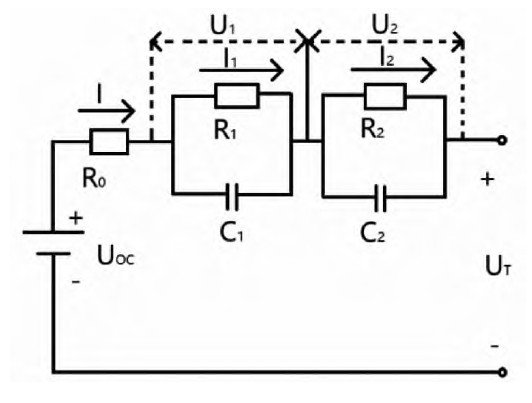
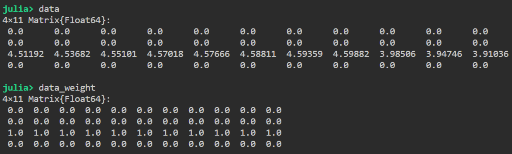
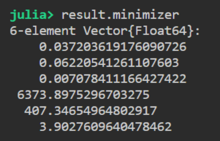
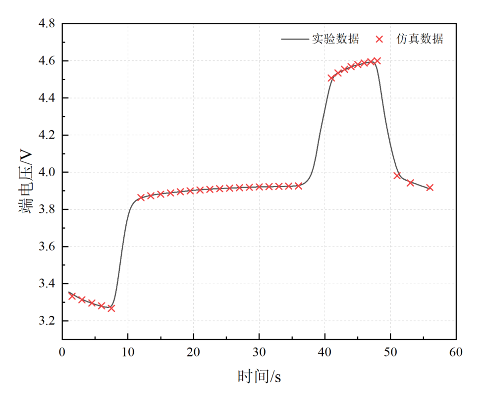
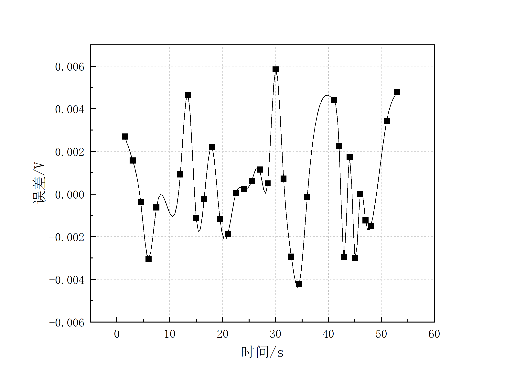

# MTK部分参数辨识实例

!!! tip
    Contents：MTK模型、优化、DiffEqParamEstim

    Contributor: HY

    Email:1171006975@qq.com

    如有错误，请批评指正。

!!! note
    DEPE = DiffEqParamEstim.jl(Differential Equation Parameters Estimate)

    [DiffEqParamEstim.jl](https://diffeqparamestim.sciml.ai/dev/)是计算微分方程参数估计的软件包。

## 原理

在进行参数辨识的时候，我们往往会遇到一个问题——实验只能测一到两个关键数据，例如温度、电压电流等。但在咱们的`ODEsystem`中，状态量`states`往往不止一两个（甚至有几十个），而在`DiffEqParamEstim.jl`包中，构建损失函数时要求我们导入所有`states`的实验数据，显然咱们是办不到的。这个时候，咱们有两种解决方案：1.自己重构损失函数，这个方法显然是最高级的，是真正的治标又治本的方法，但是重构损失函数对初学者可能不够友好（比如说我）。因此，在这里给大家介绍第2种解决方案：引入加权值`weight`，无法通过实验测得的数据，我们可以将其的`weight`设为0，其他能测得的`states`设为1。这样，我们相当于重构了损失函数，程序只会根据我们“指定”的那些数据进行参数辨识，效果跟方案1是一样的。

**下面以三星18650锂电池为例，对锂电池的模型参数进行辨识**。

## 等效电路建模

基于ModelingToolkit，建立Thevenin二阶RC等效电路模型，如下图所示。
该等效电路模型是由开路电压Uoc，欧姆内阻R0和两个RC网络结构组成，U1、U2分别为R1、R2的端电压，UT表示电池的端电压。



## 构建组件

组件总共有两个，一个是锂电池组件，用来模拟锂电池的伏安特性，另一个是充放电控制器组件，用来模拟锂电池的恒流充放电。
```julia
using DiffEqParamEstim, DifferentialEquations, Random, ModelingToolkit, PlotlyJS
using OptimizationOptimJL
using IfElse: ifelse
import RecursiveArrayTools.VectorOfArray
@variables t
∂ = Differential(t)
@connector function Pin(; name)
    sts = @variables v(t) = 1.0 i(t) = 1.0 [connect = Flow]
    ODESystem(Equation[], t, sts, []; name=name)
end
function OnePort(; name)
    @named p = Pin()
    @named n = Pin()
    sts = @variables v(t) = 1.0 i(t) = 1.0
    eqs = [
        v ~ p.v - n.v
        0 ~ p.i + n.i
        i ~ p.i
    ]
    compose(ODESystem(eqs, t, sts, []; name=name), p, n)
end
function OnePort_key(; name, v_start = 1.0, i_start = 0.0)
    @named p = Pin()
    @named n = Pin()
    sts = @variables v(t) = v_start [irreducible=true] i(t) = i_start [irreducible=true]
    eqs = [
        v ~ p.v - n.v
        0 ~ p.i + n.i
        i ~ p.i
    ]
    compose(ODESystem(eqs, t, sts, []; name=name), p, n)
end
function Ground(; name)
    @named g = Pin()
    eqs = [g.v ~ 0]
    compose(ODESystem(eqs, t, [], []; name=name), g)
end
function Lithium_ion_batteries(; name, OCV=3.9998, R0=0.029031, R1=0.00994, R2=0.01408, C1=147.462, C2=902.911)
    @named oneport = OnePort()
    @unpack v, i = oneport
    sts = @variables v_c1(t) = 0.001 v_c2(t) = 0.001 v_b(t) = 1.0 i_b(t) = 0.0
    ps = @parameters(
        R0 = R0,
        R1 = R1,
        R2 = R2,
        C1 = C1,
        C2 = C2,
        OCV = OCV,
    )
    eqs = [
        OCV ~ i_b * R0 + v_c1 + v_c2 + v_b
        i_b ~ C1 * ∂(v_c1) + v_c1 / R1
        i_b ~ C2 * ∂(v_c2) + v_c2 / R2
        v ~ v_b
        i ~ -i_b
    ]
    return extend(ODESystem(eqs, t, sts, ps; name=name), oneport)
end
function charge_controller(; name)
    @named oneport = OnePort_key()
    @unpack v, i = oneport
    equa = ifelse(t <= 10.0,16.0,ifelse(t <= 40.0,0.0,ifelse(t <= 50.0,-16.0,0.0)))
    eqs = [i ~ equa]
    return extend(ODESystem(eqs, t, [], []; name=name), oneport)
end
```
不难发现，系统一共定义有6个参数，分别是欧姆内阻`R0`,两个RC支路所对应的`R1,R2,C1,C2`以及开路电压`OCV`。

---

然后，通过连接函数，组建系统
```julia
@named ground = Ground()
@named cg = charge_controller()
@named batter = Lithium_ion_batteries()
eqs = [
    connect(batter.p, cg.p)
    connect(batter.n, cg.n, ground.g)
]

@named OdeFun = ODESystem(eqs, t)
@named model = compose(OdeFun, [batter, cg, ground])
sys = structural_simplify(model)
u0 = [
    batter.v_c1 => 0.024058864
    batter.v_c2 => 0.002594792
    cg.v => 3.928902637
    cg.i => 0
    batter.R0 => 0.037517357
    batter.R1 => 0.020913201
    batter.R2 => 0.006915906
    batter.C1 => 4636.08469
    batter.C2 => 1292.103841
    batter.OCV => 3.955556293
]
prob = ODEProblem(sys, u0, (40.0, 60.0))
```

## 导入实验数据

导入实验数据，并对数据的格式进行一定的处理。

```julia
time = [
    40.98797751
    42.00601125
    42.99980609
    43.99360093
    45.01163467
    46.00542951
    46.99922436
    47.9930192
    50.99864262
    53.0104712
    55.99185573]
real_data = [
    4.511920324
    4.536819172
    4.551011516
    4.570183629
    4.57665733
    4.5881108
    4.593588547
    4.598817305
    3.985060691
    3.94746343
    3.910364146]

randomized = VectorOfArray([[0, 0, real_data[i], 0] for i in 1:length(time)])
data = convert(Array, randomized)

weight = VectorOfArray([[0.0, 0.0, 1.0, 0.0] for i in 1:length(time)])
data_weight = convert(Array, weight)
```

本实例的数据通过getdata软件从文献中扣取。

系统变量有四个，分别为`batter.v_c1`,`batter.v_c2`,`cg.v`,`cg.i`。其中`cg.v`的数据通过实验获得，其权重值`weight`设为1，其他的变量权重值设为0。

系统参数有六个，分别为`batter.R0`,`batter.R1`,`batter.R2`,`batter.C1`,`batter.C2`,`batter.OCV`。

最终生成了`data`和`data_weight`矩阵，分别代表实验数据和相应权重值。



在不知道参数的顺序时，可以使用parameters和states函数查看系统参数。

```julia
parameters(sys)
states(sys)
```

## 构建损失函数并求解

```julia
obj = build_loss_objective(prob, Rosenbrock23(), L2Loss(time, data, data_weight=data_weight), maxiters=100000)

result = OptimizationOptimJL.optimize(obj,[0.037517357, 0.020913201, 0.006915906, 4636.08469, 1292.103841, 3.955556293])
result.minimizer
```

参数辨识结果为：



至此，锂电池充电阶段的参数辨识完毕。同理可辨识放电阶段的参数。

放电阶段实验数据：
```julia
time = [
    1.502811712	
    3.005623424
    4.508435137	
    6.011246849	
    7.489819663	
    11.9982548	
    13.50106651	
    15.00387822	
    16.50668994	
    18.00950165	
    19.48807446	
    20.99088617	
    22.49369789	
    23.9965096	
    25.49932131	
    27.00213302	
    28.50494474
    30.00775645	
    31.51056816	
    32.98914097
    34.49195269
    35.9947644]
real_data = [
    3.335698724
    3.31503268
    3.295860566
    3.277933396
    3.266977902
    3.864799253
    3.878244631
    3.880734516
    3.888702148
    3.897167756
    3.898910675
    3.902645503
    3.908372238
    3.911858077
    3.915094927
    3.918082789
    3.91957672
    3.926797386
    3.923311547
    3.92107065
    3.92107065
    3.926299409]
```

放电阶段参数辨识结果为：


# 模型验证

当放电阶段和充电阶段的模型参数全部辨识出来了以后，我们再将模型参数重新带回`ODEsystem`中，验证一下辨识结果是否有效。

```
continuous_events = [
    [t ~ 40.0] => [batter.R0 ~ 0.037203619
        batter.R1 ~ 0.062205413
        batter.R2 ~ 0.007078411
        batter.C1 ~ 6373.89753
        batter.C2 ~ 407.3465496
        batter.OCV ~ 3.902760964]
]

@named OdeFun = ODESystem(eqs,t,continuous_events=continuous_events)
@named model = compose(OdeFun, [batter, cg, ground])
sys = structural_simplify(model)
u0 = [
    batter.v_c1 => 0.0
    batter.v_c2 => 0.0
    cg.v => 0.0
    cg.i => 0.0
    batter.R0 => 0.037517357
    batter.R1 => 0.020913201
    batter.R2 => 0.006915906
    batter.C1 => 4636.08469
    batter.C2 => 1292.103841
    batter.OCV => 3.955556293
]
prob = ODEProblem(sys, u0, (0.0, 60.0))
sol = solve(prob)
```
对比锂电池的实验数据和仿真数据，可以得到锂电池模型的端电压响应拟合曲线与实际端电压响应曲线的误差，如下图所示。





可以看到，各点的拟合电压曲线误差范围均在约±0.006 V以内，即0.19%。电压最大误差为0.0059 V，平均误差为0.0021 V。电压误差大小远远较锂电池平台电压的变化范围小。因此从精度上看，模型误差尚在可接受的范围之内。

!!! note
    该参数辨识仍然是优化问题的子集，选择不同的初值很可能得到不同的结果。
    完整代码可以在`/src`目录下查看
