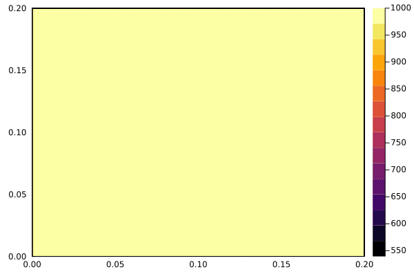

# DE求解PDE（对比MTK）

!!! tip
    Contents：DE、PDE、手动空间离散

    Contributor: YJY

    Email:522432938@qq.com

    如有错误，请批评指正。

!!! note

    DE = DifferentialEquations.jl

    PDE = Partial Differential Equation

    [DifferentialEquations.jl](https://diffeq.sciml.ai/dev/)为处理时间微分的求解建模工具包。

## DE求解PDE

在[MTK手动空间离散求解PDE](./MTK_heattran.md)中介绍了手动空间离散的思想。本篇中将通过手动PDE求解传热问题对DE与MTK进行一个小对比。

---

DE构建的问题过程中，需要把问题推演至求解之前。求解之前的部分都需要手动完成。[MTK手动空间离散求解PDE](./MTK_heattran.md)中提到，求解PDE的数值方法有这么几步：建立数学描述方程、对变量进行离散、迭代求解。

把问题进一步细化，则变为：

* Step1:建立数学描述方程
* Step2:网格生成（变量离散）
* Step3:生成求解格式
* Step4:迭代求解

MTK完成了Step3、Step4的内容，而DE只能帮我们完成Step4的内容。

!!! tip
    如果我们仔细琢磨，会发现：如果是基于时间微分的组件化建模。使用MTK时，我们完成Step1的内容，剩下MTK全包了！所以这也是为什么说，MTK提供了**基于时间的一条龙求解**。

---

我们来看看，DE是如何完成Step4的内容的。同时，也会让大家对数值求解过程有一个更加深刻的理解。

## 数值传热学实例

考虑[MTK手动空间离散求解PDE](./MTK_heattran.md)中正方形铸件的散热过程。节点的离散结果如下（不再推导）：

内节点：

$$\frac{\partial T_P}{\partial t}=A(T_W^n+T_E^n{+\ T}_N^n+T_S^n - 4T_P^n)$$

边边界节点：

$$\frac{\partial T_P}{\partial t}=A(T_W^n{+T}_N^n+T_S^n)-(B+3A)T_P^n+BT_f$$

角边界节点：

$$\frac{\partial T_P}{\partial t}=A(T_E^n\ {+\ T}_N^n\ )-(2B+2A)T_P^n+2BT_f$$

这里，我们进一步对问题进行拓展。正方形铸件初始温度1000℃，环境温度为一个变化的值：

$$T_f = 400 * (1 + sin(t))$$


## 求解实例

求解的全部代码如下：

```julia
using ModelingToolkit, DifferentialEquations
using Dates

println("=====DE TEST=====")
starttime = now()
a = 1.27E-5
n = 10
L = 0.2
δ = L / n
λ = 50
h = 1.0E9
Tf = 0.0
A = a / δ^2
B = a / (δ^2 / 2 + δ * λ / h)
p = [A, B, n]
function to_index(i, j, n)
    return (i - 1) * n + j
end
function heat!(dT, T, p, t)
    A, B, n = p
    n = Int(n)
    Tf = 400.0 * (1 + sin(t))
    # 内部节点
    for i in 2:n-1
        for j in 2:n-1
            dT[to_index(i, j, n)] = A * (T[to_index(i + 1, j, n)] + T[to_index(i - 1, j, n)] + T[to_index(i, j + 1, n)] + T[to_index(i, j - 1, n)] - 4 * T[to_index(i, j, n)])
        end
    end
    # 边边界
    for i in 2:n-1
        dT[to_index(i, 1, n)] = A * (T[to_index(i + 1, 1, n)] + T[to_index(i - 1, 1, n)] + T[to_index(i, 2, n)]) - (3B + A) * T[to_index(i, 1, n)] + B * Tf
    end
    for i in 2:n-1
        dT[to_index(i, n, n)] = A * (T[to_index(i + 1, n, n)] + T[to_index(i - 1, n, n)] + T[to_index(i, n - 1, n)]) - (3B + A) * T[to_index(i, n, n)] + B * Tf
    end
    for i in 2:n-1
        dT[to_index(1, i, n)] = A * (T[to_index(1, i + 1, n)] + T[to_index(1, i - 1, n)] + T[to_index(2, i, n)]) - (3B + A) * T[to_index(1, i, n)] + B * Tf
    end
    for i in 2:n-1
        dT[to_index(n, i, n)] = A * (T[to_index(n, i + 1, n)] + T[to_index(n, i - 1, n)] + T[to_index(n - 1, i, n)]) - (3B + A) * T[to_index(1, i, n)] + B * Tf
    end
    # 角边界
    dT[to_index(1, 1, n)] = A * (T[to_index(2, 1, n)] + T[to_index(1, 2, n)]) - (2B + 2A) * T[to_index(1, 1, n)] + 2B * Tf
    dT[to_index(n, n, n)] = A * (T[to_index(n - 1, n, n)] + T[to_index(n, n - 1, n)]) - (2B + 2A) * T[to_index(n, n, n)] + 2B * Tf
    dT[to_index(n, 1, n)] = A * (T[to_index(n, 2, n)] + T[to_index(n - 1, 1, n)]) - (2B + 2A) * T[to_index(n, 1, n)] + 2B * Tf
    dT[to_index(1, n, n)] = A * (T[to_index(2, n, n)] + T[to_index(1, n - 1, n)]) - (2B + 2A) * T[to_index(1, n, n)] + 2B * Tf
end
u0 = [1000.0 for i in 1:n for j in 1:n]
prob = ODEProblem(heat!, u0, (0, 100), p, saveat=1)
sol = solve(prob, Tsit5())
endtime = now()
println("time use:"*string(endtime - starttime))
```

### 可视化

**动画**走你！

```julia
an_len = length(sol.u)
using Plots, GR
res = rand(n, n, an_len)
for t in 1:an_len
    for i in 1:n
        for j in 1:n
            res[i, j, t] = sol.u[t][to_index(i, j, n)]
        end
    end
end
xs = LinRange(0.0, L, n)
ys = LinRange(0.0, L, n)
anim = @animate for i ∈ 1:an_len
    contourf!(xs, ys, res[:, :, i])
end
gif(anim, "DE_trans.gif", fps=24)
```



以上代码对比之前，有所改变的是：

`saveat`

我们把时间拉长，同时saveat的时间步长变成了1s。

---

## 求解速度对比

跑相同的问题：

* MTK用时：2.407s
* DE用时：0.810s

可见，Step3的符号化简与DE问题生成的确需要消耗不少的资源。

## 关于内涵的理解

MTK与DE两种方法都能够求解PDE问题。为什么这样做能行呢？下面分享一些关于问题内涵的思考。

### 空间离散的物理内涵

动画中可以清晰感受到外围颜色的震动，这是我们设定环境温度波动的结果。若要把环境温度变化以微分方程的形式定义，同样可行。只需要再添加一个变量关于时间相关的变量即可。而这个随时间的变化的环境温度，是真正驱动系统变化的变量，它的变化是由时间决定，而不受其它网格影响。相反，其它网格受到环境温度变量的影响。可以说，环境温度变量是独立于网格离散而存在的。

由此，我们可以聊一聊关于空间离散的内涵。

在以上的传热实例中，**系统的根本“驱动力”在于温差**。也就是说，因为温差的存在，才会让系统产生变化。而我们在空间离散时，其实并没有对这种变化进行处理。我们手动空间离散的内涵是：**在不同网格间，架起了让网格相互联系的桥梁**。其本质描述了网格和网格之间的联系。

从高数中微元的角度思考，只要网格足够小，那么我们就可以得到非常精确的模拟结果；从物理内涵的角度思考，不管网格如何小，任何一个网格都可以视为一个小组件，这个小组件的特性有：温度、边长、导热系数等等，并且在小组件内部，这些属性的数值视为不变。而空间离散，就是建立了这些小组件之间的关联。这种思想在数值计算领域是一种专业的离散方式——有限容积法。

所以，以上空间离散的思想内涵就和之间组件化建模的思想内涵统一起来了。区别在于，空间离散出来的结果是微元，组件化建模的模型结果是宏观组件。
但是，不同组件（微元）之间需要建立相互联系的桥梁这一点是不变的。

如果深入思考传热的内涵——由温差引起的热量传递。我们也能发现，以小组件的形式看待微元网格，其物理逻辑也是非常自洽的。

把空间离散赋予物理内涵（微元组件化）后，剩下的问题也很清晰了——组件在时间域上的变化。组件之间的连接建立好之后，当外界环境（温度）随时间动态变化，组件的属性（温度）也会发生相应的变化。这不就是时间域上动态系统的求解内涵吗？只是我们不会把描述时间微分的方程离散，而是把它丢给求解器去解。

### 迭代格式的数学内涵

迭代格式数学内涵中最关键的一环是函数`to_index()`

```julia
function to_index(i, j, n)
    return (i - 1) * n + j
end
```

MTK中采用`T[i, j]`的网格描述方式，这是从物理位置中对网格进行了一种描述。这种描述中是附加由物理含义的——空间位置。而这种附加了物理含义的变量描述，底层求解器是无法求解的。

DE能求解的方程是什么样的呢？如下所示：

```math
\left\{\begin{array}{c}
y_{1}^{\prime}(x)=f\left(x, y_{1}(x), y_{2}(x), \ldots, y_{n}(x) \right) \\y_{2}^{\prime}(x)=f\left(x, y_{1}(x), y_{2}(x), \ldots, y_{n}(x) \right) \\ \ldots \\y_{n}^{\prime}(x)=f\left(x, y_{1}(x), y_{2}(x), \ldots, y_{n}(x) \right) \\ y_{1}\left(x_{0}\right)=y_{10}, y_{2}\left(x_{0}\right)=y_{20}, \ldots, y_{n}\left(x_{0}\right)=y_{n 0}\end{array}\right.
```

写成统一的格式即：

$$\mathbf{y}\prime=\mathbf{f}(\mathbf{x},\mathbf{y})$$

!!! note

    求解微分方程的数值解法主要有：

    * 欧拉法

    $$y\left(x_{i+1}\right)=y\left(x_i\right)+hf\left(x_{i},{y(x}_{i})\right)+O\left(h^2\right)$$

    * 后退欧拉法
    $$y\left(x_{i+1}\right)=y\left(x_i\right)+hf\left(x_{i+1},{y(x}_{i+1})\right)+O\left(h^2\right)$$

    * 梯形法
    $$y\left(x_{i+1}\right)=y\left(x_i\right)+\frac{h}{2}\left[f\left(x_i,y_i\ \right)+f\left(x_{i+1},y_{i+1}\right)\right]+O\left(h^3\right)$$

    * 辛普森方法
    $$y\left(x_{i+1}\right)=y\left(x_{i-1}\right)+\\ \frac{h}{3}\left[f\left(x_{i-1},y_{i-1}\right)+4f\left(x_i,y_i\right)+f\left(x_{i+1},y_{i+1}\right)\right]+O\left(h^5\right)$$

    * 标准龙格库塔法
    ```math
    \left\{\begin{array}{c}
    y_{i+1}=y_{i}+\frac{1}{6}\left(K_{1}+2 K_{2}+2 K_{3}+K_{4}\right) \\
    K_{1}=h f\left(x_{i}, y_{i}\right) \\
    K_{2}=h f\left(x_{i}+\frac{1}{2} h, y_{i}+\frac{1}{2} K_{1}\right) \\
    K_{3}=h f\left(x_{i}+\frac{1}{2} h, y_{i}+\frac{1}{2} K_{2}\right) \\
    K_{4}=h f\left(x_{i}+h, y_{i}+K_{3}\right)
    \end{array}\right.
    ```
    其中，h为求解的步长。

    各方法阶数为（阶数越高精度越高）：

    |方法    |阶数      |
    |:------:|:-------:|
    |欧拉法   |1阶      |
    |后退欧拉法|1阶     |
    |梯形法   |  2阶    |
    |辛普森方法|  4阶    |
    |标准龙格库塔法|   4阶|

对于这样的数学描述方式，$y'$可以视为微分变量的数组，$f(x,y)$视为变量之间的联系。那么$y'=f(x,y)$的含义是：微分与其它变量之间的关联。这种关联是不包含物理内涵的。而二维数组`T[i, j]`包含了位置关系。所以要去位置化，就需要把二维映射到一维上。所以我们采用`(i - 1) * n + j`将二维索引展平为一维。

本质是通过`to_index()`消除了物理位置含义。生成了DE可计算的描述方式——最原始最根本的微分方程组数学描述方式。这一步就是前面所说的Step3。

总的来看，DE求解我们手动完成了Step2、Step3、Step4。

!!! tip
    MTK求解时。Step3、Step4由程序完成。

