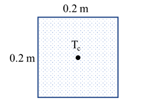
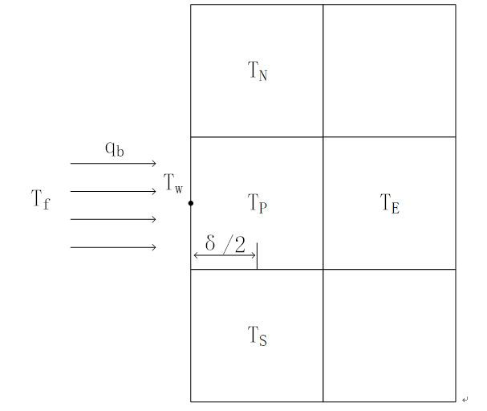

# MTK手动空间离散求解PDE

!!! tip
    Contents：MTK、PDE、手动空间离散

    Contributor: YJY

    Email:522432938@qq.com

    如有错误，请批评指正。

!!! note

    MTK = ModelingToolkit.jl

    PDE = Partial Differential Equation

    [ModelingToolkit.jl ](https://mtk.sciml.ai/stable/)符号建模包

## MTK的PDE求解技巧

在之前介绍的例子中，所有的微分都是基于时间的微分。从数学的角度来说，微分变量只有一个。而对于有多个微分变量的PDE问题，能否通过MTK手动求解呢？例如，对时间对空间微分的PDE问题。

答案是肯定的。

---

求解PDE的数值方法有这么几步：

* 建立数学描述方程
* 对变量进行离散
* 迭代求解

MTK用法中，提供了**基于时间的一条龙求解**。至于多变量的PDE，也有对应的[PDESystem](https://mtk.sciml.ai/stable/systems/PDESystem/)。但是目前来说，PDESystem还不是很完善。其离散方法涉及[NeuralPDE.jl](https://neuralpde.sciml.ai/stable/)的相关内容。就MTK.jl本身来说，没有打通PDE的建模与求解过程。

---

所以，使用MTK求解PDE的缺口在于，**没有针对其它变量的离散——空间离散**。那么，如果我们能够手动完成空间离散，这个问题就解决了。事实上，手动空间离散是可行的。

## 数值传热学实例

考虑一个正方形铸件的散热过程，正方形铸件初始温度1000℃，环境温度为0℃。如图

  

传热的控制方程为：

```math
\rho c_{p} \frac{\partial T}{\partial t}=\lambda(\frac{\partial^{2} T}{\partial x^{2}} +\frac{\partial^{2} T}{\partial y^{2}})
```

将参数统一在等式右端，即

```math
\frac{\partial T}{\partial t}=a(\frac{\partial^{2} T}{\partial x^{2}}+\frac{\partial^{2} T}{\partial y^{2}})
```

其中，

$$\rho——密度，单位为：\frac{kg}{m^3}$$

$$c_p——物体热容，单位为：\frac{J}{kg\cdot k}$$

$$\lambda——导热系数，单位为：\frac{W}{m\cdot k}$$

$$a——热扩散系数，单位为：\frac{m^2}{s}$$

### 内部节点空间离散

对方程进行空间离散，采用二阶中心差分，有：

```math
\frac{\partial T_{i,j}}{\partial t}=a (\frac{T_{i+1, j}^{n}- 2 T_{i, j}^{n}+T_{i-1, j}^{n}}{\Delta x^{2}}+\frac{T_{i, j+1}^{n}- 2 T_{i, j}^{n}+T_{i, j-1}^{n}}{\Delta y^{2}})
```

若使用化简表达，

$$\Delta x = \Delta y = \delta\\T_{i, j}=T_P,T_{i+1, j}=T_{W},T_{i-1, j}=T_{E},T_{i, j-1}=T_{N},T_{i, j+1}=T_{S}$$

则有**内部节点的空间离散**：

```math
\frac{\partial T}{\partial t}=\frac{a}{\delta^{2}}(T_{W}^{n}+T_{E}^{n}+T_{N}^{n}+T_{S}^{n} - 4T_{P}^{n})
```

### 边边界空间离散

下面考虑边界条件。以W边为例。

  

边界条件使用第三类边界条件。

$$\delta h(T_{f}-T_{W}^{n})=\delta \lambda \frac{T_{W}^{n}-T_{P}^{n}}{\frac{\delta}{2}}$$

为了消去$T_{W}^{n}$，考虑该式子的等比式：

$$\frac{(T_{f}-T_{W}^{n})}{\frac{1}{h}}=\frac{T_{W}^{n}-T_{P}^{n}}{\frac{\delta}{2 \lambda}}=\frac{(T_{f}-T_{P}^{n})}{\frac{1}{h}+\frac{\delta}{2 \lambda}} \tag{a}$$

!!! note
    当对流散热系数h足够大时，$\frac{2\lambda}{\delta h}\approx0$，即$T_W \approx T_f$。第三类边界条件可以近似为第一类边界条件——**壁温恒定为环境温度**，如下式推导：

    $$T_{W}=\frac{h T_{f}+\frac{2 \lambda}{\delta} T_{P}^{n}}{h+\frac{2 \lambda}{\delta}}=\frac{T_{f}+\frac{2 \lambda}{\delta h} T_{P}^{n}}{1+\frac{2 \lambda}{\delta h}} \approx T_f$$

    这是从数学上的一种理解，后面并没使用到该近似。

对边界采用附加源法进行分析。$T_W$为边界点温度，$T_P$节点的能量守恒方程为：

```math
\begin{array}{c}\delta \lambda \frac{T_{E}^{n}-T_{P}^{n}}{\delta}+\delta \lambda \frac{T_{N}^{n}-T_{P}^{n}}{\delta}+\delta \lambda \frac{T_{S}^{n}-T_{P}^{n}}{\delta}+\delta \lambda \frac{T_{W}^{n}-T_{P}^{n}}{\frac{\delta}{2}}=\rho c \delta^{2} \frac{\partial T_P}{\partial t}\end{array}
```

将式(a)的第三项代入上式中的$T_W-T_P$项并化简，最终能得到边边界的边界方程：

```math
\begin{array}{c}\frac{\partial T_P}{\partial t}=\frac{a }{\delta^{2}}(T_{E}^{n}+T_{N}^{n} + T_{S}^{n})-(\frac{a}{\frac{\lambda \delta}{h}+\frac{\delta^{2}}{2}}+\frac{3 a }{\delta^{2}}) T_{P}^{n}+\frac{a }{\frac{\lambda \delta}{h}+\frac{\delta^{2}}{2}} T_{f}\end{array}
```

同理可得其它3个边的边边界方程。

### 角边界空间离散

最后考虑**角边界**。以铸件左上角为例进行分析，下如图所示的角边界。

  

分析方法同边边界的分析方法，最后可得：

$$\frac{\partial T_P}{\partial t}=\frac{a}{\delta^{2}}(T_{E}^{n}+T_{N}^{n}+T_{S}^{n})-(\frac{a}{\frac{\lambda \delta}{h}+\frac{\delta^{2}}{2}}+\frac{2a}{\delta^{2}}) T_{P}^{n}+\frac{2a}{\frac{\lambda \delta}{h}+\frac{\delta^{2}}{2}} T_{f}$$

### 离散方程汇总

经过以上推导，得到了内节点表达式、边边界表达式和角边界表达式。为了方便程序表达，对方程的系数进行化简，令，

$$A = \frac{a}{\delta^2}，B = \frac{a}{\frac{\lambda\delta}{h}+\frac{\delta^{2}}{2}}$$

!!! note
    当$h$很大时，$\frac{\lambda \delta}{h}\approx 0$，所以$B \approx 2A$。和前面边界条件的理解相似。同样的，这只是一种理解方式，并没有使用。

内节点：

$$\frac{\partial T_P}{\partial t}=A(T_W^n+T_E^n{+\ T}_N^n+T_S^n - 4T_P^n)$$

边边界节点：

$$\frac{\partial T_P}{\partial t}=A(T_W^n{+T}_N^n+T_S^n)-(B+3A)T_P^n+BT_f$$

角边界节点：

$$\frac{\partial T_P}{\partial t}=A(T_E^n\ {+\ T}_N^n\ )-(2B+2A)T_P^n+2BT_f$$

## 求解实例

求解的全部代码如下：

```julia
using ModelingToolkit, DifferentialEquations

# 参数设定
a = 1.27E-5
n = 10
L = 0.2
δ = L / n
λ = 50
h = 1.0E9
Tf = 0.0
A = a / δ^2
B = a / (δ^2 / 2 + δ * λ / h)

@variables t T[1:n, 1:n](t)

D = Differential(t)

# 内节点代码
insides = [
    D(T[i, j]) ~ A * (T[i+1, j] + T[i-1, j] + T[i, j+1] + T[i, j-1] - 4 * T[i, j])
    for i in 2:n-1 for j in 2:n-1]

# 边边界代码
Wb = [
    D(T[i, 1]) ~ A * (T[i+1, 1] + T[i-1, 1] + T[i, 2]) - (3B + A) * T[i, 1] + B * Tf
    for i in 2:n-1
]
Eb = [
    D(T[i, n]) ~ A * (T[i+1, n] + T[i-1, n] + T[i, n-1]) - (3B + A) * T[i, n] + B * Tf
    for i in 2:n-1
]
Nb = [
    D(T[1, i]) ~ A * (T[1, i+1] + T[1, i-1] + T[2, i]) - (3B + A) * T[1, i] + B * Tf
    for i in 2:n-1
]
Sb = [
    D(T[n, i]) ~ A * (T[n, i+1] + T[n, i-1] + T[n-1, i]) - (3B + A) * T[1, i] + B * Tf
    for i in 2:n-1
]

# 4 corner boundary
corner = [
    D(T[1, 1]) ~ A * (T[2, 1] + T[1, 2]) - (2B + 2A) * T[1, 1] + 2B * Tf,
    D(T[n, n]) ~ A * (T[n-1, n] + T[n, n-1]) - (2B + 2A) * T[n, n] + 2B * Tf,
    D(T[n, 1]) ~ A * (T[n, 2] + T[n-1, 1]) - (2B + 2A) * T[n, 1] + 2B * Tf,
    D(T[1, n]) ~ A * (T[2, n] + T[1, n-1]) - (2B + 2A) * T[1, n] + 2B * Tf
]

eqs = append!(insides, Wb, Eb, Nb, Sb, corner)

@named sys = ODESystem(eqs, t)

sys = structural_simplify(sys)

# u0 = [1000.0 for i in 1:n for j in 1:n]
u0 = Dict(T[i, j] => 1000.0 for i in 1:n for j in 1:n)
prob = ODEProblem(sys, u0, (0, 100), [], saveat=0.1)
sol = solve(prob, Tsit5())

```

值得一提的是：

---

`MTK变量定义`:

这是有效的变量数组（矩阵）的定义方式，也就是说MTK支持变量数运算。

```julia
@variables t T[1:n, 1:n](t)
```

---

`ODESystem定义`

ODESystem定义时，既没有传递变量，也没有传递参数，甚至连t也可以不用传递，这都是可行的。ODESystem定义时能够自动检查（check）方程结构，从方程中获得变量信息。

```julia
@named sys = ODESystem(eqs, t)
```

!!! tip
    ODESystem定义时，若传递变量数组或者参数数组，check时不能通过。目前来说这是一个bug，所以可以不写。

---

`MTK初值设定`

初值或者参数传递时，以下两种方式都可以。但也有区别。在符号计算中，符号在数组中的位置是不确定的。假如以数组的形式传递进去，那么就不知道哪个初值传递给了哪个变量（如果初值或参数都相同那就无所谓）。所以，初值传递需要精确到变量时，最好使用Dict。

```julia

u0 = [1000.0 for i in 1:n for j in 1:n]

u0 = Dict(T[i, j] => 1000.0 for i in 1:n for j in 1:n)
```

---

`saveat`

saveat是solution handle中的内容。其作用是使sol中结果存储结果的时间步长为给定步长。

当然，也可以使用`sol()`获得任意时刻的值。

```julia
sol(2.5)
```

但是这样会丢失变量的顺序，就是无法得知变量与数值的对应关系了。**能否解决这个问题，这里还有许多可测试与探索的空间**。

---

### 可视化

!!! tip
    Julia生态中，可视化也是很强的！

    [Plots.ji](https://docs.juliaplots.org/dev/)远比想象的强大！

最后，**动画**走你！

```julia
an_len= length(sol[T[1,1]])
using Plots, GR
res = rand(n,n,an_len)
for t in 1:an_len
    for i in 1:n
        for j in 1:n
            res[i,j,t] = sol[T[i,j]][t]
        end
    end
end
xs = LinRange(0.0, L, n)
ys = LinRange(0.0, L, n)
contourf!(xs, ys, res[:,:,10])
anim = @animate for i ∈ 1:50
    contourf!(xs, ys, res[:,:,i])
end
gif(anim, "anim.gif", fps = 24)
```


物体温度是下降的，在不断散热。

