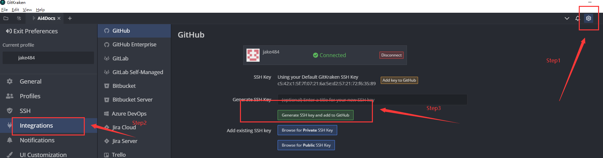
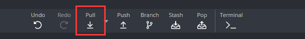
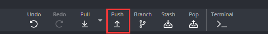
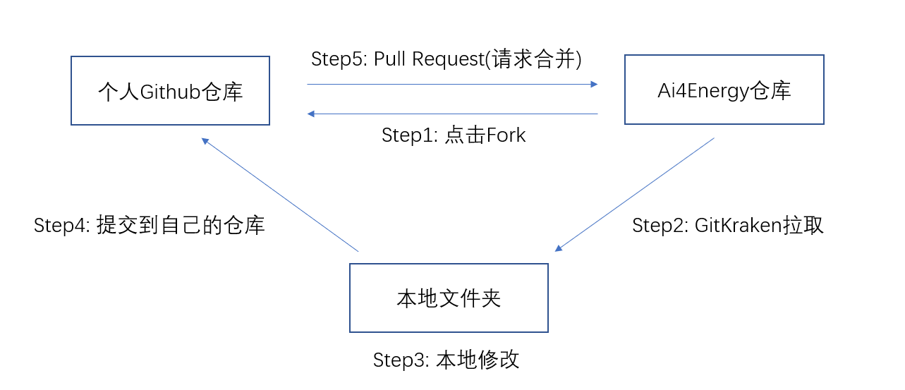
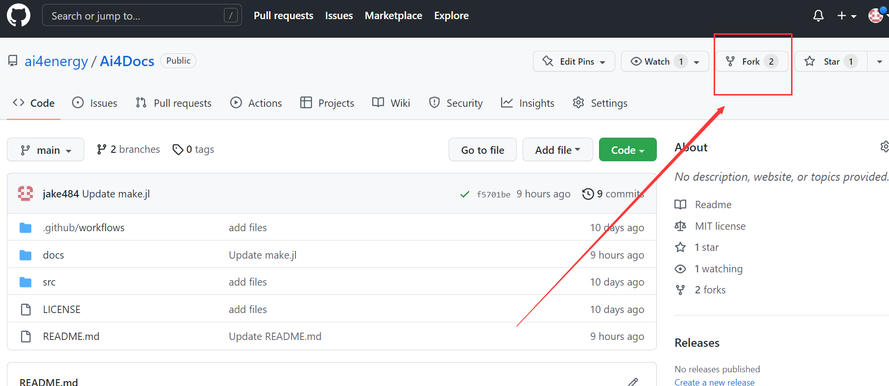
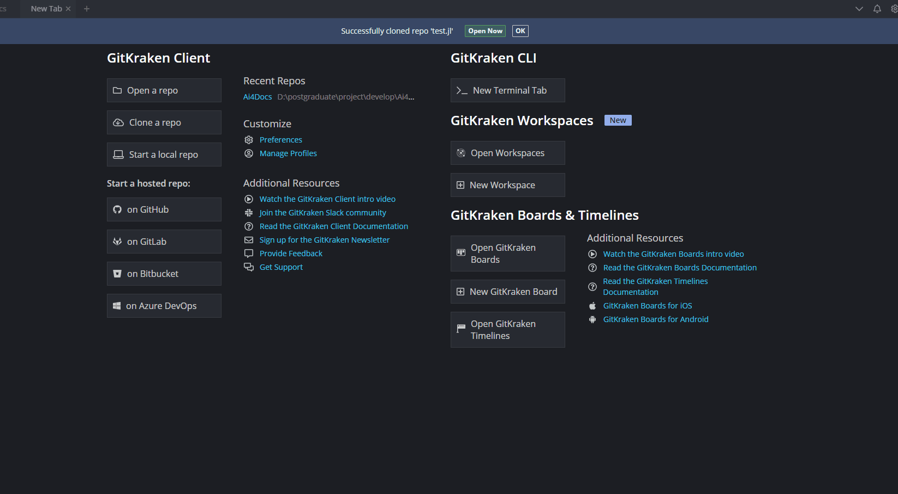
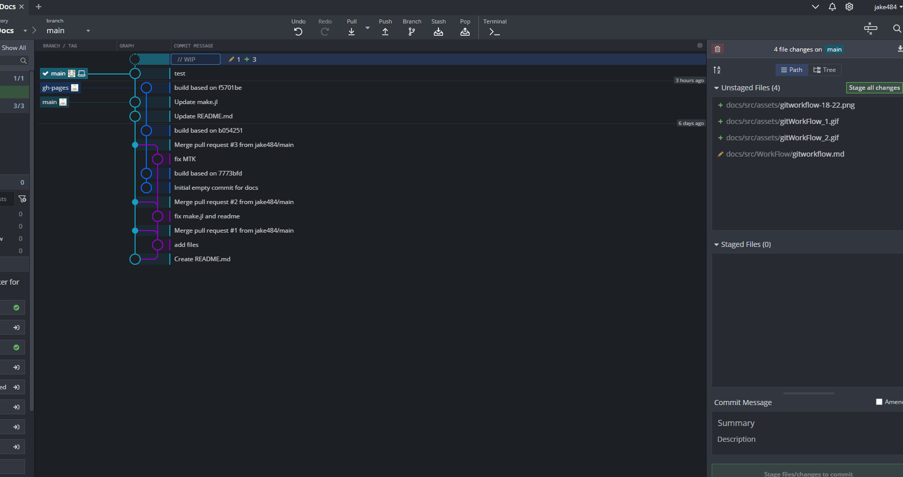

# Ai4E组织合作开发流程

!!! tip
    Contents：基于Gitkraken的合作开发流程

    Contributor: YJY

    Email:522432938@qq.com

    如有错误，请批评指正。

!!! note

    [Gitkraken](https://www.gitkraken.com/)为Git图形化软件。

    预计实践时间：60min - 120min

## 开发流程简介

Github是一个非常流行的代码托管平台，上面有许许多多的前辈与“他们的牛逼代码”。为了充分与国际接轨，我们（Ai4Energy）组织也选择Github。

Ai4Energy组织可以视为一个大的代码仓库，每个人都可以向组织中贡献代码。Github基于Git，有完善且高效的多人协作的开发流程（所谓开发流程其实就是如何向Ai4Energy组织中提交代码做贡献）。下面将介绍富有Ai4Energy特色（特色就是**简单**🤣🤣🤣）的开发流程。

## 准备工作

1. Github注册账户
2. 下载[Gitkraken](https://www.gitkraken.com/)
3. 用Github账户登录Gitkraken（**重要**），然后建立Gitkraken的profile（个人形象，**不重要**）
4. 建立SSH登录验证方式（点击下面的绿色按钮，Gitkraken自动生成并且上传），如下图。

  

!!! tip
    如何稳定连接Github，大家各显神通吧！推荐一个免费加速器**Watt Toolkit**，在微软应用商店。

接下来是开发的逻辑介绍。

## 面向组织合作开发的逻辑

应用场景是这样的：

在某师兄云盘里有一份报告，师兄给2个师弟说你们合作把这份报告改一改（假设两位师弟一个在美国一个在日本，且不认识，只有云盘的地址）。小师弟先改第一版，大师弟改第二版。他们需要干以下的操作：

1. 小师弟把文件先添加到自己的云盘资源里
2. 假设云盘没有在线编辑功能，小师弟修改文件只有一种选择：把文件下载到本地修改。
3. 小师弟修改报告
4. 小师弟把修改完成的报告上传至自己的云盘。
5. 修改完成之后，小师弟就可以对师兄说：我改完了，文件在我自己的云盘里，如果可以的话，我就把你的那一份原来的报告覆盖了。

接下来的选择就有两种：

* 师兄说：改的不错，覆盖吧。然后大师弟重复1-5步骤
* 师兄说：改的不行，重改吧。然后小师弟重复2-5步骤

以上，就是我们工作流程的实际内涵。在开发时，我们一般用**行话**来描述🤣：

1. 这个行为叫`Fork`。Fork的意思是在自己的个人账号下建立一个一样的别人的仓库，而且会显示你这个仓库是fork别人的。
  
2. 这个行为叫`Pull`。一般而言，第一次在本地建仓时，会自动Pull。本地仓库建好了，若云端仓库文件有更新，这个时候本地文件要更新的话，就有相应的Pull操作。
  
3. 这个行为叫**开发**🤣。
4. 这个行为叫`Push`。
  
5. 这个行为叫`Pull Request`（合并到主分支）。为要先推送到自己仓库的副本而不是直接覆盖别人的那个仓库呢？我想各位心里应该有数🤣。

整体的逻辑图如下：

  

## 合作开发的方法

方法对应以上5个步骤。

### Step1: Fork

  

### Step2: Pull

首先是本地建仓：

拉取之后点击`Open Now`，我们就能看到操作页面。同时在左侧需要点击`Add`。GitKraken自动检测到我们Fork了一个包，它会认为你可能需要通过修改别人的代码然后上传到你自己的库里，所以它给了一个添加自己Fork的库的一个选项（如果点上，也可以手动添加远程仓库）。

!!! note
    在Step2中，如果是从自己Fork的仓库地址建立本地仓库，也可以，只不过要手动添加Ai4的远程地址了。

中间的蓝色绿色圈是啥呢？是文件修改的记录。

### Step3: 本地进行内容编辑——开发

### Step4: Push

编辑完成之后（任何改动都会被检测到）有几个关键步骤：

* 给本次修改命名，表示干了什么（例如：add a file）
* 右边上方暂存修改
* 右边底下提交更改
* 在修改的圈那里右键，点击UpStream，修改推送地点。**一定要选择自己的库**，组织的库没有权限推送上去。
* 最后点击`Push`

### Step5: Pull Request（合并到主分支）

Gitkraken有图形化的方式创建Pull Request。如下：

Pull Request就是申请将你做的修改合并到Ai4的某个仓库（任何别人的仓库）。

!!! tip
    为什么能合并呢？因为首先把别人的库给拉取过来了，只是做了一些修改（增加或删减内容），仓库的“根”是一致的所以能合并。就类似，小师弟把师兄的文件复制过来了，在它的基础上改，改完之后把自己的内容复制，在师兄的文件中覆盖粘贴，这是没有问题的。
    所以，如果选择两个不同“根”的仓库去Pull Request，那是行不通的。

完成之后，就等“师兄审核”吧！

这是一套基于Gitkraken的简版Git合作开发流程，如果有兴趣，可以去了解原汁原味的Git。相关的资料在CSDN上很多！

## 实践

Ai4Energy中有一个`test.jl`。完成以下内容：

* 完成一次上述开发过程，形成具象认知。
* 开发内容：在`test.jl`库中的`src`文件夹中，添加编辑一个`xxx.jl`的文件，（**xxx为自己的名字，中文，便于"师兄审核"**）
* 文件内容任意。期望针对文档给出改进建议，也可以是一段Julia代码。

!!! tip
    改进建议可以是任何让你不爽的地方：有哪些没有涉及到的问题；哪些地方写得不够明白；哪些地方写得太理所当然了等等。有问题大胆的提，Ai4Energy的开发者具有开放包容的态度🤝🤝🤝

以上是一个简单的流程，对于Git或Gitkraken来说只是冰山一角。遇到任何疑问与问题，积极思考原因，可以自行查阅相关资料，也可以积极的和Ai4组的同学交流。
