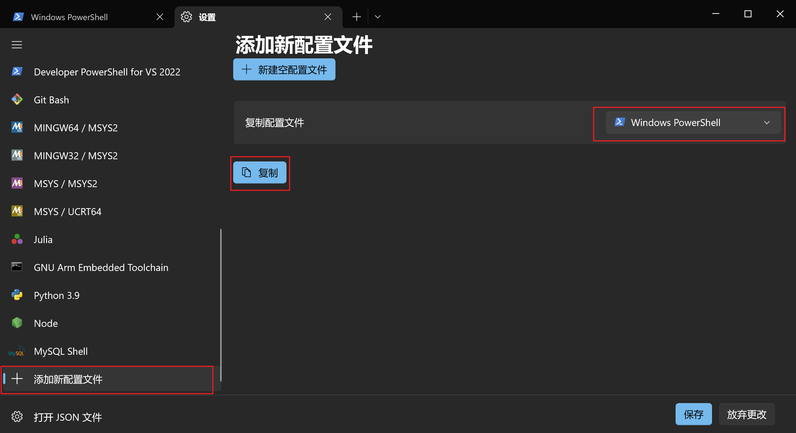
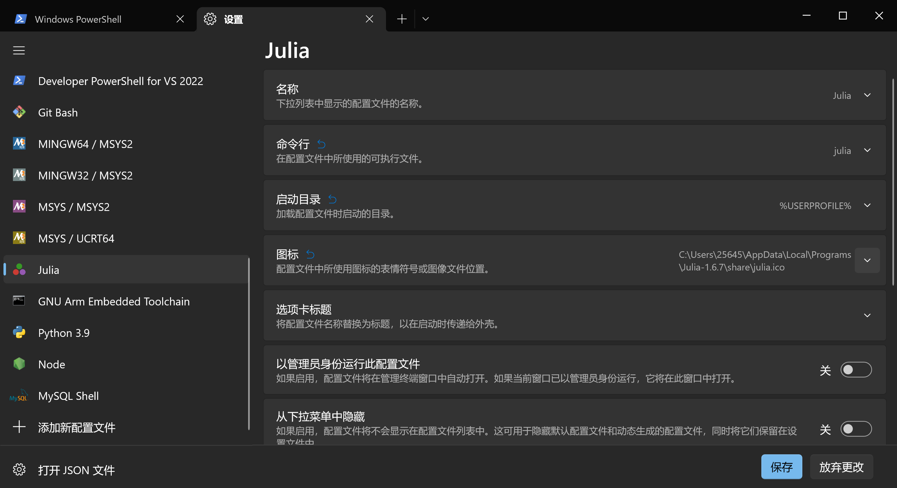

# Julia安装

!!! tip
    Contents：julia安装

    Contributor: 孙蓓蓓

    Email:

    如有错误，请批评指正。

## 下载网址

搜索[清华大学开源软件镜像站](https://mirrors.tuna.tsinghua.edu.cn/)。  

## 下载julia-1.7.2-win64.zip安装包

!!! note
    v1.7.2(Feb 6,2022)为julia当前稳定版本。

首先，在搜索框中搜索julia，点击julia-releases：

其次，点击bin/：

找到winnt/：

选择x64/：

然后，找到1.7版本系列：

最后，下拉找到julia-1.7.2-win64.zip安装包，点击下载。

## 解压安装

找到下载好的安装包，右键解压。解压后，生成一个julia-1.7.2文件夹。可执行文件julia.exe就在julia-1.7.2文件夹的bin文件夹下。

## 将路径加到环境变量中

在任务栏搜索框中找到“编辑系统环境变量”：

打开环境变量；在用户变量中选择变量Path，点击编辑；新建，将julia.exe文件所在路径复制进去，然后点击确定。

!!! tip
    也可使直接“<i>
    <svg fill="white" xmlns="http://www.w3.org/2000/svg" viewBox="0 0 30 30" width="16px" height="16px">
    <path
        d="M12 16L3 16 3 23.75 12 24.988zM12 5L3 6.25 3 14 12 14zM14 4.75L14 14 27 14 27 3zM14 16L14 25.25 27 27 27 16z" />
</svg>
</i> + r”打开运行▱，输入 `rundll32 sysdm.cpl,EditEnvironmentVariables` 直接打开环境变量设置界面，注意，此时无法编辑系统环境变量（实际上也并不建议直接编辑系统环境变量），编辑用户环境变量即可。

## 执行julia

在任务栏搜索框输入cmd，打开命令提示符，输入julia，进入Julie REPL，此时julia就可以执行了。

直接输入exit()，即可退出。

另外，Windows下推荐使用Windows Terminal作为交互终端（直接的Cmd或Powershell终端中，均不支持类似
<i>
<svg version="1.1" xmlns="http://www.w3.org/2000/svg" xmlns:xlink="http://www.w3.org/1999/xlink" width="20px" height="20px" viewBox="220 280 180 120" xml:space="preserve">
 <g>
  <path fill-rule="evenodd" clip-rule="evenodd" fill="white"
   d="M259.618,401.811l1.231,0.268l-4.314,13.678h-39.031v-1.371h1.903
  c2.132,0,3.654-0.699,4.568-2.082c0.521-0.799,0.774-2.639,0.774-5.506v-32.534c0-3.147-0.343-5.114-1.041-5.9
  c-0.964-1.091-2.398-1.637-4.301-1.637h-1.903v-1.383h22.827v1.383c-2.677-0.025-4.556,0.216-5.634,0.736
  c-1.078,0.52-1.814,1.18-2.208,1.979c-0.394,0.787-0.596,2.69-0.596,5.685v31.671c0,2.057,0.203,3.465,0.596,4.238
  c0.292,0.52,0.749,0.9,1.37,1.154c0.622,0.242,2.551,0.367,5.799,0.367h3.68c3.87,0,6.586-0.279,8.146-0.85
  c1.561-0.57,2.982-1.586,4.276-3.031C257.042,407.229,258.336,404.932,259.618,401.811L259.618,401.811L259.618,401.811z" />
  <path fill-rule="evenodd" clip-rule="evenodd" fill="white" d="M265.631,392.346h-15.192l-2.657,6.193c-0.662,1.521-0.988,2.658-0.988,3.418
  c0,0.594,0.287,1.117,0.85,1.57c0.573,0.455,1.797,0.752,3.694,0.889v1.068H238.98v-1.068c1.64-0.295,2.697-0.672,3.181-1.135
  c0.988-0.92,2.074-2.805,3.27-5.641l13.809-32.292h1.008l13.661,32.637c1.097,2.627,2.094,4.326,2.993,5.107
  c0.899,0.779,2.153,1.225,3.753,1.322v1.068h-15.489v-1.068c1.561-0.078,2.618-0.346,3.171-0.789
  c0.553-0.436,0.83-0.979,0.83-1.621c0-0.848-0.396-2.182-1.166-4.02L265.631,392.346L265.631,392.346L265.631,392.346z
   M264.821,390.202l-6.658-15.854l-6.826,15.854H264.821L264.821,390.202L264.821,390.202z" />
  <path fill-rule="evenodd" clip-rule="evenodd" fill="white" d="M313.479,365.008l0.563,11.921h-1.432c-0.27-2.098-0.64-3.594-1.126-4.502
  c-0.768-1.445-1.804-2.507-3.083-3.197c-1.292-0.691-2.98-1.036-5.077-1.036h-7.163v38.833c0,3.121,0.345,5.064,1.011,5.844
  c0.946,1.051,2.417,1.574,4.387,1.574h1.766v1.381h-21.552v-1.381h1.803c2.149,0,3.671-0.652,4.566-1.957
  c0.55-0.793,0.832-2.621,0.832-5.461v-38.833h-6.114c-2.367,0-4.055,0.179-5.053,0.524c-1.305,0.473-2.417,1.394-3.338,2.737
  c-0.92,1.356-1.471,3.172-1.65,5.475h-1.42l0.602-11.921H313.479L313.479,365.008L313.479,365.008z" />
  <path fill-rule="evenodd" clip-rule="evenodd" fill="white" d="M319.647,381.675v19.259h10.708c2.785,0,4.637-0.418,5.569-1.252
  c1.251-1.104,1.938-3.042,2.085-5.826h1.325v16.965h-1.325c-0.331-2.367-0.674-3.889-1.006-4.564
  c-0.429-0.834-1.141-1.496-2.122-1.975c-0.981-0.477-2.49-0.723-4.526-0.723h-10.708v16.068c0,2.158,0.098,3.471,0.281,3.938
  c0.197,0.467,0.528,0.834,1.006,1.117c0.479,0.27,1.398,0.404,2.736,0.404h8.267c2.748,0,4.76-0.184,5.999-0.576
  c1.251-0.381,2.44-1.129,3.594-2.258c1.484-1.484,3.006-3.729,4.563-6.723h1.435l-4.194,12.219h-37.56v-1.326h1.73
  c1.141,0,2.232-0.281,3.263-0.834c0.772-0.379,1.288-0.957,1.569-1.717c0.271-0.773,0.405-2.344,0.405-4.709v-31.661
  c0-3.091-0.307-4.992-0.933-5.716c-0.858-0.957-2.294-1.435-4.305-1.435h-1.73v-1.337h37.56l0.539,10.672h-1.41
  c-0.503-2.563-1.055-4.318-1.668-5.274c-0.613-0.957-1.509-1.693-2.711-2.196c-0.957-0.355-2.65-0.54-5.066-0.54H319.647
  L319.647,381.675L319.647,381.675z" />
  <path fill-rule="evenodd" clip-rule="evenodd" fill="white" d="M370.217,387.709l10.832,16.14c2.997,4.469,5.219,7.289,6.679,8.469
  c1.448,1.182,3.29,1.83,5.524,1.957v1.371h-21.651v-1.371c1.435-0.025,2.502-0.18,3.2-0.457c0.521-0.217,0.939-0.561,1.282-1.016
  c0.331-0.459,0.496-0.928,0.496-1.398c0-0.57-0.114-1.143-0.331-1.713c-0.178-0.42-0.862-1.512-2.044-3.277l-8.559-12.94
  l-10.565,13.538c-1.117,1.447-1.791,2.4-2.006,2.883c-0.229,0.482-0.344,0.99-0.344,1.51c0,0.801,0.344,1.447,1.004,1.969
  c0.672,0.521,1.955,0.826,3.835,0.902v1.371h-17.893v-1.371c1.27-0.127,2.349-0.395,3.276-0.789
  c1.536-0.646,2.996-1.51,4.381-2.602c1.396-1.092,2.984-2.77,4.762-5.029l11.911-15.022l-9.93-14.552
  c-2.705-3.937-5.004-6.527-6.883-7.747c-1.893-1.232-4.063-1.879-6.515-1.956v-1.384h23.327v1.384
  c-1.98,0.076-3.34,0.394-4.076,0.965c-0.724,0.571-1.092,1.207-1.092,1.893c0,0.927,0.597,2.26,1.778,4.025l7.745,11.568
  l8.966-11.353c1.041-1.333,1.676-2.248,1.917-2.743c0.229-0.508,0.355-1.016,0.355-1.537s-0.152-0.978-0.457-1.372
  c-0.368-0.521-0.838-0.889-1.409-1.092c-0.571-0.216-1.752-0.331-3.53-0.356v-1.384h17.893v1.384
  c-1.41,0.076-2.565,0.292-3.467,0.661c-1.333,0.571-2.565,1.346-3.683,2.311c-1.117,0.965-2.692,2.755-4.724,5.358L370.217,387.709
  L370.217,387.709L370.217,387.709z" />
 </g>
</svg>
</i>的用法输入UTF-8字符）。

直接在Microsoft Store上下载Windows Terminal，打开软件后进入设置界面：

可以直接在界面中运行`julia`命令，或者将Julia添加到终端中。

左侧导航栏划至最下，新建配置文件，这里这就复制Windows Powershell的（有兴趣可以复制Cmd的试试）。

在新建的配置文件里面编辑设计即可，详细如图：

注：终端界面的图标自己找一个，如果懒着找，就接着使用Powershell的也行。
