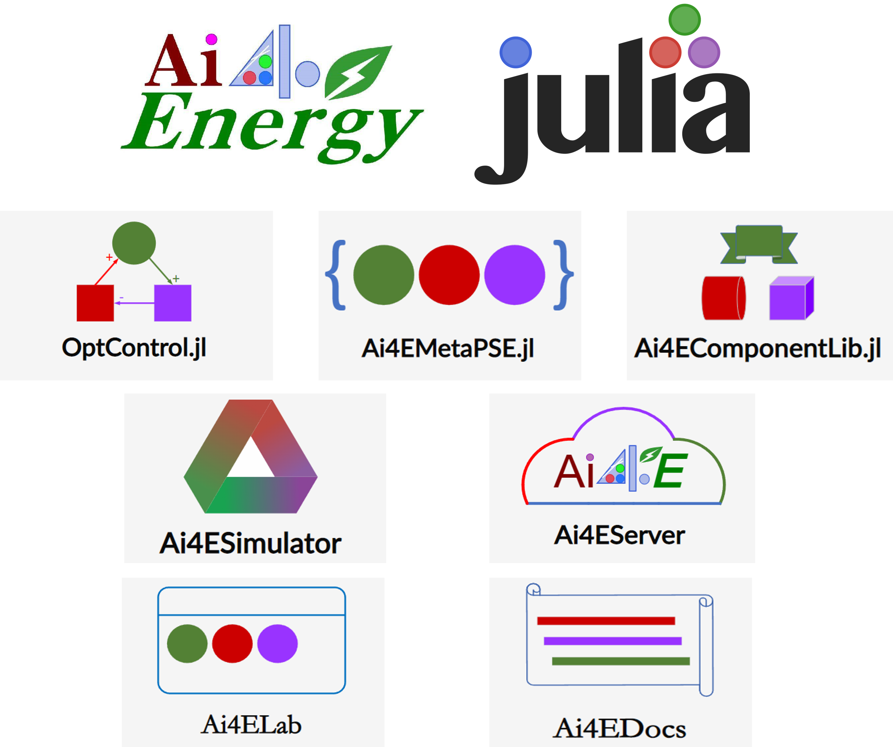

# Ai4EDocs

  

!!! tip

    * [智慧能源：从概念到实践](https://enpocourses.github.io/enpo811203/) 
    * [OptControl.jl](https://ai4energy.github.io/OptControl.jl/dev/) 对MTK中ODESystem的最优控制支持包。
    * [Ai4ELab](https://ai4energy.github.io/Ai4ELab/dev/) 虚拟仿真实验室
    * [Ai4EComponentLib.jl](https://ai4energy.github.io/Ai4EComponentLib.jl/dev/) 组件库
    * [Ai4EMetaPSE.jl](https://ai4energy.github.io/Ai4EMetaPSE.jl/dev/) 微分方程的Json文件解析器
    * [Ai4Server](https://ai4energy.github.io/Ai4EServer/) 基于Genie.jl架构的Ai4E后端服务框架。

## Ai4EDocs简介

Ai4EDocs是Ai4E小组在学习中整理的一些可操作案例。案例的核心主要与建模仿真优化控制相关。文档主要特点为：

* 既有数学层面的探究，也包含了应用层面的案例。
* 包含大量Julia生态中软件包的使用
* 兼顾建模仿真优化控制核心与拓展
* 分享对理论抽象问题的认识
* 分享软件使用过程中的技巧
* 分享学习的心路历程与对库使用的理解
* Ai4Energy组的合作开发流程

供学习参考。


欢迎贡献文档！


## Julia资源传送门

### 基础文档

* [Julia中文文档](https://cn.julialang.org/)
* [Julia官方文档](https://julialang.org/)
* [Sciml总站](https://sciml.ai/)

### 数值计算

* [DifferentialEquations.jl](https://diffeq.sciml.ai/dev/)（常微分方程求解包）
* [NeuralPDE.jl](https://neuralpde.sciml.ai/stable/)（偏微分方程求解包）
* [JuMP.jl](https://jump.dev/JuMP.jl/stable/)（优化求解器包）
* [DiffEqParamEstim.jl](https://diffeqparamestim.sciml.ai/dev/)（基于DE的参数辨识包）
* [Flux.jl](https://fluxml.ai/Flux.jl/stable/) Julia机器学习包(The Julia Machine Learning Library)
* [EquationsSolver](https://jake484.github.io/EquationsSolver.jl/) 自制的小型方程（组）求解器
* [Optimization.jl](https://optimization.sciml.ai/stable/)(Sciml优化包)

### 符号计算

* [ModelingToolkit.jl](https://mtk.sciml.ai/stable/)（符号建模包）
* [Symbolics.jl](https://symbolics.juliasymbolics.org/dev/)（MTK依赖的符号求解包）
* [SymPy.jl](https://docs.juliahub.com/SymPy/KzewI/1.0.31/) 符号计算包（可求方程解析解），与Matlab中的符号工具包类似

### 计算图形学

* [Meshes.jl](https://juliageometry.github.io/Meshes.jl/stable/) 纯Julia的CGAL（计算图形学算法库）实现
* [Gmsh.jl](https://github.com/JuliaFEM/Gmsh.jl) gmsh的Julia接口

### 数据处理

* [FileIO.jl](https://github.com/JuliaIO/FileIO.jl) Julia中不同类型文件读入的统一接口（包括MeshIO）
* [CSV.jl](https://csv.juliadata.org/stable/)
* [DataFrames.jl](https://dataframes.juliadata.org/stable/)（大规模数据批量处理包）
* [Unitful](https://painterqubits.github.io/Unitful.jl/stable/)（单位计算包）
* [JSON3.jl](https://quinnj.github.io/JSON3.jl/stable/) JSON到类型的读入
* [JSON.jl](https://github.com/JuliaIO/JSON.jl)

### 可视化

* [Plots.ji](https://docs.juliaplots.org/dev/)（可视化包）
* [Pkg.jl](https://pkgdocs.julialang.org/v1/) 包管理
* [Makie.jl](https://docs.makie.org/stable/) 高性能绘图包。
* [PlotlyJS.jl](https://plotly.com/julia/) 网页绘图，图可拖动。

### WEB框架

* [Geine.jl and Stipple.jl](https://www.genieframework.com/) Julia Web 框架Geine和Stipple的文档
* [HTTP.jl](https://juliaweb.github.io/HTTP.jl/stable/)

## 其它资源传送门

1. [CoolProp](http://www.coolprop.org/index.html)
2. [APMonitor-github](https://github.com/APMonitor/)
3. [APMonitor](http://apmonitor.com/)
4. [Greet](https://greet.es.anl.gov/)
5. [Mqtt系列教程](https://www.hangge.com/blog/cache/detail_2347.html)
6. [Mixed Integer Distributed Ant Colony Optimization(midaco-solver)](http://www.midaco-solver.com/)
7. [Python的GUI开发工具PYQT](https://github.com/PyQt5/PyQt/)
8. [Mathematica](https://tiebamma.github.io/InstallTutorial/#mathematica-1301/)

## 文档内容

```@eval
dirs = ["Frameworks","Modeling","Simulation","Optimization","Control","CSBase","Tools","WorkFlow"]

"总篇数：$(sum(map(file -> length(readdir(joinpath(@__DIR__,"..","src",file))), dirs)))"
```


### 基础入门知识

```@contents
Pages = map(file -> joinpath("CSBase", file), readdir("CSBase"))
```

### 工具准备

```@contents
Pages = map(file -> joinpath("Tools", file), readdir("Tools"))
```

### 建模

```@contents
Pages = map(file -> joinpath("Modeling", file), readdir("Modeling"))
```

### 仿真

```@contents
Pages = map(file -> joinpath("Simulation", file), readdir("Simulation"))
```

### 优化

```@contents
Pages = map(file -> joinpath("Optimization", file), readdir("Optimization"))
```

### 控制

```@contents
Pages = map(file -> joinpath("Control", file), readdir("Control"))
```

### 框架

```@contents
Pages = map(file -> joinpath("Frameworks", file), readdir("Frameworks"))
```

### 工作流程

```@contents
Pages = map(file -> joinpath("WorkFlow", file), readdir("WorkFlow"))
```